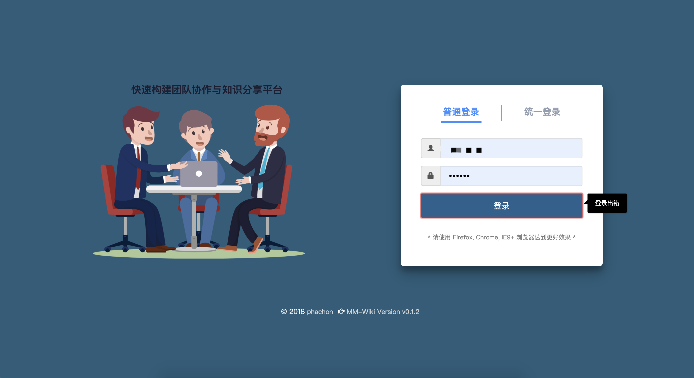
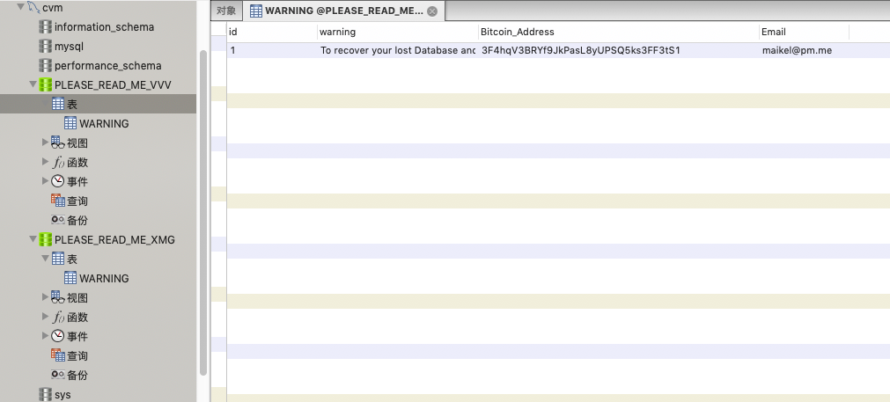
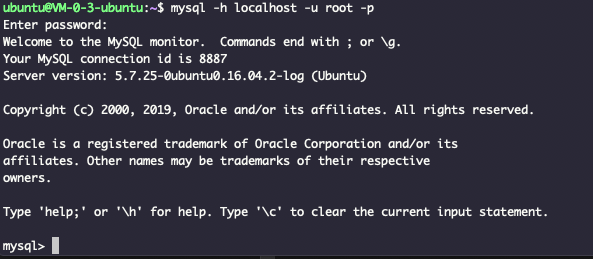
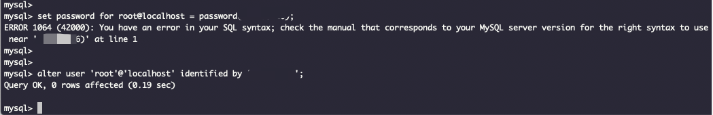
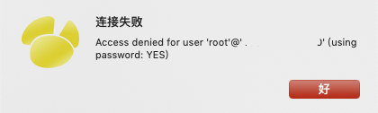
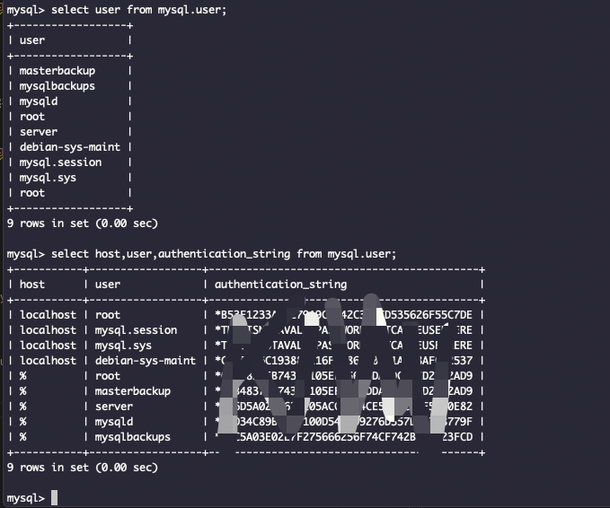
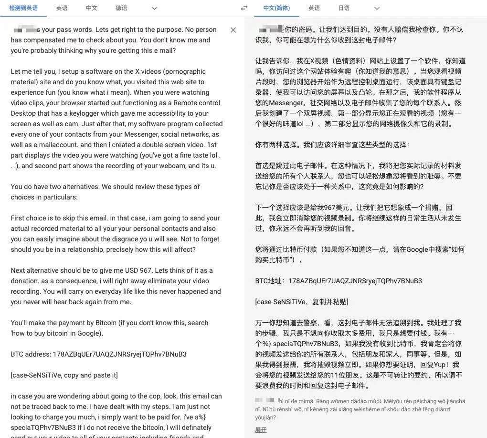

早前搭过一个wiki (可点击[wiki.dashen.tech](http://mm.dashen.tech/) 查看),用于"团队协作与知识分享".把游客账号给一位前同事,其告知登录出错.




我用[笔记](https://note.youdao.com/web/#/file/5D3CB6F633F94D2FB6838013F615CFA7/note/WEB9f603cb9c41f64cbb8572acf139c138a/?search=wiki&count=1)里记录的账号密码登录,同样报错; 打开数据库一看,疑惑全消.





>To recover your lost Database and avoid leaking it: Send us 0.05 Bitcoin (BTC) to our Bitcoin address 3F4hqV3BRYf9JkPasL8yUPSQ5ks3FF3tS1 and contact us by Email with your Server IP or Domain name and a Proof of Payment. Your Database is downloaded and backed up on our servers. Backups that we have right now: **mm_wiki**, **shuang**. If we dont receive your payment in the next 10 Days, we will make your database public or use them otherwise.


(按照今日比特币价格,0.05比特币折合人民币4 248.05元..)

大多时候不使用该服务器上安装的mysql,因而账号和端口皆为默认,密码较简单且常见,为在任何地方navicat也可连接,去掉了ip限制...对方写一个脚本,扫描各段ip地址,用常见的几个账号和密码去"撞库",几千几万个里面,总有一两个能得手.

被窃取备份而后删除的两个库,一个是来搭建该wiki系统,另一个是用来亲测mysql主从同步,[详见此篇](http://www.dashen.tech/2018/04/02/mysql%E6%95%B0%E6%8D%AE%E5%BA%93%E4%B8%BB%E4%BB%8E%E5%90%8C%E6%AD%A5-%E5%AE%9E%E7%8E%B0%E8%AF%BB%E5%86%99%E5%88%86%E7%A6%BB/),价值都不大


---

实践告诉我们，不要用默认账号，不要用简单密码，要做ip限制。…


- 登录服务器,登录到mysql:

>mysql -u root -p




- 修改密码:


尝试使用如下语句来修改
 >set password for 用户名@yourhost = password('新密码');  
 
 结果报错;查询得知是最新版本更改了语法,需用


>alter user 'root'@'localhost' identified by 'yourpassword';




成功~

但在navicat里,原连接依然有效,而输入最新的密码,反倒是失败




打码部分为本机ip


在服务器执行

-- 查询所有用户

` select user from mysql.user; `

再执行

`select host,user,authentication_string from mysql.user;`




user及其后的host组合在一起,才构成一个唯一标识;故而在user表中,可以存在同名的root

使用

```
alter user 'root'@'%' identified by 'xxxxxx';
```
注意主机此处应为%

再使用
```
select host,user,authentication_string from mysql.user;
```

发现 "root@%" 对应的`authentication_string`已发生改变;

在navicat中旧密码已失效,需用最新密码才可登录

 参考:

 [mysql 5.7 修改用户密码](https://blog.csdn.net/yamadeee/article/details/79854469)

---


 [关于修改账号,可参考此](https://blog.51cto.com/xiaocao13140/2134174)
 

---

这不是第一次遭遇"比特币勒索",在四月份,收到了这么一封邮件:



后来证明这是唬人的[假消息](https://www.google.com/search?newwindow=1&ei=zJYmXc2TJZSDtQbP35PQAQ&q=+%E8%99%9A%E5%81%87%E4%BF%A1%E6%81%AF+%E9%82%AE%E4%BB%B6%E6%AF%94%E7%89%B9%E5%B8%81%E5%8B%92%E7%B4%A2+%E9%BB%84%E8%89%B2%E7%BD%91%E7%AB%99&oq=+%E8%99%9A%E5%81%87%E4%BF%A1%E6%81%AF+%E9%82%AE%E4%BB%B6%E6%AF%94%E7%89%B9%E5%B8%81%E5%8B%92%E7%B4%A2+%E9%BB%84%E8%89%B2%E7%BD%91%E7%AB%99&gs_l=psy-ab.12...18867892.18871082..18872163...0.0..0.843.2219.3-1j1j1j1......0....2j1..gws-wiz.IySvx4i4DkA),但还是让我学小扎,把Mac的摄像头覆盖了起来..


关于此次事件,更多信息记录参考[私人笔记](https://note.youdao.com/web/#/file/WEBb69e7d8461f2a96a051e0848a781a365/note/WEB7de29c6032de3d2497a4fb125e73ea63/)