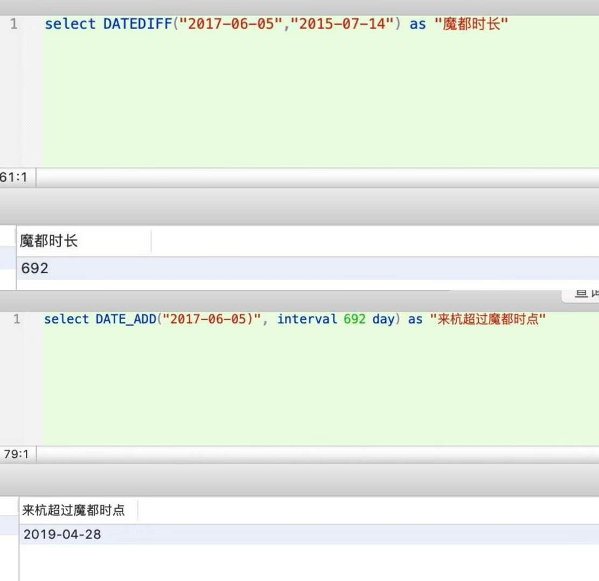
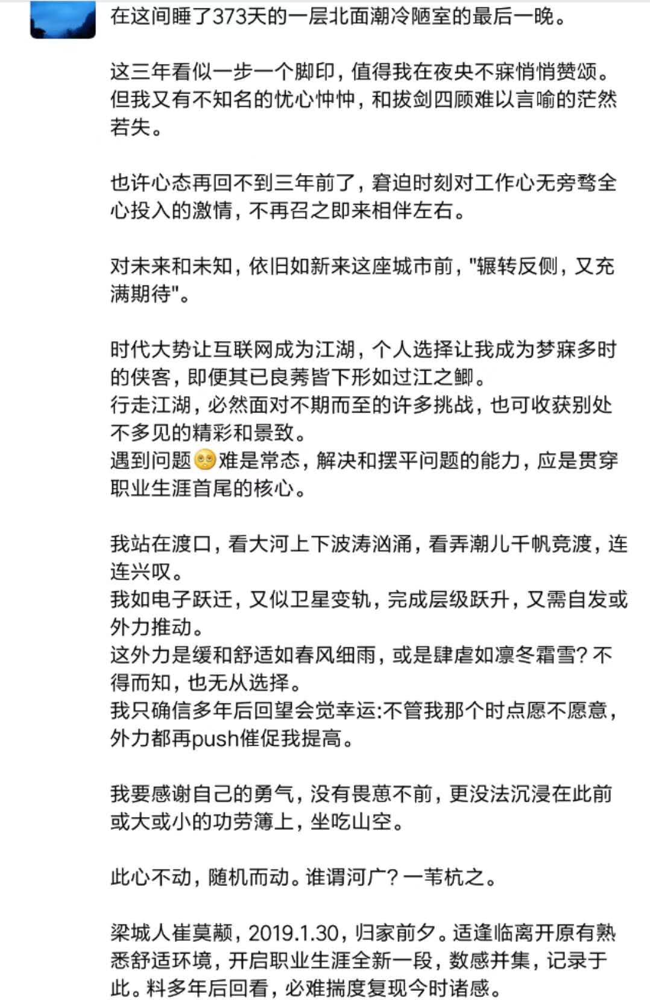

『结束第一份工作两周年』

我在落英缤纷的桃花港，在鸥鸟翔集的海鸥路，踯躅往复，痴痴想念着那一天，仙霞路的彩云与落霞。

再有半个月，更确切地说，是在28号之后，我在杭时间将超过魔都，成为有生26年来，除去家乡小城和大学四年某省会，所呆最久一地；且对飘蓬落定的我，终有一天它会超过生养我的家乡，成为久居终老之所。回瞰近两年，技艺飞涨，薪资提升，结束漂泊，落户安居，我不能说有什么遗憾和不满。但毫不夸张，不带矫情，我分明更留恋和回味上海那两年，虽是蜗居密室，虽是薪水微薄，虽是天天凌晨前后回去休憩，纵是常捉襟见肘，买件酷爱的电子设备要瞻前顾后，但却有对明天无限的期待和愿景，有兴冲冲浇不灭的劲头和源源不竭的内力，有永远生猛下去什么也锤不倒的豪情魄力...

按说比之魔都并不让我感冒的高档商场，这里的山色湖光更具吸引，而被我吐槽的公共交通尤其地铁，也在一日千里发展且技术设备更好更新。但在无人深夜漫步余杭塘河沿时，我还是时常想起苏州河畔的斑斓灯火，仙霞路的片片云朵和工技大外墙茂盛的爬山虎，也许是我妥协没在魔都扎根做了逃兵，也许是那里有我工作之初最是真挚的早期同事和回忆，也许更是那里有血脉亲属可以常聚　交心倾诉。…

也或许，是对时光大河一去不返的悲哀，我拼搏数年沮丧发现，努力不可或缺但机遇权重更大，我不再有看不到顶的无限可能了，不能再自视甚高甚以南阳岗卧龙自居了。而更可能只是中规中矩。

我不再能轻盈如昔年往常，也不再动力满满。尤是姥姥姥爷先后高龄辞世那几月，最小接受ｔａ们最多关爱，却无暇回馈万一，一度让我心灰意颓，我的世界不再圆满，我的拼搏还有何意义？…这个执念一度缠绕我许久，虽然明知逝者最是希望我能释怀能笑口常开。

明天太阳升起，还是会精神满满前去工作学习，改用一位朋友状态，“为了爱，为了父母，为了爱自己的人和自己爱的人，为了在和不在的人，为了书写自己的故事。更为了能在历史的长河中，用蘸了自来水的笔留下自己淡淡的一点“。

曾有梦，还有梦。

