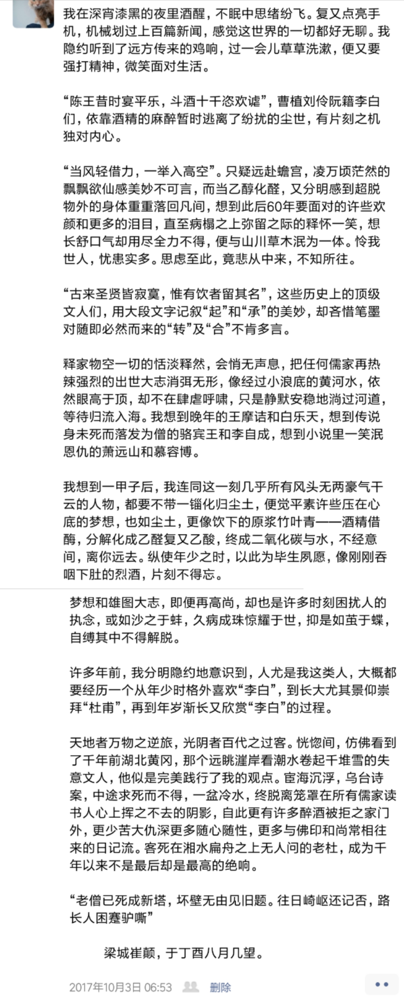

---
时从沪来杭不久,满心欣喜归家.
不喜饮酒,不胜杯杓;然一家团聚,破例为之.
清宵酒醒,数感并集,予以一记.
彼时,外公外婆尚在,爷爷奶奶康健;
过后一年多,落户买房,跳槽加薪,浮沉起伏,一再不表;
幼时种种事,都到眼前来,然故人暌违永隔.
观此旧文,真如隔世.

2019.02.19补记.

---

  我在深宵漆黑的夜里酒醒，不眠中思绪纷飞。复又点亮手机，机械划过上百篇新闻，感觉这世界的一切都好无聊。我隐约听到了远方传来的鸡响，过一会儿草草洗漱，便又要强打精神，微笑面对生活。

  “陈王昔时宴平乐，斗酒十千恣欢谑”，曹植刘伶阮籍李白们，依靠酒精的麻醉暂时逃离了纷扰的尘世，有片刻之机独对内心。

  “当风轻借力，一举入高空”。只疑远赴蟾宫，凌万顷茫然的飘飘欲仙感美妙不可言，而当乙醇化醛，又分明感到超脱物外的身体重重落回凡间，想到此后60年要面对的许些欢颜和更多的泪目，直至病榻之上弥留之际的释怀一笑，想长舒口气却用尽全力不得，便与山川草木泯为一体。怜我世人，忧患实多。思虑至此，竟悲从中来，不知所往。

  “古来圣贤皆寂寞，惟有饮者留其名”，这些历史上的顶级文人们，用大段文字记叙“起”和“承”的美妙，却吝惜笔墨对随即必然而来的“转”及“合”不肯多言。

  释家物空一切的恬淡释然，会悄无声息，把任何儒家再热辣强烈的出世大志消弭无形，像经过小浪底的黄河水，依然眼高于顶，却不在肆虐呼啸，只是静默安稳地淌过河道，等待归流入海。我想到晚年的王摩诘和白乐天，想到传说身未死而落发为僧的骆宾王和李自成，想到小说里一笑泯恩仇的萧远山和慕容博。

  我想到一甲子后，我连同这一刻几乎所有风头无两豪气干云的人物，都要不带一锱化归尘土，便觉平素许些压在心底的梦想，也如尘土，更像饮下的原浆竹叶青——酒精借酶，分解化成乙醛复又乙酸，终成二氧化碳与水，不经意间，离你远去。纵使年少之时，以此为毕生夙愿，像刚刚吞咽下肚的烈酒，片刻不得忘。

  梦想和雄图大志，即便再高尚，却也是许多时刻困扰人的执念，或如沙之于蚌，久病成珠惊耀于世，抑是如茧于蝶，自缚其中不得解脱。

  许多年前，我分明隐约地意识到，人尤是我这类人，大概都要经历一个从年少时格外喜欢“李白”，到长大尤其景仰崇拜“杜甫”，再到年岁渐长又欣赏“李白”的过程。

  天地者万物之逆旅，光阴者百代之过客。恍惚间，仿佛看到了千年前湖北黄冈，那个远眺漄岸看潮水卷起千堆雪的失意文人，他似是完美践行了我的观点。宦海沉浮，乌台诗案，中途求死而不得，一盆冷水，终脱离笼罩在所有儒家读书人心上挥之不去的阴影，自此更有许多醉酒被拒之家门外，更少苦大仇深更多随心随性，更多与佛印和尚常相往来的日记流。客死在湘水扁舟之上无人问的老杜，成为千年以来不是最后却是最高的绝响。

  “老僧已死成新塔，坏壁无由见旧题。往日崎岖还记否，路长人困蹇驴嘶”

         梁城崔颠，于丁酉八月几望。
         
        
