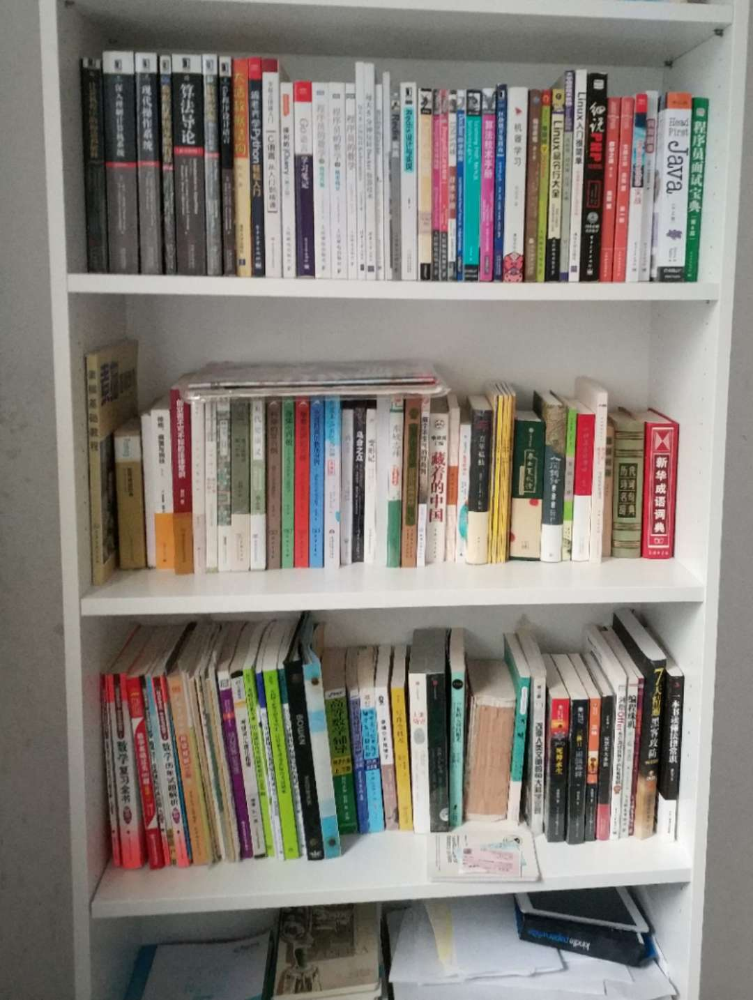
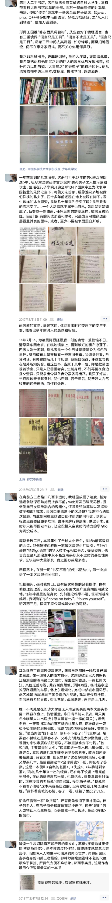
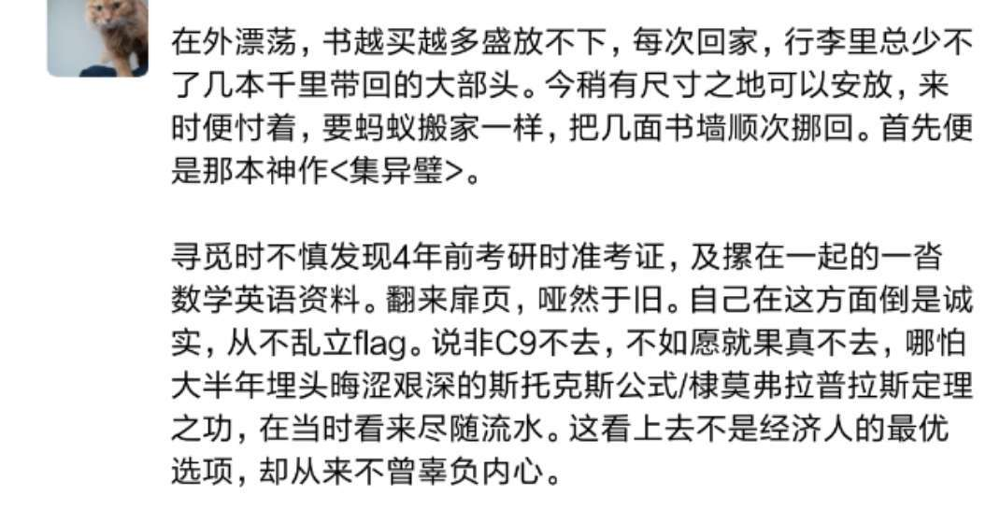
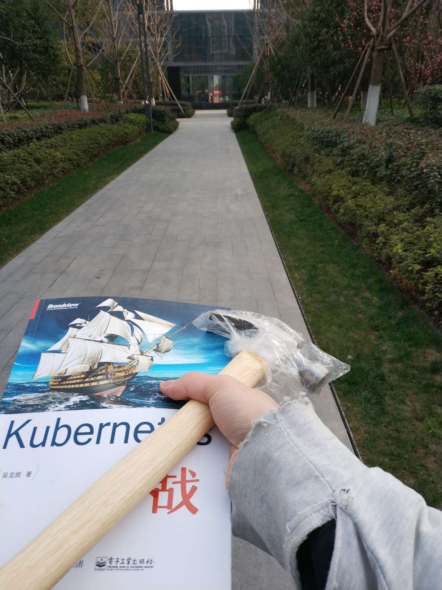
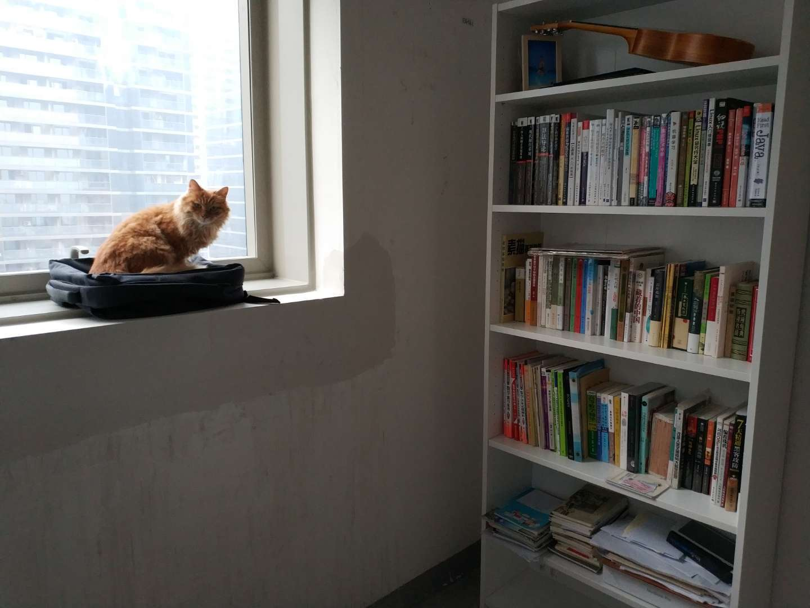

我们大多是在最近几年才相遇相识，

你们一个个从天涯海角，从北国南疆，不辞千里到我身旁，

也有在旅途相逢 一见倾心，蜗于行囊随我辗转归乡。

你们陪伴我跨越省域区划，从沪来杭；也与我蜷缩出租房，颠沛流亡。

出租屋逼仄甚或无窗，阴寒潮冷不见天光，曾让你们湿漉漉，与我床被一模一样。

今稍有立锥，迫不及待便是安置妥当。你们来自五湖四海，终相聚于一堂。

我知道你们听说不到，却还像怪胎一样自顾自说。当跨越千里阻隔，当我虔诚地翻开扉页，当我的眼珠乌溜溜扫过千行，当我小心翼翼做出批解图注，就好像为你们注入灵魂与生命，我们的故事，从那瞬便开始源远流长。

有你们在，如有取之不竭的无尽矿藏；
有你们在，破衣烂衫也自信如着新装；
有你们在，鸡飞狗跳我也能心中不慌。

我们好多还不算深交，我着急赶路步履匆匆，恐怕好些还只是一面之缘，相逢一笑便又如隔大江。

此后一甲子，望我们能杯茶片饮，晴天相约书房，阴雨相聚连廊。我更希望你们能跨越兵戈扰攘龙血玄黄，寿命比我更长。

2019.02.24

