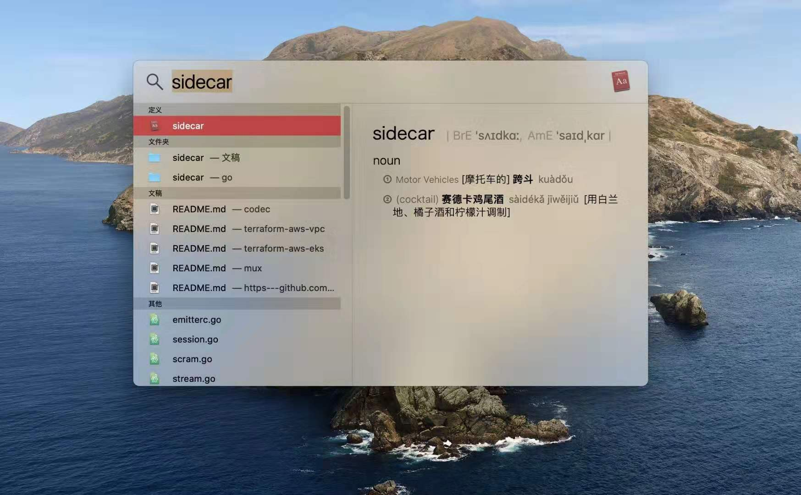
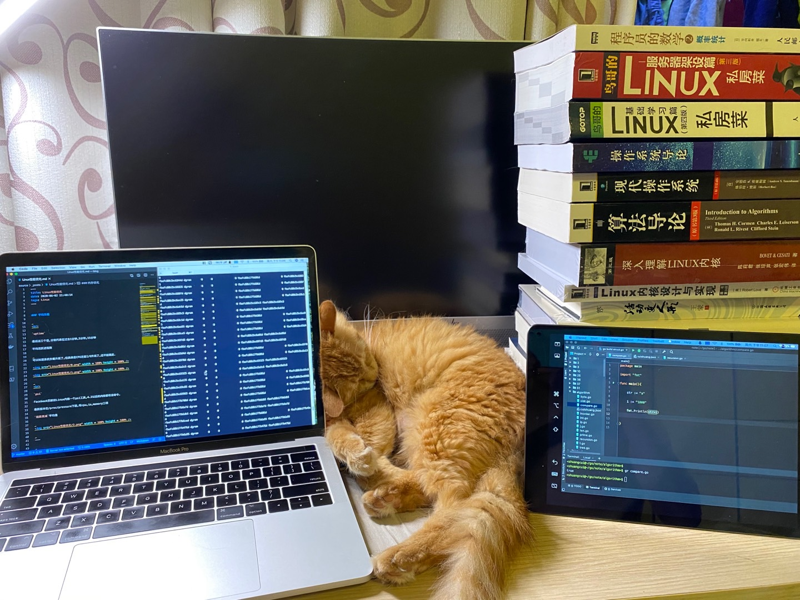

 

微服务中有所谓“sidecar”概念，无独有偶，最新的macOS Catalina增加了一个同名功能，旨在将iPad作为Mac的扩展屏幕。

sidecar译为『边车，跨斗』，听了这解释基本还是一脸懵逼。其实就是过去这种老式摩托，抗日神剧里常见，我小时貌似派出所出警，也多用这种车，伴随汽车普及，几乎被淘汰。

微服务中，此概念解释为:就像边车加装在摩托车上一样，在软件架构中，sidecar附加到主应用，或者叫父应用上，以扩展/增强功能特性，同时Sidecar与主应用是松耦合的。

Sidecar与主应用依然是一体的，用这种老式摩托车比喻十分生动。而Mac和iPad，虽说水果一直想将桌面操作系统和移动操作系统整合，但现下看，依然是同一公司搭载macOS和iOS不同操作系统的两款独立设备，此情境下，用“wing plane”或“corvette”更是贴合，尤其后者，与该功能的中文名“随航”，翻译得堪称神来之笔。

——————

 

另:继美洲大型猫科动物被用得差不多后，苹果开始用加州知名风景区作为新系统名称。Catalina是洛杉矶附近一座小岛，以景色秀丽著称。catalina和katrina，分别译作“卡特琳娜”/“卡特丽娜”。以后者命名的飓风，曾在我刚上初中时席卷佛州，最终造成1800多人丧生，小布什因为行动迟缓，备受诟病。

与苹果的文艺不同，谷歌则属吃货阵营。从2009年的Cupcake开始，至2019年Android 10为止，10年间，“CP”之间的14种甜点，被谷歌用来作为新版本“机器人”的代号。