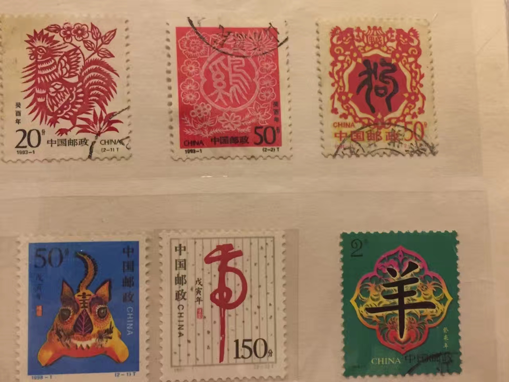
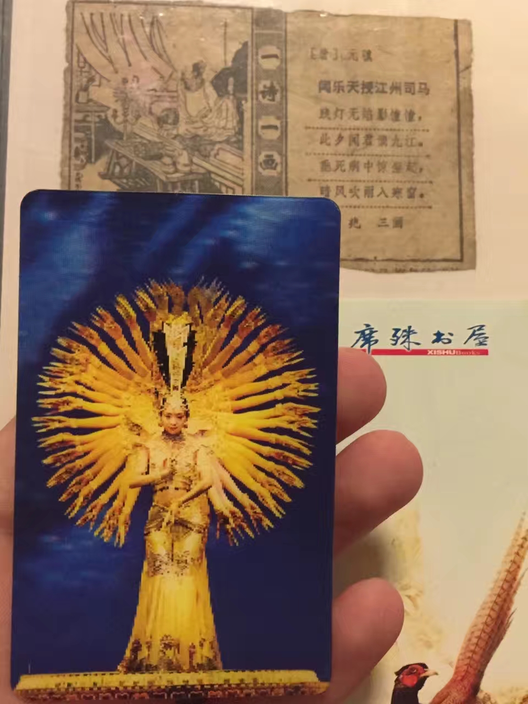
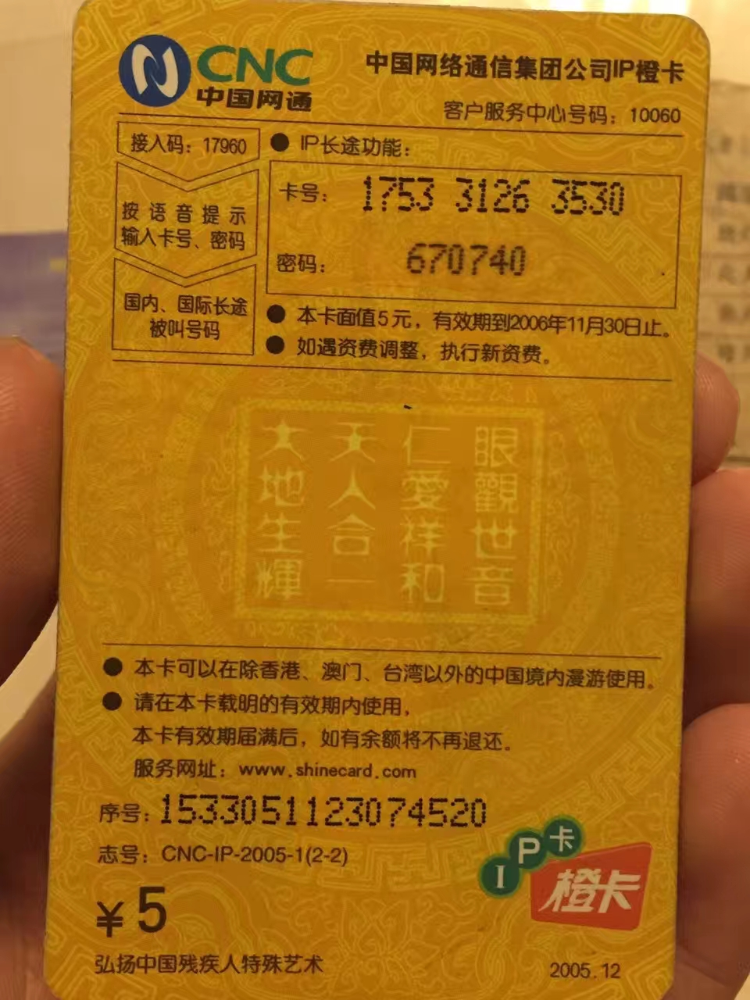
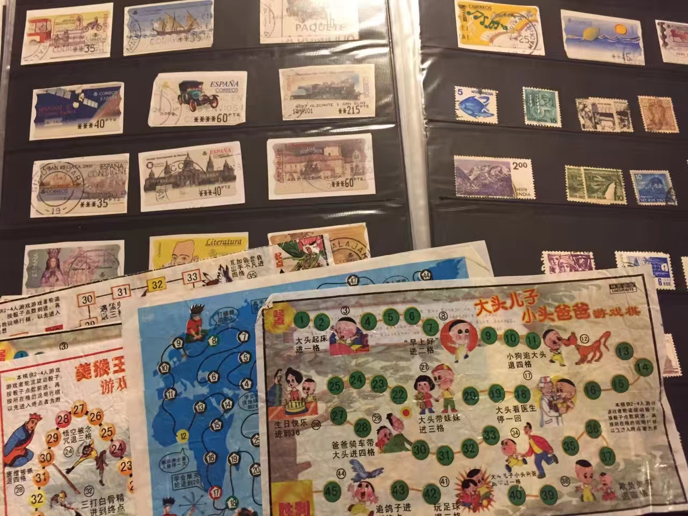
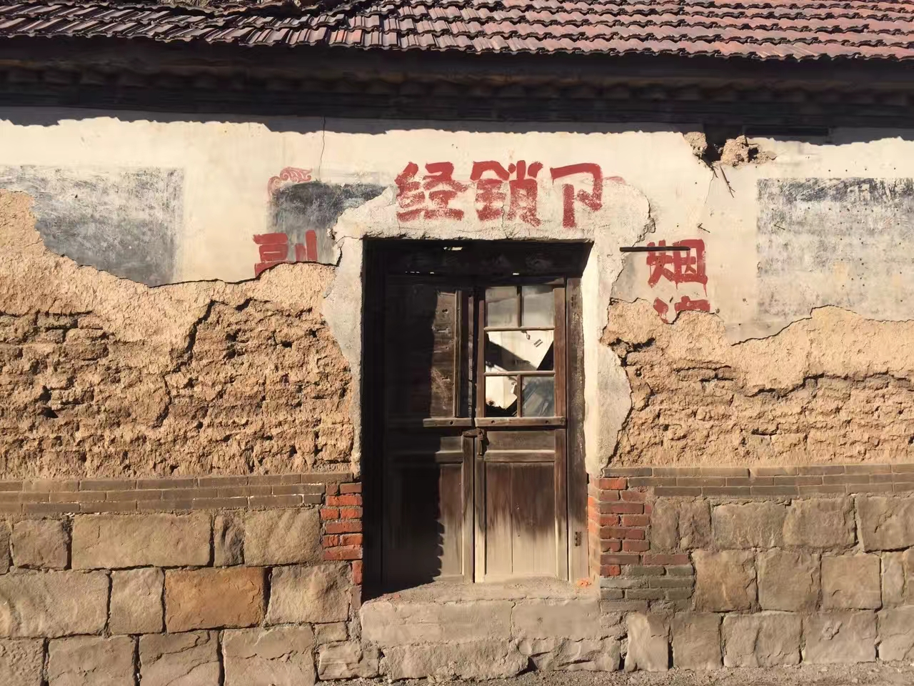

翻看旧照和故物集结册，很难想象，竟然整整过去了24年和12年。那年春晚结束后的深夜，从奶奶家老宅走出，我穿着东北大军靴，拿着一把生锈的小刀，冠名曰“冷艳锯”，外面用纸壳粘折作为剑鞘，剑把末端拴上剑穗，拿在手中飞舞。 雪花堆叠覆盖了老家那条红砖铺设的“中心大街”，路灯昏暗，却在素洁无垠的月光笼罩下，一切安详隐约可见。此起彼伏的爆竹和烟花，以及弥散在空气中特有的我称之为“年味”的气息，与蹦蹦跳跳欢欣不已的我动静相融，那是12年前的除夕夜。

那年除<千手观音>外，给我留下深刻印象的是黄宏巩汉林小品<装修>，“东风吹，战鼓擂，装修需要我黄大锤”。我改编了这句开场台词并不时重复，让我年轻的爸妈捧腹。而今，春晚已经是毫无存在感的东西。12年，仿佛只是一瞬。闭眼，却都真切历历在目。

12年前，早上陪同我去给长辈拜年的还有堂哥堂姐，而今，ta们居在大城，皆成家有子，弟弟年幼身在沪上，逢年还从未回，作为新新人类，此地习俗怕已陌生，家乡长辈更是相逢不识。12年来，我早起拜年的对象也愈发稀少，ta们同那个以“腌透了的咸鸭蛋”代指黄宏的填词人闫肃，在这一旬岁月里告别了这烦喧世界。

下午去山间公墓上坟祭拜，平素幽静无人的坟场被炮声扰得粉碎。望着燃烧的黄钱纸化为余红未褪的灰烬，局部空气受热升腾，给人强烈的目眩感和幻灭感。那刹那一刻，我想到很多，但受限于止有两旬的阅历和依旧拙劣的笔力，我无法把捕捉到的信息不做失真地还原。

今天，我带着耳机，步行10分钟，从望京横穿309国道和胶济铁路，到另一个地级市的姥姥家。ta们年过九十日渐衰老，我几乎无法想象，他当年是如何用仅存的一只手把我抱起，对着院中那棵已经不再的梧桐树，磕磕鞋上尘土放入冰糕箱中，穿过马路和大桥，只为满足我“看看新家有没有贴上马赛克瓷砖”。而我的“新家”也已然不再名副其实，它已经建成20年，我只在其中常住两年。姥姥患病已过10年，一侧偏瘫，神志清晰却表达不出，精神矍铄却行动不便。同样很难想象，许多年前，我正是跟在她们几个挎着篮子的裹脚老太太身后，去“很远很远”的村边"打兔子草"。那次，我相依相伴形影不离的竖笛，遗落在了到我小腿的麦苗层中，沮丧失望哇哇落泪，忐忑地回去寻找，幸运发现。那一年，揣着失而复得如释重负的畅快心情，风吹麦浪，绿油油的麦田摆动一波未至一波又起，我迎风奔跑，不时跳跃飞舞，咧嘴欢笑，丝毫未留意刚被风吹干的泪痕。

许多年前，更确切是当从奶奶家到“新家”的一公里距离我第一次敢独自行走。路过“南和巷”已残破多载的“代销点”，几位晒太阳的老太太，因我未像平时跟着父母走过时在，在大人催促下喊其“奶奶”，而质问甚至抛出口头禅般的脏话，听后十分生气，用我有限的词汇和其“对骂”。过去讲“三个女人一台戏”，何况又是三位“桥胜路，盐赛米”的老妪，年幼的我不敢恋战，择路快逃。今天路过那里，却早是物是人非许多年。

---

 

在下午公墓烧纸燃炮间隙，听到近旁几位前来祭祀的男人不经意的对话，“今天比初一来的人都多啊”，“嗨，初一都在家打扑克了”。祖宗灵前，能这样直白潇洒不遮不掩地表述，让我莞尔失笑。我们都是大变化时代中的小人物，根深蒂固奉若圭皋的风俗礼仪，在新时代价值观的冲击下支离破碎，像<百鸟朝凤>那段西安城头的日落，有些许不舍却不得不如此。碑上男主人皆有名有姓，女主人则只有姓氏名被隐去，哪怕这位男主人有两任夫人，能看到的也只是她们的姓氏，这让我感到有些逆眼，而我只是这个儒家发源地有新时代精神的年青一代，尚不能算“新人类”——虽不知未来具体去往何处，却都知目标是朝更平等更幸福的地方。

我看着远近起伏连绵的新茔旧墓，不禁想到自己。这里会是我跋涉千山万水留宿异乡几万日夜最终的归宿吗？一个甲子后，我一生落幕，也会是此地一处毫不起眼的坟茔？…当我稍稍像爸妈透露这想法，ta们当即笑我守旧思量太久。“哪里能给你幸福，哪里是你的新家乡”。自出生起，生命已经是一头点燃并疯狂燃烧不为所动的香烛，迟早有天是要灯灭香熄。而唯一能做的，是用余生的60年，做更多有价值和幸福感的事。

