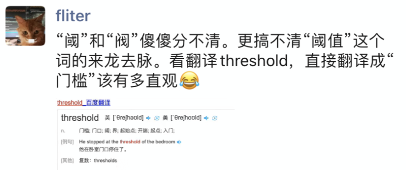
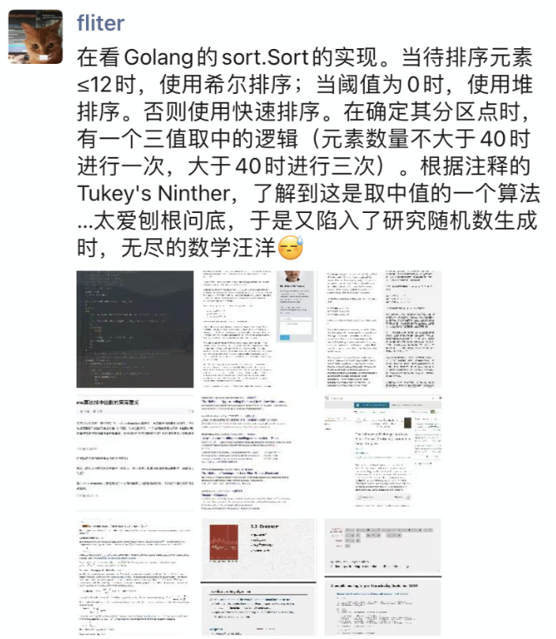
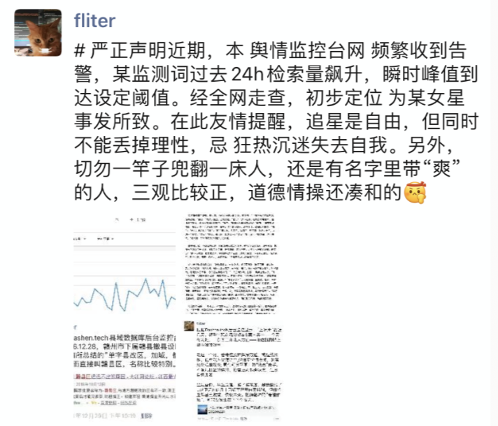
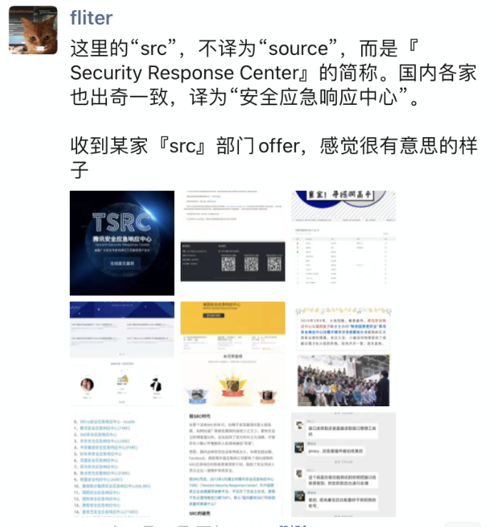
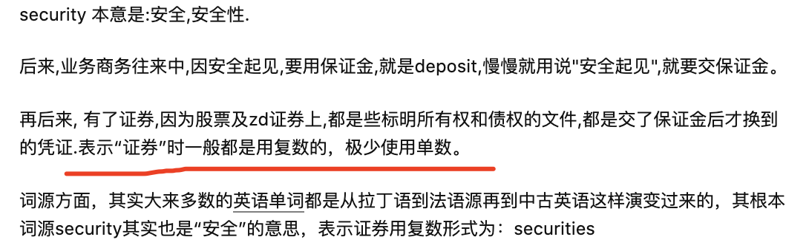

### 缘起

<br>


起因是看一位其他行业的好友微博,把`阈值`精准得打了出来,不禁慨叹*难得* `---` 因为在工作中,作为高频接触到的词,还是会经常听到`阀值`,`阀值`...

但对方颇有不忿`---`"我在你那儿的形象这么没文化啊". 一番探究,发现其行业同样使用该词. 在这样一个相互渗透,相融共生的年代,并没有想象中那样隔行隔山.










<br>

但也有一些相同缩写,在不同行业不同场景下,含义大相径庭,在此总结,持续更新.


<br>


### CPI

<br>

#### [Consumer Price Index](https://baike.baidu.com/item/%E6%B6%88%E8%B4%B9%E8%80%85%E7%89%A9%E4%BB%B7%E6%8C%87%E6%95%B0/9843779)

 消费者价格指数/居民消费价格指数

<br>


#### [Cycles Per Instruction](https://en.wikipedia.org/wiki/Cycles_per_instruction)

[执行每条指令所需要的时钟周期数](https://dashen.tech/2020/06/13/CPU%E5%8F%8A%E5%B9%B6%E5%8F%91/)


<br>


---


<br>


### SRC

<br>

#### Securities Regulatory Commission

证券监督管理委员会


<br>


#### Security Response Center

安全应急响应中心





```s
security	

英[sɪˈkjʊərəti]
美[sɪˈkjʊrəti]
n.	保护措施; 安全工作; 保卫部门; 保安部门; 担保; 保证;
[例句]The group was considered to be a risk to national security.
这伙人被认为是威胁国家安全的危险分子。

```

<br>

[为什么证券的英文是securities?](https://www.zhihu.com/question/67529545)
security是安全的意思，为什么securities却是证券的意思？证券的意思是如何从安全引申过来的呢？




<br>


---


<br>


### OTC

<br>

#### Over-the-counter 

场外交易市场(也称 柜台交易市场)

<br>

#### Over the counter drug

非处方药


红底白字的是甲类，绿底白字的是乙类。甲乙两类OTC虽然都可以在药店购买，但乙类非处方药安全性更高。乙类非处方药除了可以在药店出售外，还可以在超市、宾馆、百货商店等处销售


<br>


---


<br>


### MIPS

<br>

#### Microprocessor without interlocked piped stages architecture

一种采取精简指令集（RISC）的处理器架构，1981年出现，由MIPS科技公司开发并授权，广泛被使用在许多电子产品、网络设备、个人娱乐装置与商业装置上。最早的MIPS架构是32位，最新的版本已经变成64位。


MIPS架构20多年前由斯坦福大学开发，是一种简洁、优化、具有高度扩展性的RISC架构。它的基本特点是：包含大量的寄存器、指令数和字符、可视的管道延时时隙，这些特性使MIPS架构能够提供最高的每平方毫米性能和当今SoC设计中最低的能耗


<br>

#### Millions of Instructions Per Second

每秒处理的百万级的机器语言指令数。

是衡量CPU速度的一个指标。如一台 Intel80386 电脑可以每秒处理3百万到5百万机器语言指令，即可以说80386是3到5MIPS的CPU。MIPS只是衡量CPU性能的指标。


