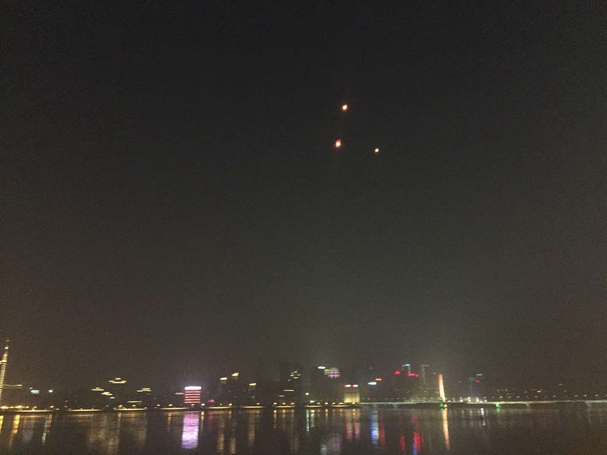

 

 

我在滨江的塑料道上慢跑，看到一群年轻的男男女女，在欢声笑语中放飞孔明灯。刹那便想到了<万箭穿心>中，儿子和其断绝关系后，李宝莉在江边的经闻感悟。

灯盞飘过的江那岸，残破的爱巢，失去妻儿的男人林生斌，并不会因跨年短暂忘却锥心，而会在旁人的热闹中，更显无边孤独。这夜色，并不能吞噬所有苦痛。也许没有互联网，便不会让地下赌场如雨后春笋，也或无此农夫与蛇的悲剧。

在青岛，江秋莲将度过第二个没有女儿陪伴的新年。这个倔强要强离异多年的女人，一手将女儿拉扯成人。没有什么，比失去24岁的孤女更让其撕心裂肺不能接受。

两年多前，在这个国家最豪华的地方，一所校园里，一个胖女孩拦路祈求与我相拥。在我惊讶狐疑的眼神中，她不太伶俐地做出解释：脑中长瘤，所剩无多，不会传染，从未抱过异性，希望今生无憾。我在犹豫中点头，在屏息闭眼中接受了这非比一般的拥抱。她眼已漫涣，在点头称谢中转身，哭笑着离开。我呆呆矗在原地，望其背影瞠目结舌，欲言“再见”至嘴角又止。

通过一款互联网众筹产品的微薄捐赠，我目睹了一位患病同龄人的日常。我看到他的许多动态，有深夜难眠，拍下病房里陪同他的母亲，蜷缩在木板一角潦草睡下的画面。为人子的辛酸与无奈，莫不过此。尝曾以些许鼓励，泛泛祝语，太过单薄；物质相助，可出有限。几个月前，我的这位未曾谋面的网友，带着痛苦离开了这个世界。

君子不立于危墙之下，初时我多有不解，想年轻血气方刚，缘何年岁再大却“贪生怕死”？

纪录片<人间世>中，一位独子下水救人，不幸溺水身亡的42岁农村妇女徐喜娣，选择了再次尝试孕育生命。一次次千里往返上海，成为生活日常，住在80一晚的宾馆地下室，“移植胚胎后住一个稍好一点的”。

看罢这段，我登时明白。90还不至“油腻中年”，却也全部告别少年，悄悄变得“越来越重要”。而这“重要”，更多由自责任。

我在平安喜乐中迎来2018，却知道，并不是所有人都如你我好运。并不知，如此好运是否能相伴一生。“安得广厦千万间”，这是千年前贫病交加的最伟大诗人，垂暮之年的浩叹。也是几小时前，领导人新年贺词的引用。

我们总是高估一两年的进步，而低估十年后的进展。2018年，希望能更加和谐，更加法治，更加公平一些。但深知，相比2017，不会有特大突破。处身其间，我们也当能力之内略尽绵薄，10年后看，或会为我们滴水捐埃垒积出的进步脱帽致敬。这或许也是时代赋予的没有明言的使命。