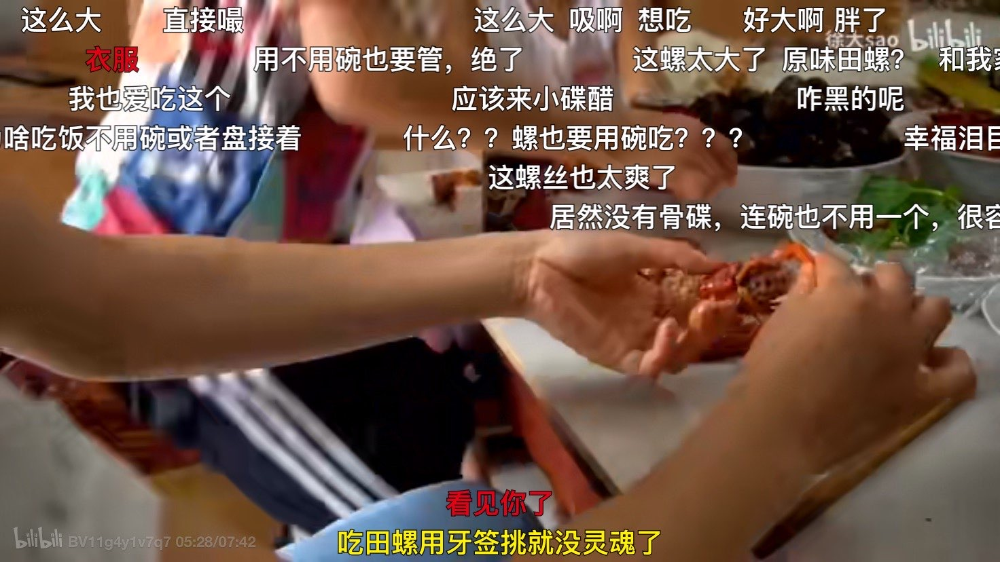
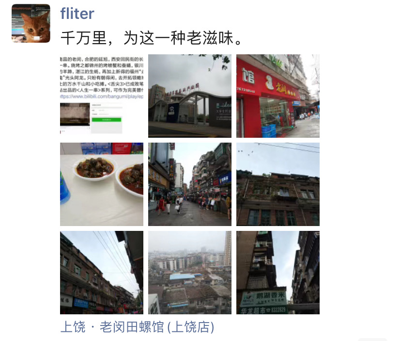
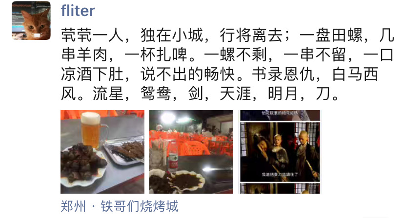
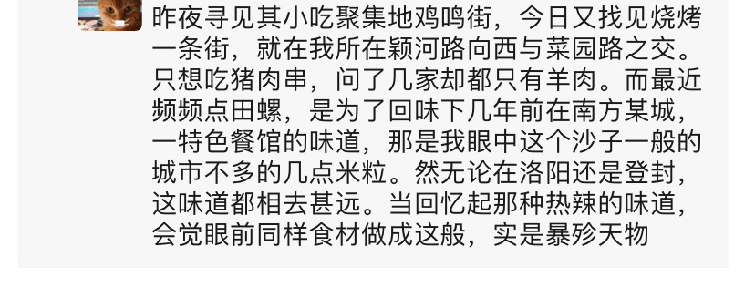

深宵郊外，看着徐大Sao 制作&享用 田螺的视频，赤脚盘坐在临河的长椅，啃着鸭头，聊以慰藉。

有两样挺实用的技能，迄今没能自然而然学会：一是吹口哨，二是嘬田螺。在杭州时，我一老铁H哥，温州人，亦喜食此物。他可以用筷子夹起，吸一口，壳吐掉，像嗑瓜子一样。而我屡试不成，嘬得牙花子生疼，无奈只得用牙签挑食，如弹幕言“实在没了灵魂”。

 

 

 

一眨眼快三十了，人生不折不扣过了三分之一。而这近三十载，除去南国的荔枝，极少再有某样食材，与之相干的回忆多是温馨美好。

 

---

### 一

 

初次品尝这种并不算健康，吃起来也颇麻烦的食物，是幼年一天傍晚，在外公家的葡萄架下。暑假临近结束，吃完饭，爸妈要接我回去，复又接受学校的钤束。

对这餐告别，姥爷极是在意，从村头肴菜店买来几样菜品，其一便是爆炒田螺。孩童不知吃法，也拿起牙签照猫画虎，却把整个挑出吞下。尾部滋长的小螺被咬得吱呀作响，爸闻声忙说: 那不能吃 不能吃。我愣了，接着听他说起怖人的血吸虫病，和不知所云的“绿水青山枉自多，华佗无奈小虫何”。也是那鲜红似火的辣椒放得多而入味，两样交织，头前还晴空万里，转瞬便阴转多云哇哇大哭起来。

……

那个年纪，以为漫长的暑假，芊绵的院落，梧桐树上的蝉鸣，淡紫色花朵的幽香，永远如常不会结束，外公也会健硕超脱岁月。

 

---

 

### 二

 

九岁十岁，在群山环抱的南北寺，度过了最开心的两年。一年盛夏，忘年交 **由大爷**，带我去附近的 *上河水库* 摸田螺。夕阳攲斜，散碎的熹光打在黑虎山。我只在齐膝深的浅滩，在被水淹没的野草间寻落，不多时便有满满战果。这时，由大爷从水深处来，风轻云淡说：“那边有条长虫（蛇），正盘着吐芯子，你先上去，别被它咬到”。我闻言踮脚看去，那边水间一块石头上，确有模模糊糊一团，吐着芯子似在示威启衅。想起动画片里被蛇一口吞掉的桥段，急忙朝岸边走。但感觉踩下的每一脚，都好似恰踏在那蛇身上。

回去后，就在由大爷家歆享佳肴。谈起那条蛇，他颇带遗憾：“要逮住送饭店，得要好几十”。由大娘白了一眼道：“被它咬着你就好了”。

……

没过多久，南北寺裁撤，合到了县里的中学。我也匆匆离开了百草园，一脚从乡野顽童成了“市民”。初去时的各种不适，尚还犹记。县城某些芝麻绿豆的惺惺作态，迄今作呕。

[县城才是中国的底色:一位中西部“前浪”青年的来信](https://mp.weixin.qq.com/s?src=11&timestamp=1599381587&ver=2567&signature=d5io1WQDkEapAz8TouEJLdr3x8Kj1gdL7PzxiWpvjBwhPHuviU*KCSvgH9UeiGPxkWouBTsujrAdXwbSquksUOvijBbrdAdhXND2vOp*T7960U*CSoLBQNKi4oilB4Au&new=1)

 

---

 

### 三

 

十七八岁，亦在暑假。西面的黛溪河汛期涨水。一日早起趁着清凉，爸妈连同还要抱在怀中不愿走路的幼小堂弟，去河里摸索。爸妈轮流，一在河岸抱着跃跃欲试也想参与的弟弟，一人同我下河。清水濯足，算是快事。而我心事萦绕，如雨后初歇的夏日午后般潮湿，实在心不在焉，不觉如何。…当时只道是寻常，却是在多年后才心痛惊觉，这般别无间隙其乐融融，都是莫大幸福。

后来去南方求学务工，像千年前同是弱冠之年南下的同乡辛稼轩。这一晃近10年没能北归，也习惯他乡作故里在此终老。在看不对眼的城市，对并不算吃货的我，不多的几处亮点，竟是三五瓦舍几盘田螺 `---` 那感觉实在是好，口感筋弹，入味三分。以至于后来一年中秋，去某市小住，心头最为期待，不是火红的革命旧迹，亦非打卡幼年邮票上的5A景区，而是当年那个极是小众的品牌，在外市开出的第一家加盟店面。千山万水，为那一种老滋味。…工作以后，确乎发现，那衣食无忧，亦有大把时间的四年，年轻时仅有一次。我过得比99%的人充实，但过后看其实还能再好。

 

 

 

---

 

### 四

 

结束第一份工作，无房车按揭，有过万存款。奢侈休息了一个半月，西去[古都高岳](http://www.dashen.tech/2017/05/05/%E9%95%BF%E5%AE%89%E5%8F%A4%E6%84%8F/)。佯作侠客，从[华山而下](http://www.dashen.tech/2017/05/30/%E5%8D%8E%E5%B1%B1%E5%88%AB%E4%BC%A0/)，至[洛城东郊](http://www.dashen.tech/2017/05/10/%E6%B4%9B%E9%98%B3%E5%9F%8E%E4%B8%AD-%E7%BB%BF%E7%AB%B9%E5%B7%B7/)，再到[嵩山少林](http://www.dashen.tech/2017/05/11/%E5%B0%91%E5%AE%A4%E5%B1%B1%E4%B8%8B-%E9%B8%A1%E9%B8%A3%E8%A1%97/)，临在离开时，曾在小城对月浅酌。

 

 

 

 

千里孤行，徐唱吟游，而今思来，好不快哉。

……

后来，兜兜转转，又回了曾作别，再见是游客的魔都。公务繁踵恐再难得闲，奉钱数万仍捉襟见肘。那种四海无家四海为家，茕茕孑立浪荡江湖的豪情，也伴随年岁渐长而被压缩黯淡。

 

---

 

### 五

 

在初次食用田螺的20年后，昔时咿呀孩童长大，在南方某*地下工坊*劳作；当日古稀耆宿耄耋，于病榻痛苦残喘。青年闻之失声，[北上一千六百里归家](http://www.dashen.tech/2018/06/06/%E6%96%AF%E4%BA%BA%E8%99%BD%E8%BF%9C%E5%8E%BB-%E7%B2%BE%E7%A5%9E%E6%B0%B8%E7%95%99%E5%AD%98/)。泪目之后，在那间承载无数幼年回忆，近些年将要倒掉的西屋里，午饭桌上又见一碟田螺，不由将思绪，拉回20年前那个当时觉来平平无奇的傍晚。

青年已经嗜辣成性甚至无辣不欢，几口下去，却还是落得像小时涕泗横流，布满浓密的须眉，和脸庞的褶皱。

……

因地处矿区，近些年的过度采煤，令地下塌陷。也正有并居之策，当地政府已在数公里外的别村，开始修建社区。几年之后，这些村落，将伴随[几代人回忆](http://www.dashen.tech/2018/06/07/%E5%B0%91%E5%B9%B4%E5%AD%90%E5%BC%9F%E6%B1%9F%E6%B9%96%E8%80%81-%E7%BA%A2%E7%B2%89%E4%BD%B3%E4%BA%BA%E4%B8%A4%E9%AC%93%E6%96%91/)，消逝而成为苍茫一片的硗薄田地。

 

---

 

如果把人的一辈子，比作一幅水墨长卷，幼年童年少年，就好似画作的开篇，初时漫漫不感光阴疏忽世事迁流。而到青年到了人生1/3处，忽得意识到，只需对折再对折，就要结束了，开始有些恐慌。

时日一长，也就在日常琐屑的厮磨中，在生活重锤敲击下慢慢接受，到最后，终究是要如星球上过往的千亿访客，悄悄地来，静静地走。

…

这些承载回忆的物件，就是过往勾勒出的远山近水，接下来也只有泼墨挥毫径自朝前，为画作结束前卑微地短暂回瞰，尽可能不留什么缺憾。
