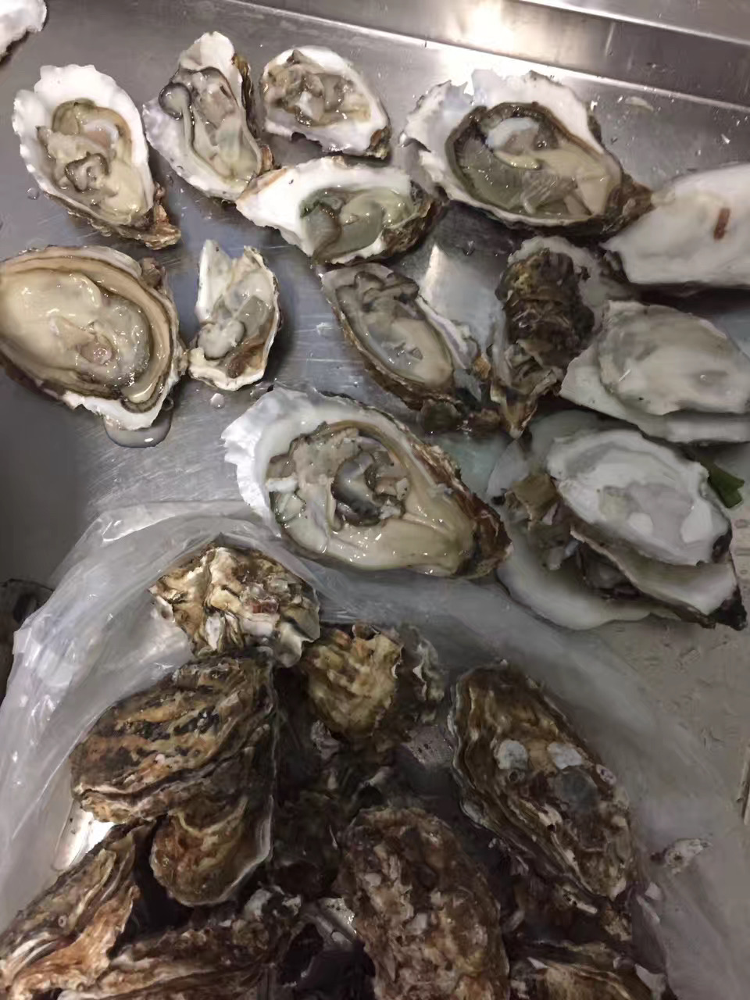
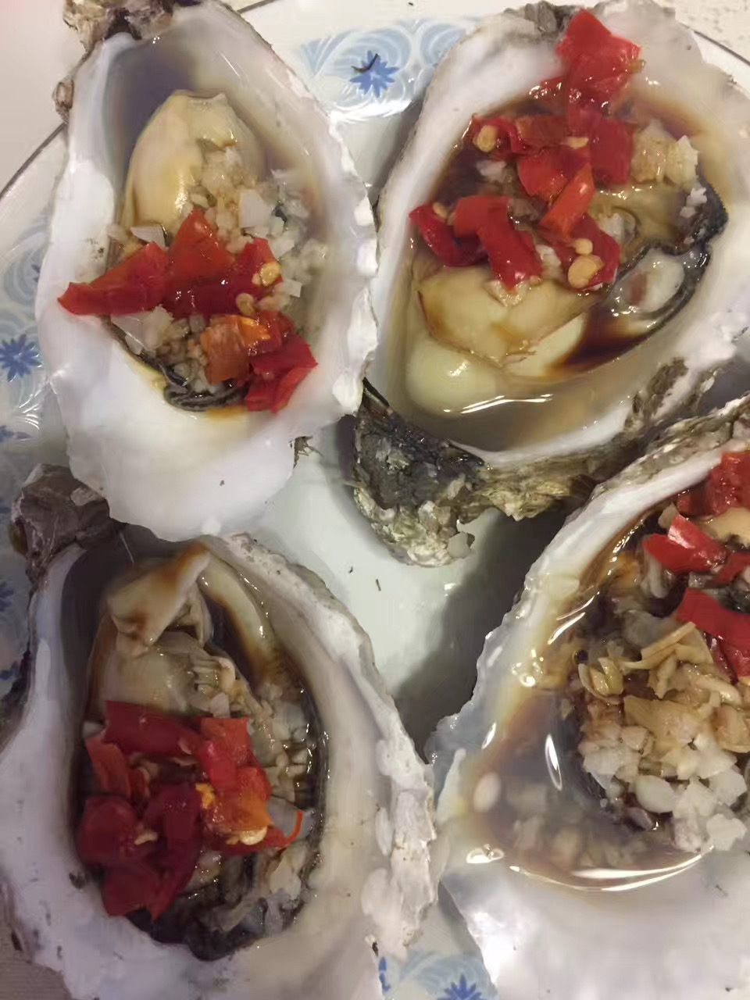
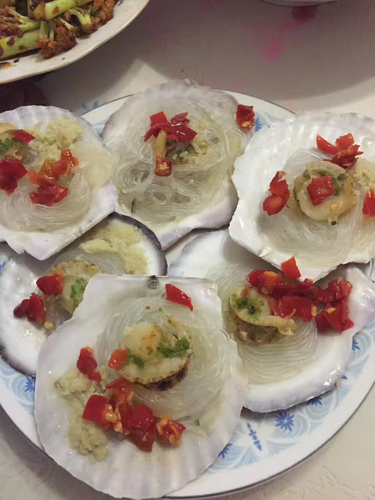
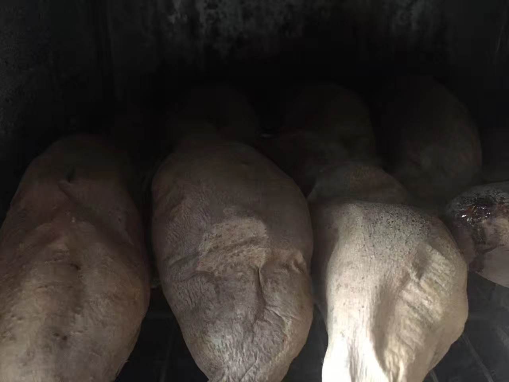
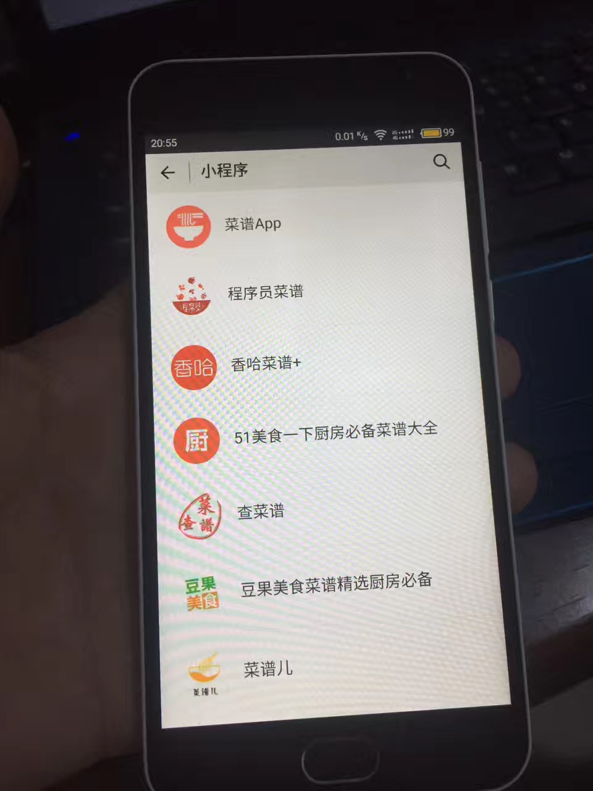
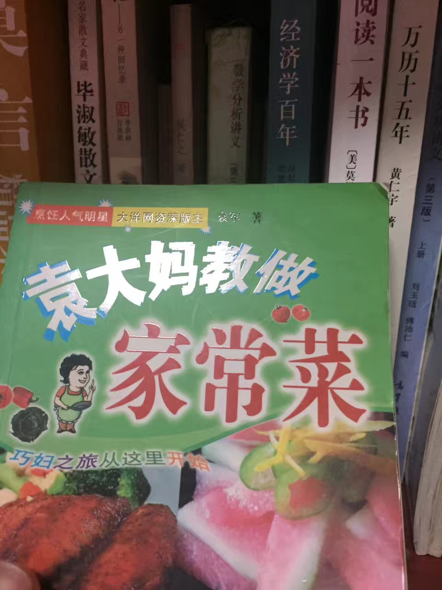

樱桃好吃树难栽，生蚝味鲜壳难开。

在外漂泊不辨菽麦，在家尽享庖厨之欢。

一粥一饭见证寒来暑往，一饮一啄饱蘸苦辣酸甜。

 

 

过去我能想到最浪漫的事，是和未来的她在柴米油盐的琐屑疲劳后，能有心情和雅致，一起平静地看各种无用的公开课。淡淡地，静静地，看到会心处，相视一笑。

而今我诧讶，平素以之无趣的柴米油盐，过往眼中蹉跎生命的厨台案板，此刻却如此歆享。

 

 

和家人至亲一道，共同完成一桌喜爱的家宴。

辛苦劳作带来的幸福与喜悦，溢于言表。我的虎咽狼吞，父母的相视一笑，平常无奇的外表，弥足珍贵的味道。

时光恰如其分，浪费在最美好的事物上，慢品细酌，值得细细回味。

而再过不久，我茕茕一人，又要走上离乡外出的陌生路。

故乡终不再只有冬夏，春秋却止才寥寥几天。

 

 

“这是巨变的华夏，人和食物，比任何时候走的都要快。无论脚步怎样匆忙，不管聚散悲欢，来的有多么不由自主，总有一种味道，以其独有的方式，每天三次，在舌尖上提醒着我们，认清明天的去向，不忘昨日的来处。”

过去我想拥有自己的书房，早已得偿所愿多年。而今，我想在栖居的城市，有自己的厨房。