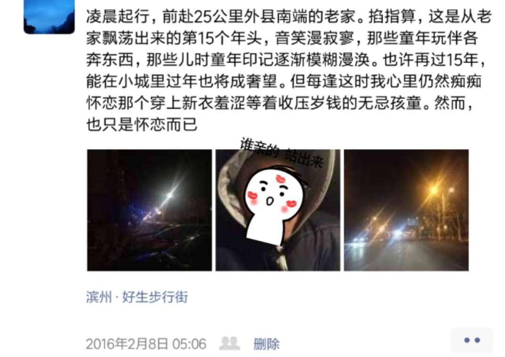
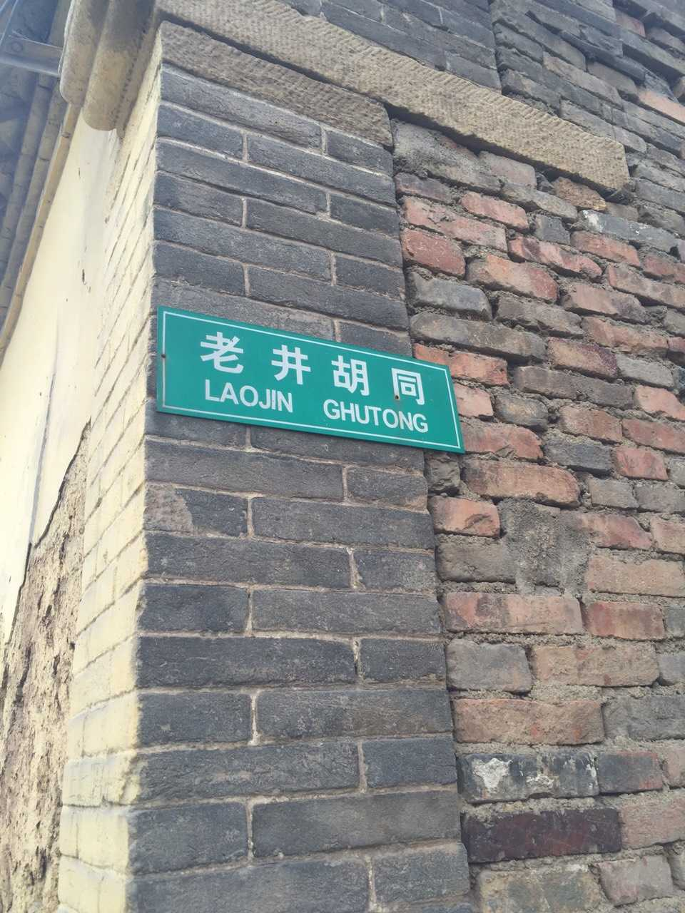
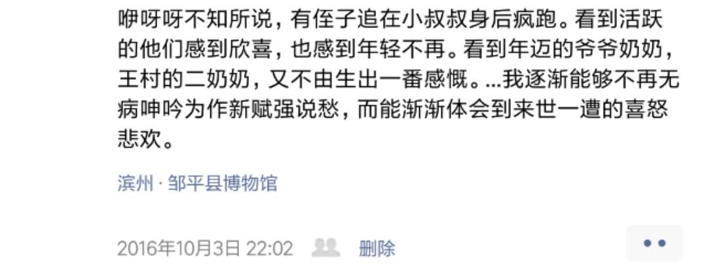

`2019.02.08`

爷爷感冒身体不适，入院查看检查无碍，只伴有低烧。稳妥起见输液几天再走。但无论如何捺不住，各种要求回家。缓兵之计无用，托词借口识破，红脸束手，黑脸枉然。

然而遵医嘱不能出院，开始了从昨天下午到今天拂晓的斗智斗勇。一个近90岁的病中人，气力和精力把三个值青年壮年的儿孙整得侧目歪头。…叔叔可能是近1/4个世纪来第一次回家过年，逢见此事，我之以为人中龙凤大场面先生，也无计可施。

我正为一道找寻最大字符串子串的算法题焦头烂额，却联系诸事，突得发现，数理之难，逻辑之难，并非真难，好多说不清讲不通搞不定的人间事，才是真的让人无从下手，一团乱麻般地无有头绪。

夜半爷爷不折腾稍睡期间，听爸爸叔叔讲幼时种种，兄弟之谊，跃然于前。我也忽然想起爷爷幼时抱我的照片，想最近些年渐去的故人和渐淡的年味。

白天终于拗他不过，匆匆回家了。我拿回了两双作为"传家宝"的银筷子(实际应该是铝质)，却一点高兴不起。

也许一转帧，像<山河故人>，又是几十年后。须发皆白的我有几多儿孙，也许会在某个入院深宵不寐的时刻，恍惚间想起那个遥远年份的大年初三。那时我爷爷还老当益壮，我即将知天命的叔叔和爸爸聊着当年往事，我正对算法如痴如醉，对未来忐忑中充满期待。

一眨眼，却又都消失不见，除去空中一轮同样皎洁的弯月。时间，像一个恶作剧里的坏小子，让我再写不出过去几年的文字，让我再不能平静回忆十多年前的山遥水远。

 

---

`2016.02.07`

过年已经像电视机一样被日渐边缘。物质丰盛再无需把一年的饕餮欲望攒到年底一天集中爆发，技术进步天涯也如咫尺可见，那种积攒一年的期待，那样满心欢喜激动的氛围一去不返了。

我躺在床上，没感觉出今天与其它364天异样在何，只是隔窗听着不间断的响声心里还在遥想当年记忆残存的盛况：乡村夜晚的天格外漆黑，三五如豆的昏黄路灯不及天上耀眼的星，月儿皎白，我呼吸着带着火药味的寒冽空气，脚步在雪里一深一浅地吱吖吱吖，粗劣的花炮时而点缀夜空，雪花飘落挂在眉梢。那方块老电视传出的热烈喜庆的歌儿，那灶台上摆放着的各式各样的吃食，那低矮铁炉上的锅葱和牛肉馅儿水饺冒出腾腾热气，炉口摆放着的烤地瓜香气四溢。大红的对联和福字粘在门楹，细嗅还能闻出浆糊的香味。爆仗声此起彼伏，孩童欢呼，却惊怕远处寒鸦静雀。   

这些封印在我的思维殿堂，已经好久没有出现。我在想，对那些长在大城市的新一代，对春节的印象和感情维系在哪里？如今在那里，内环线内禁止燃放烟花爆竹已成铁律，城市的高楼大厦也逐渐掩盖老家村庄的习俗，半生羁旅他乡终成故里。

春节尚是我们最大最广泛的文化认同之一，人活着更需要一点仪式感。单从我考虑，我希望它能如常然又知这根本无望，这些都是趋势，趋势通向的未来，我们自己都无法知晓。

