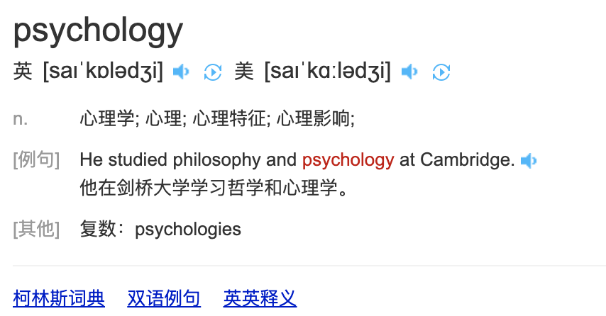
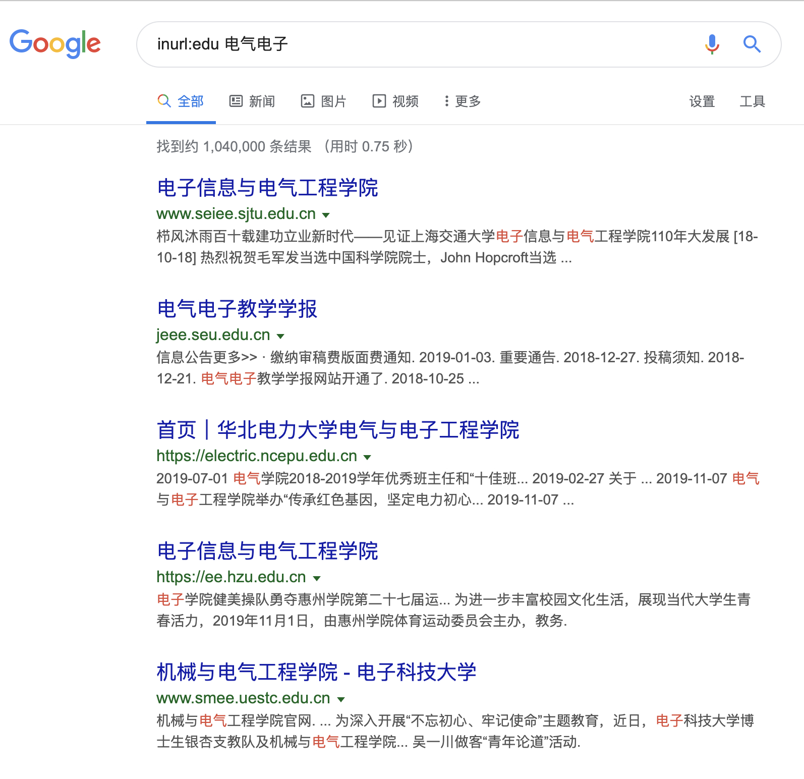

###  philosophy && psychology && physiology

 

philosophy	
英[fəˈlɒsəfi]
美[fəˈlɑːsəfi]
n.	哲学; 哲学体系; 思想体系; 人生哲学; 生活的信条(或态度);

psychology
英[saɪˈkɒlədʒi]
美[saɪˈkɑːlədʒi]
n.	心理学; 心理; 心理特征; 心理影响;

physiology
英[ˌfɪziˈɒlədʒi]
美[ˌfɪziˈɑːlədʒi]
n.	生理学; 生理机能;

---

### Authentication && Authorization
 

即AuthN和AuthZ

前者为认证,判断是不是自己人,让不让进外面的大门;authn，即authentication的简写

后者为授权,已经得知是自己人,进了大门.但不是每个楼层和房间都能去,控制和管理其权限;authz，即authorization的简写

---
 

### Electrical && Electronic 

electrical	英[ɪˈlektrɪkl]
美[ɪˈlektrɪkl]
adj.	电的; 用电的; 发电的;

electronic
英[ɪˌlekˈtrɒnɪk]
美[ɪˌlekˈtrɑːnɪk]
adj.	电子的; 电子器件的; 电子设备的;

`IEEE`: Institute of Electrical and Electronics Engineers

全世界有N多 电气与电子工程学院

---

### introduction && instruction && specification

 

introduction 介绍,引见,引论,引言

例如：Mary was shy at her introduction to the company.

instruction 命令,指示；讲授,指导,教学；使用说明书,操作指南

例如：They had received instructions to watch him.他们收到了监视他的命令
The instructions for assembling the toy are very clear.如何装配玩具的说明非常清楚明了.

"说明"多用`instruction`

如

> The final step is to make sure that the vault binary is available on the PATH. See this page for `instructions` on setting the PATH on Linux and Mac. This page contains `instructions` for setting the PATH on Windows.

https://learn.hashicorp.com/vault/getting-started/install

 
---

### Coarse && Course

coarse	
英[kɔːs]
美[kɔːrs]
adj.	粗糙的; 粗织的; 粗的; 大颗粒的; 粗鲁无礼的，粗俗的(尤指涉及性的);
[例句]The soldiers did not bother to moderate their coarse humour in her presence.
她在的时候，士兵们还是照样说粗俗的笑话，都懒得收敛。

 

course	
英[kɔːs]
美[kɔːrs]
n.	(有关某学科的系列) 课程，讲座; (大学中要进行考试或取得资格的) 课程; (船或飞机的) 航向，航线;
v.	快速地流动; 奔流;
[例句]Aircraft can avoid each other by going up and down, as well as by altering course to left or right
飞机可以通过上下升降和左右移动改变航线来避免相撞。

### Command Completion

指命令行的命令补全

>On the bash command-line, command completion shortens the typing needed for everyday tasks.

在bash命令行上，命令补全特性可以减少日常任务所需的输入量。

 

---

`seal`
n. 密封；印章；海豹；封条；标志
vt. 密封；盖章

`unseal`

vt. 开封；开启；使解除束缚

---

`reverse proxy `

反向代理

### subtitle

有`字幕`的意思

n.	(电影或电视上的) 字幕; 副标题; 小标题;
v.	给…加副标题; 给(电影等)加字幕;

---

### tendency

swelled  [sweld]  
基本翻译
v. 膨胀；隆起；增大（swell的过去分词）
adj. 骄傲自大；自负的

 

plentiful	英[ˈplentɪfl]
美[ˈplentɪfl]

adj.	大量的; 众多的; 充足的; 丰富的;

[例句]Fish are plentiful in the lake.
这个湖里鱼很多。

 

painstaking

英[ˈpeɪnzteɪkɪŋ]
美[ˈpeɪnzteɪkɪŋ]

adj.	需细心的; 辛苦的; 需专注的;

[例句]Forensic experts carried out a painstaking search of the debris.
法医专家对残骸进行了极其仔细的搜索。

 

As discerned
如所见

 

whereas  [ˌweərˈæz] 

conj. 然而；鉴于
n. 序言，开场白；条件语句

whereas: 然而
Whereas Clauses: 鉴于条款
Whereas You: 而你

 

stagnant	

英[ˈstæɡnənt]
美[ˈstæɡnənt]

adj.	(水或空气) 不流动而污浊的; 停滞的; 不发展的; 无变化的;

[例句]He is seeking advice on how to revive the stagnant economy
他正在就如何振兴低迷的经济征求意见。

 

