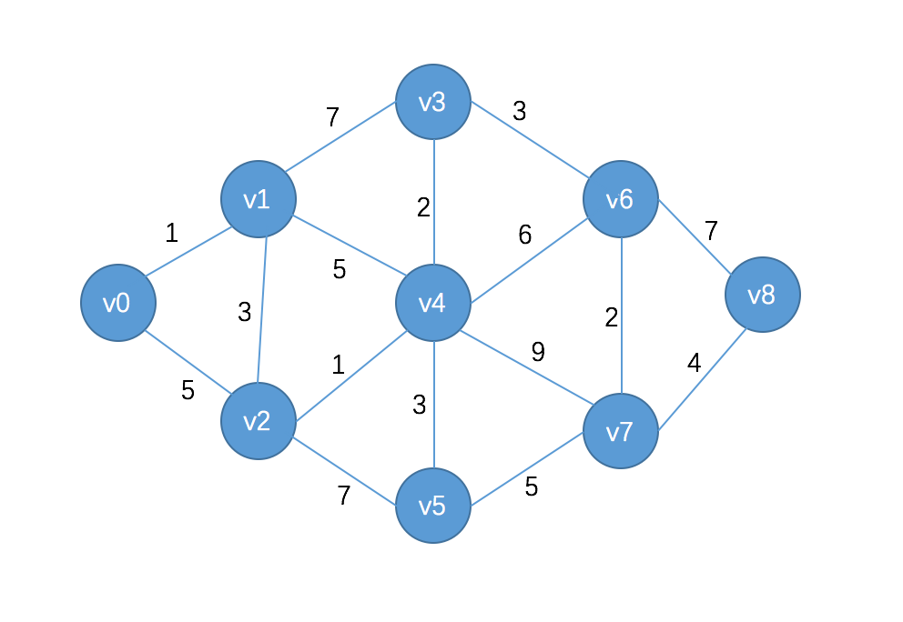
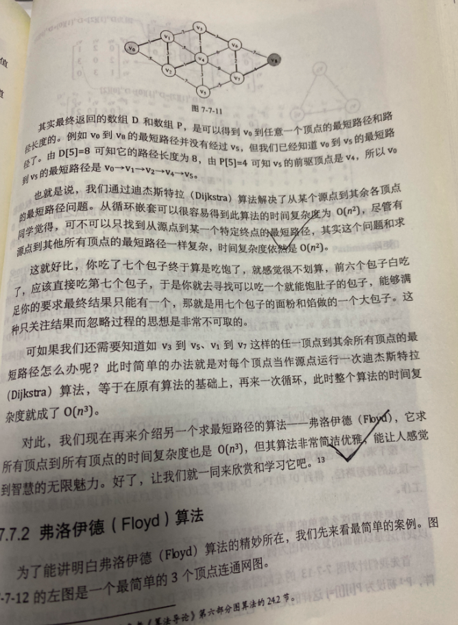

之前在[动态规划--最短路问题](https://dashen.tech/2019/02/14/%E5%8A%A8%E6%80%81%E8%A7%84%E5%88%92-%E6%9C%80%E7%9F%AD%E8%B7%AF%E9%97%AE%E9%A2%98/)中阐述了Dijkstra算法的思想,在此用代码进行实现.("**在实际实现这个算法时,我们又正过来解决这个问题**")


<br>





```go
package main

const MAXVEX int = 9 //顶点数量
const MAXWEIGHT int = 1000

var shortestPath = [MAXVEX]int{MAXWEIGHT, MAXWEIGHT, MAXWEIGHT, MAXWEIGHT, MAXWEIGHT, MAXWEIGHT, MAXWEIGHT, MAXWEIGHT, MAXWEIGHT} //v0到vx的最短路径

func main() {
	graph := NewGraph()

	shortestV := make(map[int]int) //前驱节点的下标

	var pathMin int            //存放shortestPath中,未遍历的最小节点的值
	var Vx int                 //存放shortestPath中,未遍历的最小节点的下标
	var isgetPath [MAXVEX]bool //记录节点是否已经找到v0到vx的最小路径
	for v := 0; v < len(graph); v++ {
		shortestPath[v] = graph[0][v]
	}
	isgetPath[0] = true //v0至v0不需要求路径
	for v := 1; v < len(graph); v++ {
		pathMin = MAXWEIGHT               //当前所知的离v0最近的距离
		for n := 0; n < len(graph); n++ { //寻找离v0最近的顶点
			if !isgetPath[n] && shortestPath[n] < pathMin {
				Vx = n
				pathMin = shortestPath[n] //w顶点距离v0距离更近
			}
		}
		isgetPath[Vx] = true              //将目前找到的最近的顶点置为true
		for n := 0; n < len(graph); n++ { //修正当前最短路径及距离
			if !isgetPath[n] && pathMin+graph[Vx][n] < shortestPath[n] {
				shortestPath[n] = pathMin + graph[Vx][n]
				shortestV[n] = Vx
			}
		}
	}
}

func NewGraph() [MAXVEX][MAXVEX]int {
	var graph [MAXVEX][MAXVEX]int
	var v0 = [MAXVEX]int{0, 1, 5, MAXWEIGHT, MAXWEIGHT, MAXWEIGHT, MAXWEIGHT, MAXWEIGHT, MAXWEIGHT}
	var v1 = [MAXVEX]int{1, 0, 3, 7, 5, MAXWEIGHT, MAXWEIGHT, MAXWEIGHT, MAXWEIGHT}
	var v2 = [MAXVEX]int{5, 3, 0, MAXWEIGHT, 1, 7, MAXWEIGHT, MAXWEIGHT, MAXWEIGHT}
	var v3 = [MAXVEX]int{MAXWEIGHT, 7, MAXWEIGHT, 0, 2, MAXWEIGHT, 3, MAXWEIGHT, MAXWEIGHT}
	var v4 = [MAXVEX]int{MAXWEIGHT, 5, 1, 2, 0, 3, 6, 9, MAXWEIGHT}
	var v5 = [MAXVEX]int{MAXWEIGHT, MAXWEIGHT, 7, MAXWEIGHT, 3, 0, MAXWEIGHT, 5, MAXWEIGHT}
	var v6 = [MAXVEX]int{MAXWEIGHT, MAXWEIGHT, MAXWEIGHT, 3, 6, MAXWEIGHT, 0, 2, 7}
	var v7 = [MAXVEX]int{MAXWEIGHT, MAXWEIGHT, MAXWEIGHT, MAXWEIGHT, 9, 5, 2, 0, 4}
	var v8 = [MAXVEX]int{MAXWEIGHT, MAXWEIGHT, MAXWEIGHT, MAXWEIGHT, MAXWEIGHT, MAXWEIGHT, 7, 4, 0}
	graph[0] = v0
	graph[1] = v1
	graph[2] = v2
	graph[3] = v3
	graph[4] = v4
	graph[5] = v5
	graph[6] = v6
	graph[7] = v7
	graph[8] = v8
	return graph
}

```

<br>

**其真正核心的代码,只有不到20行,一个从1开始的大循环,里面包含两个小循环**

时间复杂度很显然为O(n²)


先进行初始化(即准备工作),再进行贪心算法(大循环部分)

不断"松弛",即将无穷大或者较大的值,改写为小的


最重要的两个变量是记录v0到各点最短距离的数组shortestPath,和标志位isgetPath

shortestV这个map,用来记录每个节点的前驱节点,不是必要的

```go
	for v := 0; v < len(graph); v++ {
		shortestPath[v] = graph[0][v]
	}
	isgetPath[0] = true //v0至v0不需要求路径
	for v := 1; v < len(graph); v++ {
		pathMin = MAXWEIGHT               //当前所知的离v0最近的距离
		for n := 0; n < len(graph); n++ { //寻找离v0最近的顶点
			if !isgetPath[n] && shortestPath[n] < pathMin {
				Vx = n
				pathMin = shortestPath[n] //w顶点距离v0距离更近
			}
		}
		isgetPath[Vx] = true              //将目前找到的最近的顶点置为true
		for n := 0; n < len(graph); n++ { //修正当前最短路径及距离
			if !isgetPath[n] && pathMin+graph[Vx][n] < shortestPath[n] {
				shortestPath[n] = pathMin + graph[Vx][n]
				shortestV[n] = Vx
			}
		}
    }
```


<br>




含有详细注释和辅助信息的完整代码如下:

<br>


```go
package main

import (
	"fmt"
)

const MAXVEX int = 9 //顶点数量
const MAXWEIGHT int = 1000

var shortestPath = [MAXVEX]int{MAXWEIGHT, MAXWEIGHT, MAXWEIGHT, MAXWEIGHT, MAXWEIGHT, MAXWEIGHT, MAXWEIGHT, MAXWEIGHT, MAXWEIGHT} //v0到vx的最短路径

func main() {
	graph := NewGraph()

	shortestV := make(map[int]int) //前驱节点的下标

	var pathMin int            //存放shortestPath中,未遍历的最小节点的值
	var Vx int                 //存放shortestPath中,未遍历的最小节点的下标
	var isgetPath [MAXVEX]bool //记录节点是否已经找到v0到vx的最小路径

	//准备工作
	// 获取v0这一行的权值数组
	for v := 0; v < len(graph); v++ {
		shortestPath[v] = graph[0][v]
	}

	fmt.Println("shortTablePath is:", shortestPath) //shortTablePath is: [0 1 5 1000 1000 1000 1000 1000 1000]

	//shortestPath[0] = 0  //v0至v0的路径为0.这步可以不需要
	isgetPath[0] = true //v0至v0不需要求路径

	//遍历v1 ~ v8
	//开始主循环,每次求得v0到某个v顶点的最短路径,因此v从1开始而非0
	for v := 1; v < len(graph); v++ {

		fmt.Printf("------第%d次大循环开始------\n", v)

		//先令min为极大值,通过下面的第一个循环,与shortestPath[n]比较找到最小值,min=1,Vx=1
		pathMin = MAXWEIGHT //当前所知的离v0最近的距离

		//找出shortTablePath中,未遍历的最小节点的值
		for n := 0; n < len(graph); n++ { //寻找离v0最近的顶点

			fmt.Printf("----第%d次第一个小循环开始----\n", n)

			if !isgetPath[n] && shortestPath[n] < pathMin {
				fmt.Println("Vx和n是:", Vx, n)
				Vx = n
				pathMin = shortestPath[n] //w顶点距离v0距离更近
				fmt.Println("当前的pathMin为:", pathMin)
			}

			fmt.Printf("~~~~第%d次第一个小循环结束~~~~\n\n", n)
		}

		//Vx=1,表示与v0最近的顶点是v1,且由shortestPath[1]=1,知道此时v0到v1的最短距离为1.改isgetPath[1]为true
		isgetPath[Vx] = true //将目前找到的最近的顶点置为true
		fmt.Println("此时的isgetPath为:", isgetPath)

		//下面这个循环至关重要.其目的是在刚才已找到v0与v1最短路径基础上,对v1与其他顶点的边进行计算,得到v0与它们的当前最短距离.
		//(第一次)完成下面的小循环之后,shortestPath为(0,1,4,8,6,1000,1000,1000,1000). shortestV[2]=1,shortestV[3]=1,shortestV[4]=1,表示v0到v2,v3,v4点的前驱节点均为v1.此时 shortestV为[0,0,1,1,1,0,0,0,0]

		for n := 0; n < len(graph); n++ { //修正当前最短路径及距离

			fmt.Printf("------第%d次第二个小循环开始------\n", n)
			//如果经过v顶点的路径比现在这条路径更短的话
			fmt.Println("pathMin 和 graph[Vx][n]为", pathMin, graph[Vx][n])
			fmt.Println("shortestPath[n]", shortestPath[n])
			if !isgetPath[n] && pathMin+graph[Vx][n] < shortestPath[n] {
				//说明找到了更短的路径,修改当前路径长度

				shortestPath[n] = pathMin + graph[Vx][n]
				shortestV[n] = Vx

				fmt.Println("shortestPath为:", shortestPath)
				fmt.Println("shortestV为:", shortestV)
			}
			fmt.Printf("~~~~~第%d次第二个小循环结束~~~~~~~\n\n", n)
		}

		fmt.Println("遍历完V", v, "后:", shortestPath)

		fmt.Println("各个节点的前驱节点为", shortestV)

		fmt.Printf("~~~~~~~第%d次大循环结束~~~~~~~\n\n", v)

	}

	//输出
	for i := 0; i < len(shortestPath); i++ {
		fmt.Println("V0到V", i, "最小路径:", shortestPath[i])
	}

}

func NewGraph() [MAXVEX][MAXVEX]int {
	var graph [MAXVEX][MAXVEX]int
	var v0 = [MAXVEX]int{0, 1, 5, MAXWEIGHT, MAXWEIGHT, MAXWEIGHT, MAXWEIGHT, MAXWEIGHT, MAXWEIGHT}
	var v1 = [MAXVEX]int{1, 0, 3, 7, 5, MAXWEIGHT, MAXWEIGHT, MAXWEIGHT, MAXWEIGHT}
	var v2 = [MAXVEX]int{5, 3, 0, MAXWEIGHT, 1, 7, MAXWEIGHT, MAXWEIGHT, MAXWEIGHT}
	var v3 = [MAXVEX]int{MAXWEIGHT, 7, MAXWEIGHT, 0, 2, MAXWEIGHT, 3, MAXWEIGHT, MAXWEIGHT}
	var v4 = [MAXVEX]int{MAXWEIGHT, 5, 1, 2, 0, 3, 6, 9, MAXWEIGHT}
	var v5 = [MAXVEX]int{MAXWEIGHT, MAXWEIGHT, 7, MAXWEIGHT, 3, 0, MAXWEIGHT, 5, MAXWEIGHT}
	var v6 = [MAXVEX]int{MAXWEIGHT, MAXWEIGHT, MAXWEIGHT, 3, 6, MAXWEIGHT, 0, 2, 7}
	var v7 = [MAXVEX]int{MAXWEIGHT, MAXWEIGHT, MAXWEIGHT, MAXWEIGHT, 9, 5, 2, 0, 4}
	var v8 = [MAXVEX]int{MAXWEIGHT, MAXWEIGHT, MAXWEIGHT, MAXWEIGHT, MAXWEIGHT, MAXWEIGHT, 7, 4, 0}
	graph[0] = v0
	graph[1] = v1
	graph[2] = v2
	graph[3] = v3
	graph[4] = v4
	graph[5] = v5
	graph[6] = v6
	graph[7] = v7
	graph[8] = v8
	return graph
}

```

<br>

输出为:


```go
shortTablePath is: [0 1 5 1000 1000 1000 1000 1000 1000]
------第1次大循环开始------
----第0次第一个小循环开始----
~~~~第0次第一个小循环结束~~~~

----第1次第一个小循环开始----
Vx和n是: 0 1
当前的pathMin为: 1
~~~~第1次第一个小循环结束~~~~

----第2次第一个小循环开始----
~~~~第2次第一个小循环结束~~~~

----第3次第一个小循环开始----
~~~~第3次第一个小循环结束~~~~

----第4次第一个小循环开始----
~~~~第4次第一个小循环结束~~~~

----第5次第一个小循环开始----
~~~~第5次第一个小循环结束~~~~

----第6次第一个小循环开始----
~~~~第6次第一个小循环结束~~~~

----第7次第一个小循环开始----
~~~~第7次第一个小循环结束~~~~

----第8次第一个小循环开始----
~~~~第8次第一个小循环结束~~~~


爽哥评注,之所以从2-8均没有进入if逻辑,是因为 此时shortestPath为[0 1 5 1000 1000 1000 1000 1000 1000],而当前的pathMin在n=1这次循环时被设置为了1,故而[5 1000 1000 1000 1000 1000 1000]均不满足条件


此时的isgetPath为: [true true false false false false false false false]
------第0次第二个小循环开始------
pathMin 和 graph[Vx][n]为 1 1
shortestPath[n] 0
~~~~~第0次第二个小循环结束~~~~~~~

------第1次第二个小循环开始------
pathMin 和 graph[Vx][n]为 1 0
shortestPath[n] 1
~~~~~第1次第二个小循环结束~~~~~~~


爽哥评注:上面两次!isgetPath[n] && pathMin+graph[Vx][n] < shortestPath[n] 都不满足,(此时的isgetPath为: [true true false false false false false false false]),即v0到v0,v1节点的最小路径已经找到

------第2次第二个小循环开始------
pathMin 和 graph[Vx][n]为 1 3
shortestPath[n] 5
shortestPath为: [0 1 4 1000 1000 1000 1000 1000 1000]
shortestV为: map[2:1] //即v2节点的前驱节点为v1
~~~~~第2次第二个小循环结束~~~~~~~

------第3次第二个小循环开始------
pathMin 和 graph[Vx][n]为 1 7
shortestPath[n] 1000
shortestPath为: [0 1 4 8 1000 1000 1000 1000 1000]
shortestV为: map[2:1 3:1]//即v2节点的前驱节点为v1,v3节点的前驱节点也为v1
~~~~~第3次第二个小循环结束~~~~~~~

------第4次第二个小循环开始------
pathMin 和 graph[Vx][n]为 1 5
shortestPath[n] 1000
shortestPath为: [0 1 4 8 6 1000 1000 1000 1000]
shortestV为: map[2:1 3:1 4:1]
~~~~~第4次第二个小循环结束~~~~~~~

------第5次第二个小循环开始------
pathMin 和 graph[Vx][n]为 1 1000
shortestPath[n] 1000
~~~~~第5次第二个小循环结束~~~~~~~

------第6次第二个小循环开始------
pathMin 和 graph[Vx][n]为 1 1000
shortestPath[n] 1000
~~~~~第6次第二个小循环结束~~~~~~~

------第7次第二个小循环开始------
pathMin 和 graph[Vx][n]为 1 1000
shortestPath[n] 1000
~~~~~第7次第二个小循环结束~~~~~~~

------第8次第二个小循环开始------
pathMin 和 graph[Vx][n]为 1 1000
shortestPath[n] 1000
~~~~~第8次第二个小循环结束~~~~~~~

遍历完V 1 后: [0 1 4 8 6 1000 1000 1000 1000]
各个节点的前驱节点为 map[2:1 3:1 4:1]
~~~~~~~第1次大循环结束~~~~~~~

------第2次大循环开始------
----第0次第一个小循环开始----
~~~~第0次第一个小循环结束~~~~

----第1次第一个小循环开始----
~~~~第1次第一个小循环结束~~~~

----第2次第一个小循环开始----
Vx和n是: 1 2
当前的pathMin为: 4
~~~~第2次第一个小循环结束~~~~

----第3次第一个小循环开始----
~~~~第3次第一个小循环结束~~~~

----第4次第一个小循环开始----
~~~~第4次第一个小循环结束~~~~

----第5次第一个小循环开始----
~~~~第5次第一个小循环结束~~~~

----第6次第一个小循环开始----
~~~~第6次第一个小循环结束~~~~

----第7次第一个小循环开始----
~~~~第7次第一个小循环结束~~~~

----第8次第一个小循环开始----
~~~~第8次第一个小循环结束~~~~

此时的isgetPath为: [true true true false false false false false false]
------第0次第二个小循环开始------
pathMin 和 graph[Vx][n]为 4 5
shortestPath[n] 0
~~~~~第0次第二个小循环结束~~~~~~~

------第1次第二个小循环开始------
pathMin 和 graph[Vx][n]为 4 3
shortestPath[n] 1
~~~~~第1次第二个小循环结束~~~~~~~

------第2次第二个小循环开始------
pathMin 和 graph[Vx][n]为 4 0
shortestPath[n] 4
~~~~~第2次第二个小循环结束~~~~~~~

------第3次第二个小循环开始------
pathMin 和 graph[Vx][n]为 4 1000
shortestPath[n] 8
~~~~~第3次第二个小循环结束~~~~~~~

------第4次第二个小循环开始------
pathMin 和 graph[Vx][n]为 4 1
shortestPath[n] 6
shortestPath为: [0 1 4 8 5 1000 1000 1000 1000]
shortestV为: map[2:1 3:1 4:2]
~~~~~第4次第二个小循环结束~~~~~~~

------第5次第二个小循环开始------
pathMin 和 graph[Vx][n]为 4 7
shortestPath[n] 1000
shortestPath为: [0 1 4 8 5 11 1000 1000 1000]
shortestV为: map[2:1 3:1 4:2 5:2]
~~~~~第5次第二个小循环结束~~~~~~~

------第6次第二个小循环开始------
pathMin 和 graph[Vx][n]为 4 1000
shortestPath[n] 1000
~~~~~第6次第二个小循环结束~~~~~~~

------第7次第二个小循环开始------
pathMin 和 graph[Vx][n]为 4 1000
shortestPath[n] 1000
~~~~~第7次第二个小循环结束~~~~~~~

------第8次第二个小循环开始------
pathMin 和 graph[Vx][n]为 4 1000
shortestPath[n] 1000
~~~~~第8次第二个小循环结束~~~~~~~

遍历完V 2 后: [0 1 4 8 5 11 1000 1000 1000]
各个节点的前驱节点为 map[2:1 3:1 4:2 5:2]
~~~~~~~第2次大循环结束~~~~~~~

------第3次大循环开始------
----第0次第一个小循环开始----
~~~~第0次第一个小循环结束~~~~

----第1次第一个小循环开始----
~~~~第1次第一个小循环结束~~~~

----第2次第一个小循环开始----
~~~~第2次第一个小循环结束~~~~

----第3次第一个小循环开始----
Vx和n是: 2 3
当前的pathMin为: 8
~~~~第3次第一个小循环结束~~~~

----第4次第一个小循环开始----
Vx和n是: 3 4
当前的pathMin为: 5
~~~~第4次第一个小循环结束~~~~

----第5次第一个小循环开始----
~~~~第5次第一个小循环结束~~~~

----第6次第一个小循环开始----
~~~~第6次第一个小循环结束~~~~

----第7次第一个小循环开始----
~~~~第7次第一个小循环结束~~~~

----第8次第一个小循环开始----
~~~~第8次第一个小循环结束~~~~

此时的isgetPath为: [true true true false true false false false false]
------第0次第二个小循环开始------
pathMin 和 graph[Vx][n]为 5 1000
shortestPath[n] 0
~~~~~第0次第二个小循环结束~~~~~~~

------第1次第二个小循环开始------
pathMin 和 graph[Vx][n]为 5 5
shortestPath[n] 1
~~~~~第1次第二个小循环结束~~~~~~~

------第2次第二个小循环开始------
pathMin 和 graph[Vx][n]为 5 1
shortestPath[n] 4
~~~~~第2次第二个小循环结束~~~~~~~

------第3次第二个小循环开始------
pathMin 和 graph[Vx][n]为 5 2
shortestPath[n] 8
shortestPath为: [0 1 4 7 5 11 1000 1000 1000]
shortestV为: map[2:1 3:4 4:2 5:2]
~~~~~第3次第二个小循环结束~~~~~~~

------第4次第二个小循环开始------
pathMin 和 graph[Vx][n]为 5 0
shortestPath[n] 5
~~~~~第4次第二个小循环结束~~~~~~~

------第5次第二个小循环开始------
pathMin 和 graph[Vx][n]为 5 3
shortestPath[n] 11
shortestPath为: [0 1 4 7 5 8 1000 1000 1000]
shortestV为: map[2:1 3:4 4:2 5:4]
~~~~~第5次第二个小循环结束~~~~~~~

------第6次第二个小循环开始------
pathMin 和 graph[Vx][n]为 5 6
shortestPath[n] 1000
shortestPath为: [0 1 4 7 5 8 11 1000 1000]
shortestV为: map[2:1 3:4 4:2 5:4 6:4]
~~~~~第6次第二个小循环结束~~~~~~~

------第7次第二个小循环开始------
pathMin 和 graph[Vx][n]为 5 9
shortestPath[n] 1000
shortestPath为: [0 1 4 7 5 8 11 14 1000]
shortestV为: map[2:1 3:4 4:2 5:4 6:4 7:4]
~~~~~第7次第二个小循环结束~~~~~~~

------第8次第二个小循环开始------
pathMin 和 graph[Vx][n]为 5 1000
shortestPath[n] 1000
~~~~~第8次第二个小循环结束~~~~~~~

遍历完V 3 后: [0 1 4 7 5 8 11 14 1000]
各个节点的前驱节点为 map[2:1 3:4 4:2 5:4 6:4 7:4]
~~~~~~~第3次大循环结束~~~~~~~

------第4次大循环开始------
----第0次第一个小循环开始----
~~~~第0次第一个小循环结束~~~~

----第1次第一个小循环开始----
~~~~第1次第一个小循环结束~~~~

----第2次第一个小循环开始----
~~~~第2次第一个小循环结束~~~~

----第3次第一个小循环开始----
Vx和n是: 4 3
当前的pathMin为: 7
~~~~第3次第一个小循环结束~~~~

----第4次第一个小循环开始----
~~~~第4次第一个小循环结束~~~~

----第5次第一个小循环开始----
~~~~第5次第一个小循环结束~~~~

----第6次第一个小循环开始----
~~~~第6次第一个小循环结束~~~~

----第7次第一个小循环开始----
~~~~第7次第一个小循环结束~~~~

----第8次第一个小循环开始----
~~~~第8次第一个小循环结束~~~~

此时的isgetPath为: [true true true true true false false false false]
------第0次第二个小循环开始------
pathMin 和 graph[Vx][n]为 7 1000
shortestPath[n] 0
~~~~~第0次第二个小循环结束~~~~~~~

------第1次第二个小循环开始------
pathMin 和 graph[Vx][n]为 7 7
shortestPath[n] 1
~~~~~第1次第二个小循环结束~~~~~~~

------第2次第二个小循环开始------
pathMin 和 graph[Vx][n]为 7 1000
shortestPath[n] 4
~~~~~第2次第二个小循环结束~~~~~~~

------第3次第二个小循环开始------
pathMin 和 graph[Vx][n]为 7 0
shortestPath[n] 7
~~~~~第3次第二个小循环结束~~~~~~~

------第4次第二个小循环开始------
pathMin 和 graph[Vx][n]为 7 2
shortestPath[n] 5
~~~~~第4次第二个小循环结束~~~~~~~

------第5次第二个小循环开始------
pathMin 和 graph[Vx][n]为 7 1000
shortestPath[n] 8
~~~~~第5次第二个小循环结束~~~~~~~

------第6次第二个小循环开始------
pathMin 和 graph[Vx][n]为 7 3
shortestPath[n] 11
shortestPath为: [0 1 4 7 5 8 10 14 1000]
shortestV为: map[2:1 3:4 4:2 5:4 6:3 7:4]
~~~~~第6次第二个小循环结束~~~~~~~

------第7次第二个小循环开始------
pathMin 和 graph[Vx][n]为 7 1000
shortestPath[n] 14
~~~~~第7次第二个小循环结束~~~~~~~

------第8次第二个小循环开始------
pathMin 和 graph[Vx][n]为 7 1000
shortestPath[n] 1000
~~~~~第8次第二个小循环结束~~~~~~~

遍历完V 4 后: [0 1 4 7 5 8 10 14 1000]
各个节点的前驱节点为 map[2:1 3:4 4:2 5:4 6:3 7:4]
~~~~~~~第4次大循环结束~~~~~~~

------第5次大循环开始------
----第0次第一个小循环开始----
~~~~第0次第一个小循环结束~~~~

----第1次第一个小循环开始----
~~~~第1次第一个小循环结束~~~~

----第2次第一个小循环开始----
~~~~第2次第一个小循环结束~~~~

----第3次第一个小循环开始----
~~~~第3次第一个小循环结束~~~~

----第4次第一个小循环开始----
~~~~第4次第一个小循环结束~~~~

----第5次第一个小循环开始----
Vx和n是: 3 5
当前的pathMin为: 8
~~~~第5次第一个小循环结束~~~~

----第6次第一个小循环开始----
~~~~第6次第一个小循环结束~~~~

----第7次第一个小循环开始----
~~~~第7次第一个小循环结束~~~~

----第8次第一个小循环开始----
~~~~第8次第一个小循环结束~~~~

此时的isgetPath为: [true true true true true true false false false]
------第0次第二个小循环开始------
pathMin 和 graph[Vx][n]为 8 1000
shortestPath[n] 0
~~~~~第0次第二个小循环结束~~~~~~~

------第1次第二个小循环开始------
pathMin 和 graph[Vx][n]为 8 1000
shortestPath[n] 1
~~~~~第1次第二个小循环结束~~~~~~~

------第2次第二个小循环开始------
pathMin 和 graph[Vx][n]为 8 7
shortestPath[n] 4
~~~~~第2次第二个小循环结束~~~~~~~

------第3次第二个小循环开始------
pathMin 和 graph[Vx][n]为 8 1000
shortestPath[n] 7
~~~~~第3次第二个小循环结束~~~~~~~

------第4次第二个小循环开始------
pathMin 和 graph[Vx][n]为 8 3
shortestPath[n] 5
~~~~~第4次第二个小循环结束~~~~~~~

------第5次第二个小循环开始------
pathMin 和 graph[Vx][n]为 8 0
shortestPath[n] 8
~~~~~第5次第二个小循环结束~~~~~~~

------第6次第二个小循环开始------
pathMin 和 graph[Vx][n]为 8 1000
shortestPath[n] 10
~~~~~第6次第二个小循环结束~~~~~~~

------第7次第二个小循环开始------
pathMin 和 graph[Vx][n]为 8 5
shortestPath[n] 14
shortestPath为: [0 1 4 7 5 8 10 13 1000]
shortestV为: map[2:1 3:4 4:2 5:4 6:3 7:5]
~~~~~第7次第二个小循环结束~~~~~~~

------第8次第二个小循环开始------
pathMin 和 graph[Vx][n]为 8 1000
shortestPath[n] 1000
~~~~~第8次第二个小循环结束~~~~~~~

遍历完V 5 后: [0 1 4 7 5 8 10 13 1000]
各个节点的前驱节点为 map[2:1 3:4 4:2 5:4 6:3 7:5]
~~~~~~~第5次大循环结束~~~~~~~

------第6次大循环开始------
----第0次第一个小循环开始----
~~~~第0次第一个小循环结束~~~~

----第1次第一个小循环开始----
~~~~第1次第一个小循环结束~~~~

----第2次第一个小循环开始----
~~~~第2次第一个小循环结束~~~~

----第3次第一个小循环开始----
~~~~第3次第一个小循环结束~~~~

----第4次第一个小循环开始----
~~~~第4次第一个小循环结束~~~~

----第5次第一个小循环开始----
~~~~第5次第一个小循环结束~~~~

----第6次第一个小循环开始----
Vx和n是: 5 6
当前的pathMin为: 10
~~~~第6次第一个小循环结束~~~~

----第7次第一个小循环开始----
~~~~第7次第一个小循环结束~~~~

----第8次第一个小循环开始----
~~~~第8次第一个小循环结束~~~~

此时的isgetPath为: [true true true true true true true false false]
------第0次第二个小循环开始------
pathMin 和 graph[Vx][n]为 10 1000
shortestPath[n] 0
~~~~~第0次第二个小循环结束~~~~~~~

------第1次第二个小循环开始------
pathMin 和 graph[Vx][n]为 10 1000
shortestPath[n] 1
~~~~~第1次第二个小循环结束~~~~~~~

------第2次第二个小循环开始------
pathMin 和 graph[Vx][n]为 10 1000
shortestPath[n] 4
~~~~~第2次第二个小循环结束~~~~~~~

------第3次第二个小循环开始------
pathMin 和 graph[Vx][n]为 10 3
shortestPath[n] 7
~~~~~第3次第二个小循环结束~~~~~~~

------第4次第二个小循环开始------
pathMin 和 graph[Vx][n]为 10 6
shortestPath[n] 5
~~~~~第4次第二个小循环结束~~~~~~~

------第5次第二个小循环开始------
pathMin 和 graph[Vx][n]为 10 1000
shortestPath[n] 8
~~~~~第5次第二个小循环结束~~~~~~~

------第6次第二个小循环开始------
pathMin 和 graph[Vx][n]为 10 0
shortestPath[n] 10
~~~~~第6次第二个小循环结束~~~~~~~

------第7次第二个小循环开始------
pathMin 和 graph[Vx][n]为 10 2
shortestPath[n] 13
shortestPath为: [0 1 4 7 5 8 10 12 1000]
shortestV为: map[2:1 3:4 4:2 5:4 6:3 7:6]
~~~~~第7次第二个小循环结束~~~~~~~

------第8次第二个小循环开始------
pathMin 和 graph[Vx][n]为 10 7
shortestPath[n] 1000
shortestPath为: [0 1 4 7 5 8 10 12 17]
shortestV为: map[2:1 3:4 4:2 5:4 6:3 7:6 8:6]
~~~~~第8次第二个小循环结束~~~~~~~

遍历完V 6 后: [0 1 4 7 5 8 10 12 17]
各个节点的前驱节点为 map[2:1 3:4 4:2 5:4 6:3 7:6 8:6]
~~~~~~~第6次大循环结束~~~~~~~

------第7次大循环开始------
----第0次第一个小循环开始----
~~~~第0次第一个小循环结束~~~~

----第1次第一个小循环开始----
~~~~第1次第一个小循环结束~~~~

----第2次第一个小循环开始----
~~~~第2次第一个小循环结束~~~~

----第3次第一个小循环开始----
~~~~第3次第一个小循环结束~~~~

----第4次第一个小循环开始----
~~~~第4次第一个小循环结束~~~~

----第5次第一个小循环开始----
~~~~第5次第一个小循环结束~~~~

----第6次第一个小循环开始----
~~~~第6次第一个小循环结束~~~~

----第7次第一个小循环开始----
Vx和n是: 6 7
当前的pathMin为: 12
~~~~第7次第一个小循环结束~~~~

----第8次第一个小循环开始----
~~~~第8次第一个小循环结束~~~~

此时的isgetPath为: [true true true true true true true true false]
------第0次第二个小循环开始------
pathMin 和 graph[Vx][n]为 12 1000
shortestPath[n] 0
~~~~~第0次第二个小循环结束~~~~~~~

------第1次第二个小循环开始------
pathMin 和 graph[Vx][n]为 12 1000
shortestPath[n] 1
~~~~~第1次第二个小循环结束~~~~~~~

------第2次第二个小循环开始------
pathMin 和 graph[Vx][n]为 12 1000
shortestPath[n] 4
~~~~~第2次第二个小循环结束~~~~~~~

------第3次第二个小循环开始------
pathMin 和 graph[Vx][n]为 12 1000
shortestPath[n] 7
~~~~~第3次第二个小循环结束~~~~~~~

------第4次第二个小循环开始------
pathMin 和 graph[Vx][n]为 12 9
shortestPath[n] 5
~~~~~第4次第二个小循环结束~~~~~~~

------第5次第二个小循环开始------
pathMin 和 graph[Vx][n]为 12 5
shortestPath[n] 8
~~~~~第5次第二个小循环结束~~~~~~~

------第6次第二个小循环开始------
pathMin 和 graph[Vx][n]为 12 2
shortestPath[n] 10
~~~~~第6次第二个小循环结束~~~~~~~

------第7次第二个小循环开始------
pathMin 和 graph[Vx][n]为 12 0
shortestPath[n] 12
~~~~~第7次第二个小循环结束~~~~~~~

------第8次第二个小循环开始------
pathMin 和 graph[Vx][n]为 12 4
shortestPath[n] 17
shortestPath为: [0 1 4 7 5 8 10 12 16]
shortestV为: map[2:1 3:4 4:2 5:4 6:3 7:6 8:7]
~~~~~第8次第二个小循环结束~~~~~~~

遍历完V 7 后: [0 1 4 7 5 8 10 12 16]
各个节点的前驱节点为 map[2:1 3:4 4:2 5:4 6:3 7:6 8:7]
~~~~~~~第7次大循环结束~~~~~~~

------第8次大循环开始------
----第0次第一个小循环开始----
~~~~第0次第一个小循环结束~~~~

----第1次第一个小循环开始----
~~~~第1次第一个小循环结束~~~~

----第2次第一个小循环开始----
~~~~第2次第一个小循环结束~~~~

----第3次第一个小循环开始----
~~~~第3次第一个小循环结束~~~~

----第4次第一个小循环开始----
~~~~第4次第一个小循环结束~~~~

----第5次第一个小循环开始----
~~~~第5次第一个小循环结束~~~~

----第6次第一个小循环开始----
~~~~第6次第一个小循环结束~~~~

----第7次第一个小循环开始----
~~~~第7次第一个小循环结束~~~~

----第8次第一个小循环开始----
Vx和n是: 7 8
当前的pathMin为: 16
~~~~第8次第一个小循环结束~~~~

此时的isgetPath为: [true true true true true true true true true]
------第0次第二个小循环开始------
pathMin 和 graph[Vx][n]为 16 1000
shortestPath[n] 0
~~~~~第0次第二个小循环结束~~~~~~~

------第1次第二个小循环开始------
pathMin 和 graph[Vx][n]为 16 1000
shortestPath[n] 1
~~~~~第1次第二个小循环结束~~~~~~~

------第2次第二个小循环开始------
pathMin 和 graph[Vx][n]为 16 1000
shortestPath[n] 4
~~~~~第2次第二个小循环结束~~~~~~~

------第3次第二个小循环开始------
pathMin 和 graph[Vx][n]为 16 1000
shortestPath[n] 7
~~~~~第3次第二个小循环结束~~~~~~~

------第4次第二个小循环开始------
pathMin 和 graph[Vx][n]为 16 1000
shortestPath[n] 5
~~~~~第4次第二个小循环结束~~~~~~~

------第5次第二个小循环开始------
pathMin 和 graph[Vx][n]为 16 1000
shortestPath[n] 8
~~~~~第5次第二个小循环结束~~~~~~~

------第6次第二个小循环开始------
pathMin 和 graph[Vx][n]为 16 7
shortestPath[n] 10
~~~~~第6次第二个小循环结束~~~~~~~

------第7次第二个小循环开始------
pathMin 和 graph[Vx][n]为 16 4
shortestPath[n] 12
~~~~~第7次第二个小循环结束~~~~~~~

------第8次第二个小循环开始------
pathMin 和 graph[Vx][n]为 16 0
shortestPath[n] 16
~~~~~第8次第二个小循环结束~~~~~~~

遍历完V 8 后: [0 1 4 7 5 8 10 12 16]
各个节点的前驱节点为 map[2:1 3:4 4:2 5:4 6:3 7:6 8:7]
~~~~~~~第8次大循环结束~~~~~~~

V0到V 0 最小路径: 0
V0到V 1 最小路径: 1
V0到V 2 最小路径: 4
V0到V 3 最小路径: 7
V0到V 4 最小路径: 5
V0到V 5 最小路径: 8
V0到V 6 最小路径: 10
V0到V 7 最小路径: 12
V0到V 8 最小路径: 16

```

<br>


总结一下：

迪杰斯特拉算法总共就干了两件事：

【1】不断运行广度优先算法找可见点，计算可见点到源点的距离长度

【2】从当前已知的路径中选择长度最短的将其顶点加入S作为确定找到的最短路径的顶点。


---


<br>


参考:

[最短路问题之Dijkstra(Golang)算法](https://www.cnblogs.com/zhongxuan/p/7608641.html)


[Dijkstra算法](https://www.bilibili.com/video/BV1cT4y1E7C3)


[迪杰斯特拉（Dijkstra)算法最通俗易懂的讲解](https://blog.csdn.net/goodxin_ie/article/details/88707966)

<br>


牛刀小用:

[leetcode-743. 网络延迟时间](https://leetcode-cn.com/problems/network-delay-time/)