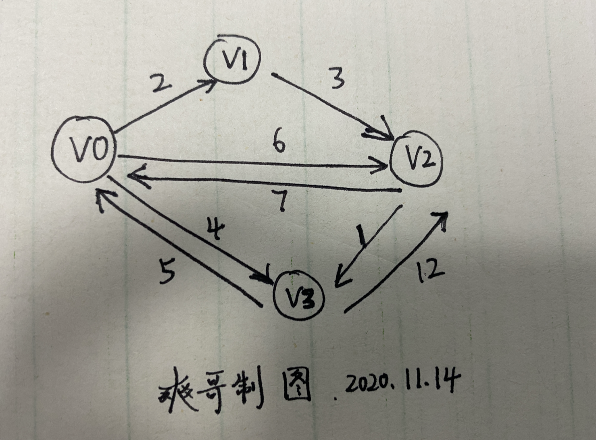
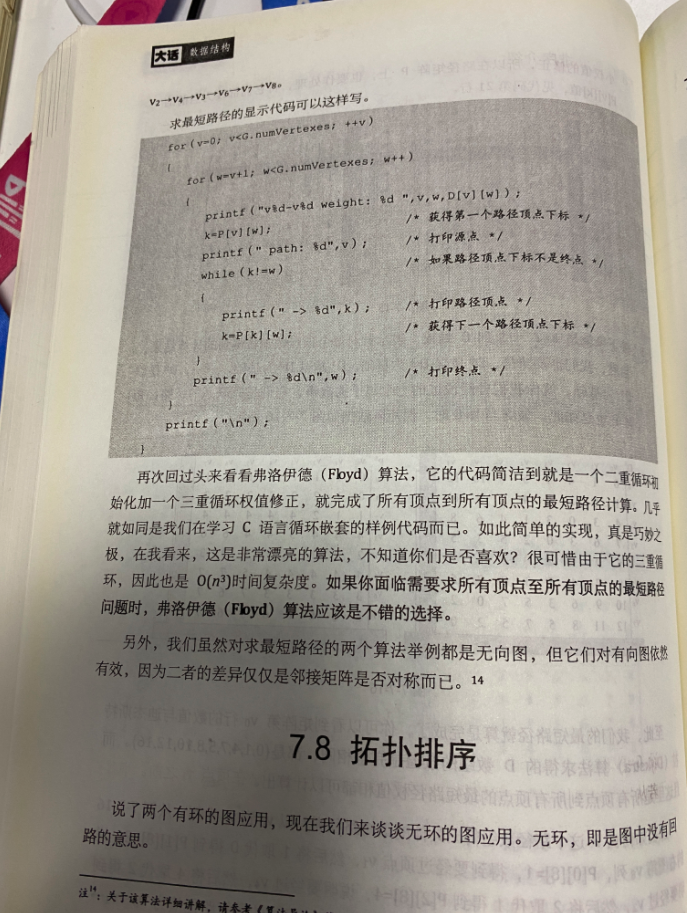

上篇的[Dijkstra算法](https://dashen.tech/2020/11/14/Dijkstra%E7%AE%97%E6%B3%95/),可以求某个确定的起始点到其他任何点的最短路径.但当需要计算任意两点间的最短距离时,Dijkstra算法就需要改变起点多次计算


而利用Floyd算法,可以求**任意**两个顶点之间的最短路径


形式非常简单,三层循环,故而也被谐称为"3f算法",时间复杂度为O(n³)

<br>





<br>


```go
package main

import "fmt"

//FMap is used to store point`s distance
var FMap [4][4]int32

//PointNum is point num
var PointNum int = 4

func main() {
	var Inf int32
	Inf = 1 << 16 //2的16次方,即65536

	initMap(Inf)

	fmt.Println("循环之前的FMap:", FMap)
	//中间点
	for k := 0; k < PointNum; k++ {
		//任意两点间距离更新
		for i := 0; i < PointNum; i++ {
			for j := 0; j < PointNum; j++ {
				if i == j {
					continue
				}
				if FMap[i][j] > FMap[i][k]+FMap[k][j] {
					FMap[i][j] = FMap[i][k] + FMap[k][j]
				}
			}
		}
	}
	fmt.Println("循环之后的FMap:", FMap)
}

//init map
func initMap(inf int32) {
	FMap[0][0] = 0
	FMap[0][1] = 2
	FMap[0][2] = 6
	FMap[0][3] = 4
	FMap[1][0] = inf
	FMap[1][1] = 0
	FMap[1][2] = 3
	FMap[1][3] = inf
	FMap[2][0] = 7
	FMap[2][1] = inf
	FMap[2][2] = 0
	FMap[2][3] = 1
	FMap[3][0] = 5
	FMap[3][1] = inf
	FMap[3][2] = 12
	FMap[3][3] = 0
}
```

输出为:


```go
循环之前的FMap: [[0 2 6 4] [65536 0 3 65536] [7 65536 0 1] [5 65536 12 0]]
循环之后的FMap: [[0 2 5 4] [9 0 3 4] [6 8 0 1] [5 7 10 0]]

```



<br>

真正核心的代码只有这寥寥几行:

**三重循环k,i,j,最内层循环的跳出当次循环条件是i==j,否则如若 m[i][j]> m[i][k]+m[k][j],变为等号即m[i][j] =  m[i][k]+m[k][j]**

(即 23 > 21+13时, 使23 = 21+13)

```go
	for k := 0; k < PointNum; k++ {
		//任意两点间距离更新
		for i := 0; i < PointNum; i++ {
			for j := 0; j < PointNum; j++ {
				if i == j {
					continue
				}
				if FMap[i][j] > FMap[i][k]+FMap[k][j] {
					FMap[i][j] = FMap[i][k] + FMap[k][j]
				}
			}
		}
    }
```


<br>


---

<br>

更多阅读:

[图的四种最短路径算法](https://blog.csdn.net/wzy_2017/article/details/78910697)

- 深度或广度优先搜索算法（解决单源最短路径）

- 弗洛伊德算法（解决多源最短路径）：时间复杂度O(n^3),空间复杂度O(n^2)

- 迪杰斯特拉算法（解决单源最短路径）

- 福特算法 (解决负权边，解决单源最短路径，前几种方法不能求含负权边的图)：时间复杂度O(nm),空间复杂度O(m)