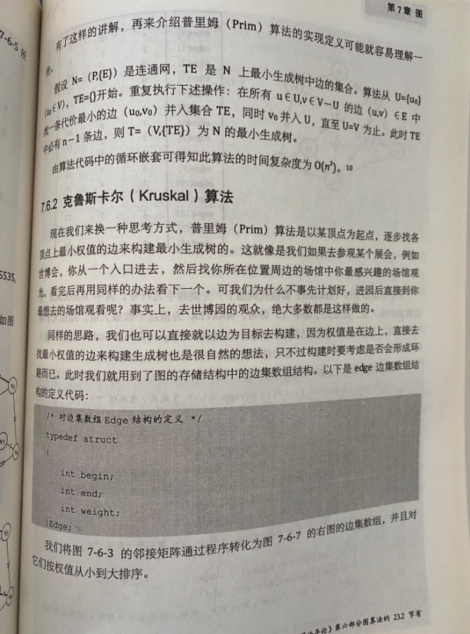
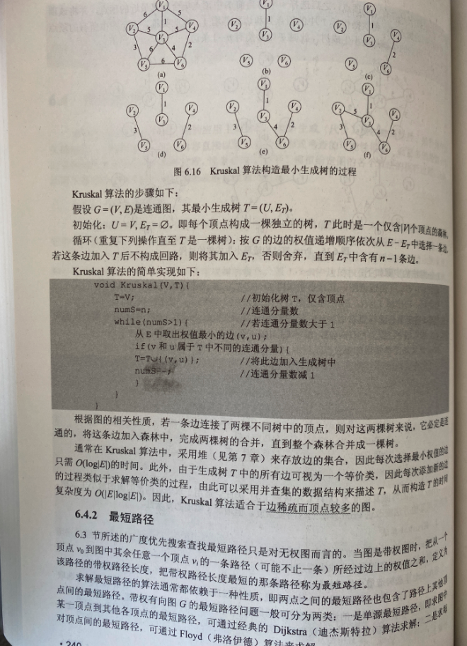
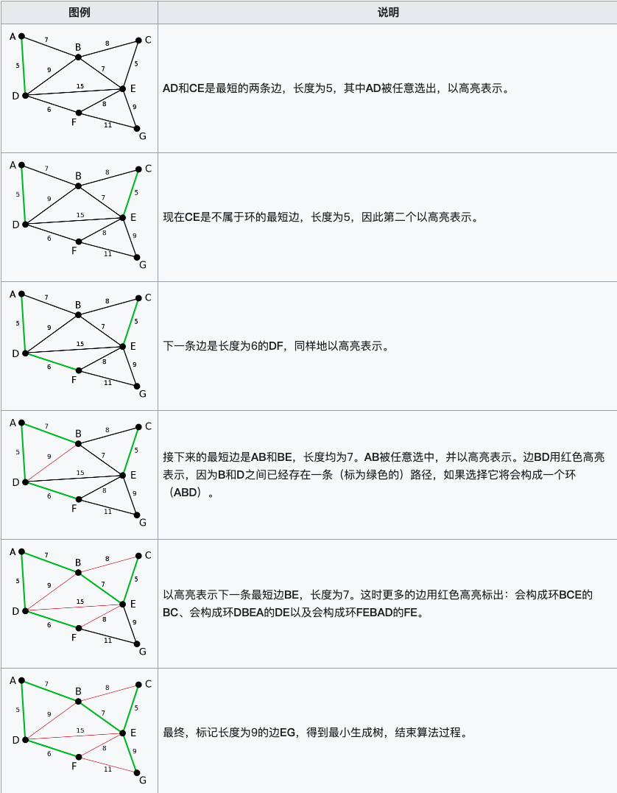
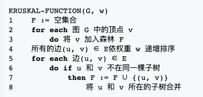

中文一般译作[**克鲁斯卡尔算法**](https://zh.wikipedia.org/wiki/%E5%85%8B%E9%B2%81%E6%96%AF%E5%85%8B%E5%B0%94%E6%BC%94%E7%AE%97%E6%B3%95)

由[**Joseph Kruskal**](https://en.wikipedia.org/wiki/Joseph_Kruskal)(犹太裔美国人,1928年1月29日--2010年9月19日)在1956年发表

用来解决同样问题的还有Prim算法和Boruvka算法等。三种算法都是贪心算法的应用

 

 

 

时间复杂度为O（eloge）（e为网中的边数）,所以适合于求边稀疏的网的最小生成树

克鲁斯卡尔算法的时间复杂度主要由排序方法决定，而其排序方法只与网中边的条数有关，而与网中顶点的个数无关，当使用时间复杂度为O（elog2e）的排序方法时，克鲁斯卡尔算法的时间复杂度即为O（log2e)

 

伪代码:

---

 

参考:

[最小生成树之Prim算法和Kruskal算法](https://www.cnblogs.com/yghjava/archive/2004/01/13/6858364.html)

[最小生成树(Kruskal(克鲁斯卡尔)和Prim(普里姆))算法动画演示](https://www.bilibili.com/video/av47042691/)

[克鲁斯卡尔算法（以边为中心，适合稀疏图）](https://blog.csdn.net/weixin_43823808/article/details/108098958)