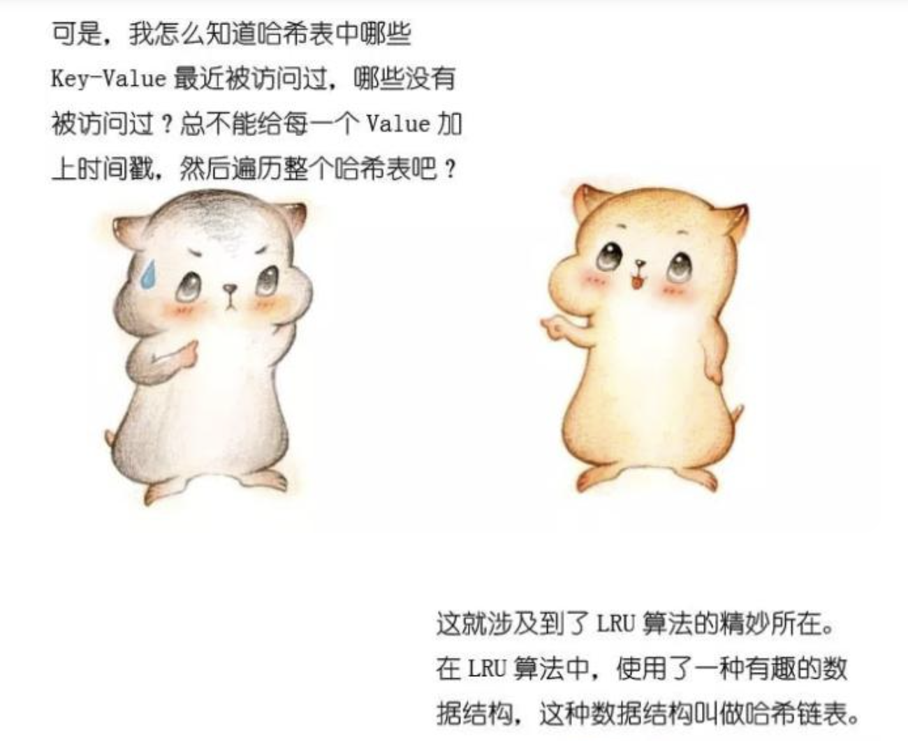
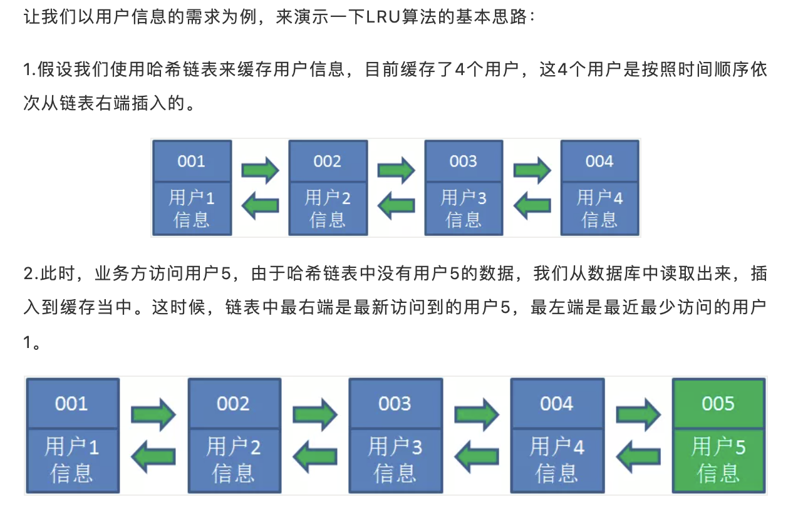
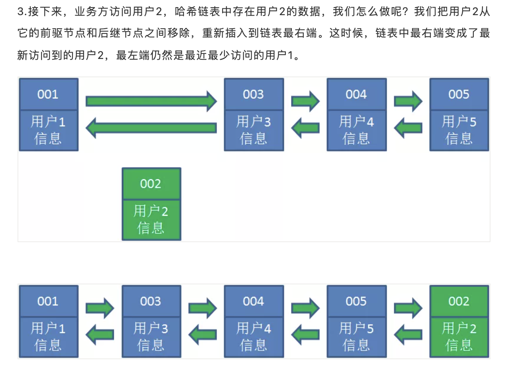
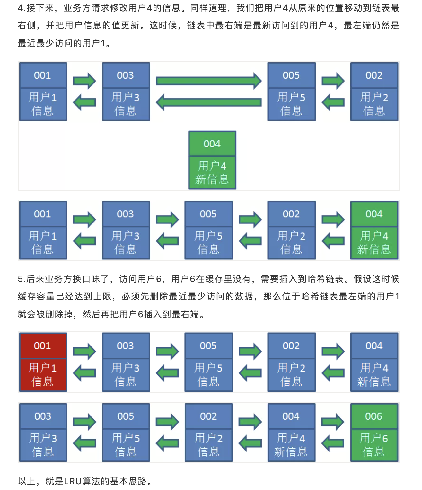
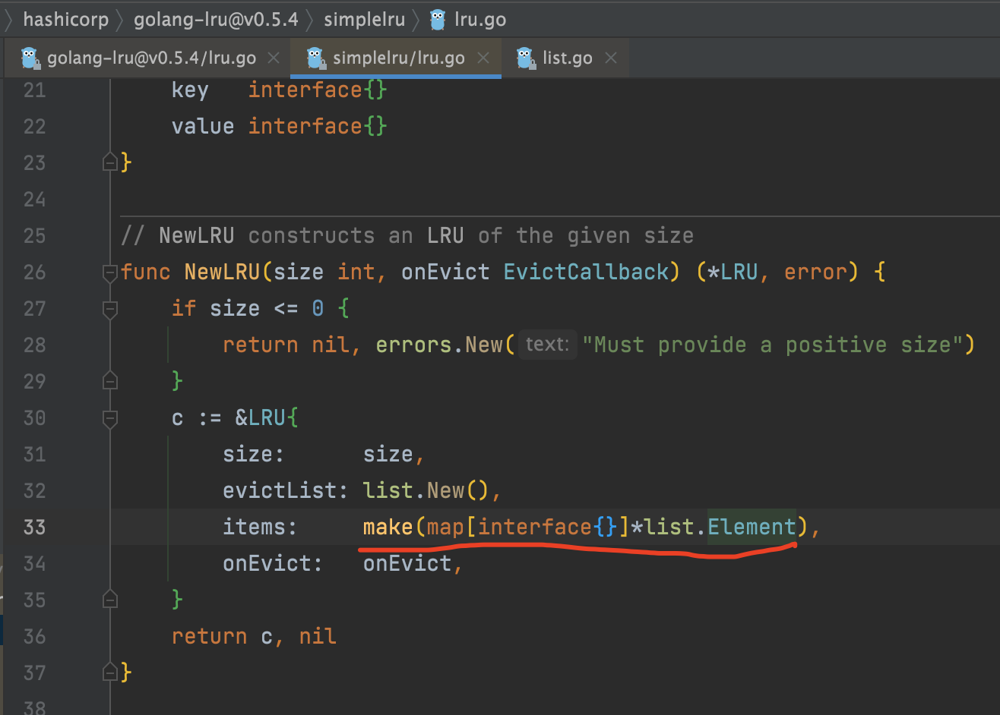
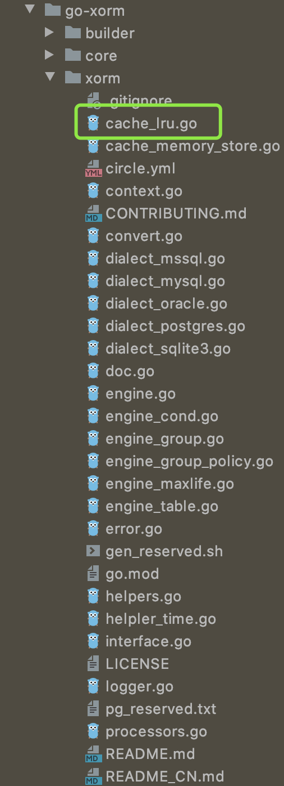

### 使用


<br>


LRU即`Least Recently Used`的缩写, 即最近最少使用，是一种常用的页面置换算法，选择`最近最久未使用`的资源予以淘汰


或者说是 一种内存管理方法，最早应用于Linux系统

*如果一个数据在最近一段时间没有被访问到，那么在将来它被访问的可能性也很小(局部性原理)*

<br>

```go
package main

import (
	"fmt"
	lru "github.com/hashicorp/golang-lru"
)

func main() {

	l, _ := lru.New(128)

	for i := 0; i < 256; i++ {
		l.Add(i, fmt.Sprintf("这是第%d号元素的值", i))
	}

	v10, ok := l.Get(10)

	if ok {
		fmt.Println("第10号key对应的值为：", v10)
	} else {
		fmt.Println("缓存中没有10号key")
	}

	v128, ok := l.Get(128)

	if ok {
		fmt.Println("第128号key对应的值为：", v128)
	} else {
		fmt.Println("缓存中没有128号key")
	}

	if l.Len() != 128 {
		panic(fmt.Sprintf("bad len: %v", l.Len()))
	}

	// 此时会"挤出"一个key
	l.Add(300, fmt.Sprintf("这是第%d号元素的值", 300))

	// 但不会是第128号key，因为在上面刚刚被get； 第129号key就成了排在队列最前面的key
	v128, ok = l.Get(128)
	if ok {
		fmt.Println("第128号key对应的值为：", v128)
	} else {
		fmt.Println("缓存中没有128号key")
	}

	v129, ok := l.Get(129)
	if ok {
		fmt.Println("第129号key对应的值为：", v129)
	} else {
		fmt.Println("缓存中没有129号key")
	}

}
```

输出为：

```go
缓存中没有10号key
第128号key对应的值为： 这是第128号元素的值
第128号key对应的值为： 这是第128号元素的值
缓存中没有129号key
```


<br>


---


<br>


### 原理

<br>

以下内容来自 [漫画：什么是 LRU 算法？](https://mp.weixin.qq.com/s/AGH9a4iTYkDiPcuL5EZYfA)




哈希链表 （Java中的LinkedHashMap）









<br>


[LRU算法四种实现方式介绍](https://blog.csdn.net/elricboa/article/details/78847305)


<br>


---

<br>


### 代码实现


<br>




可参考 [go实现LRU cache](https://segmentfault.com/a/1190000014479050)


<br>


---

<br>

### 知名项目中的使用


<br>

- XORM




- Redis底层也实现了类似LRU的回收算法


- substrate以及N多个项目中，都广泛使用到LRU

<br>

---


<br>

Golang官方提供了一个[groupcache](https://github.com/golang/groupcache)库，其中包含LRU。使用可参考[Golang groupcache LRU 缓存简介与用法](https://cloud.tencent.com/developer/article/1478020)