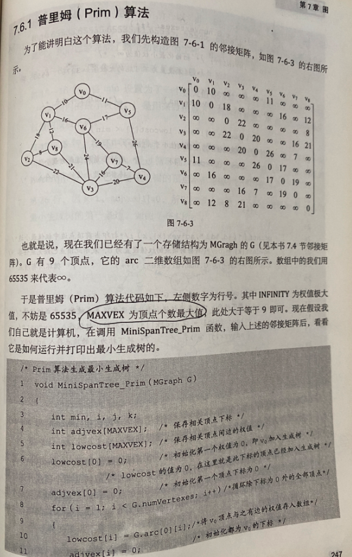

中文一般译作[**普里姆算法**](https://zh.wikipedia.org/wiki/%E6%99%AE%E6%9E%97%E5%A7%86%E7%AE%97%E6%B3%95)


该算法于1930年由捷克数学家沃伊捷赫·亚尔尼克发现；并在1957年由美国计算机科学家[**罗伯特·普里姆**](https://en.wikipedia.org/wiki/Robert_C._Prim)(Robert C. Prim,1921年出生于美国德州)独立发现；1959年，艾兹格·迪科斯彻再次发现了该算法。因此，在某些场合，普里姆算法又被称为DJP算法.


有些类似迪杰克斯拉算法





<br>


<br>


```C
//来源：严蔚敏 吴伟民《数据结构(C语言版)》

void MiniSpanTree_PRIM (MGraph G, VertexType u) {
    /*  用普利姆算法從第u個頂點出發構造網G 的最小生成樹T,輸出T的各條邊。
        記錄從頂點集U到V-U的代價最小的邊的輔助數組定義：
        struct
        {
            VertexType adjvex;
            VRtype lowcost;
        }closedge[MAX_VERTEX_NUM];
    */
    
    k = LocateVex(G, u);
    for (j = 0 ; j < G.vexnum; j++) {           //輔助數組初始化
        if (j != k)
            closedge[j] = {u, G.arcs[k][j].adj}; //{adjvex, lowcost}
    }
    closedge[k].lowcost = 0;                 //初始，U={u}
    for (i = 1; i < G.vexnum ; i++) {           //選擇其餘G.vexnum -1 個頂點
        k = minimum(closedge);              //求出T的下個結點：第k結點
        //  此时 closedge[k].lowcost = MIN{ closedge[Vi].lowcost|closedge[Vi].lowcost>0,Vi∈V-U}
        printf(closedge[k].adjvex, G.vexs[k]);    //輸出生成樹的邊
        closedge[k].lowcost = 0;             //第k條邊併入U集
        for (j = 0; j < G.vexnum; j++) {
        
            //新頂點併入U後重新選擇最小邊
            if (G.arcs[k][j].adj < closedge[j].lowcost && closedge[j].lowcost!=0) 
                closedge[j] = {G.vex[k], G.arcs[k][j].adj};
        }
    }
}
```