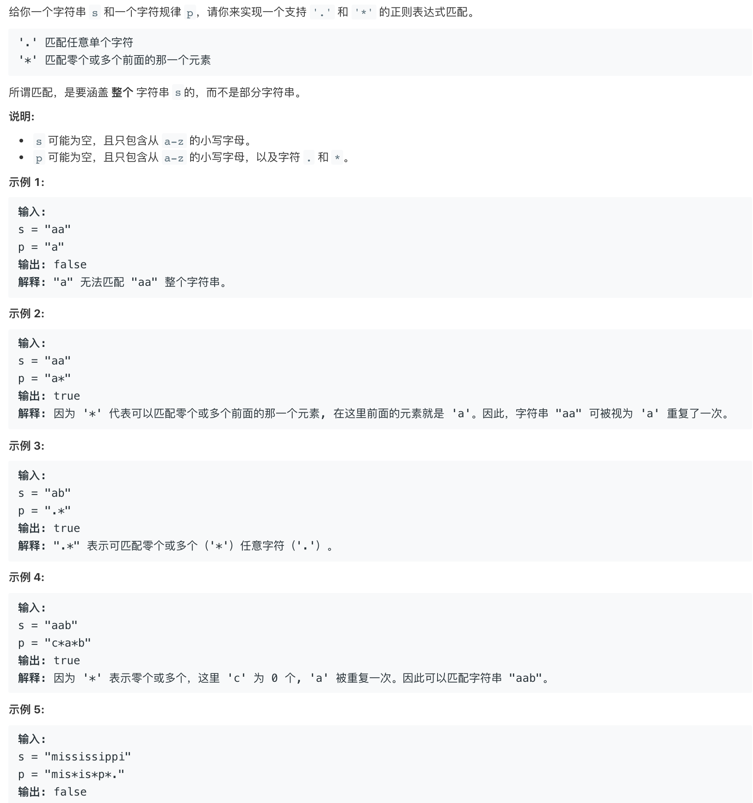
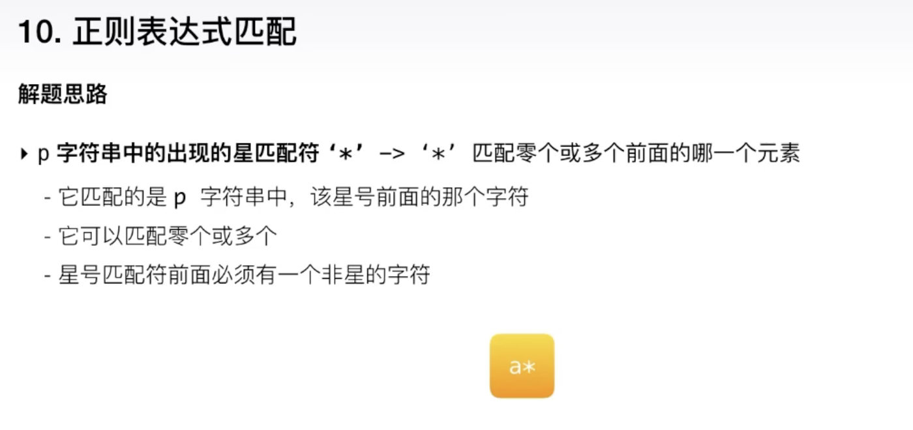
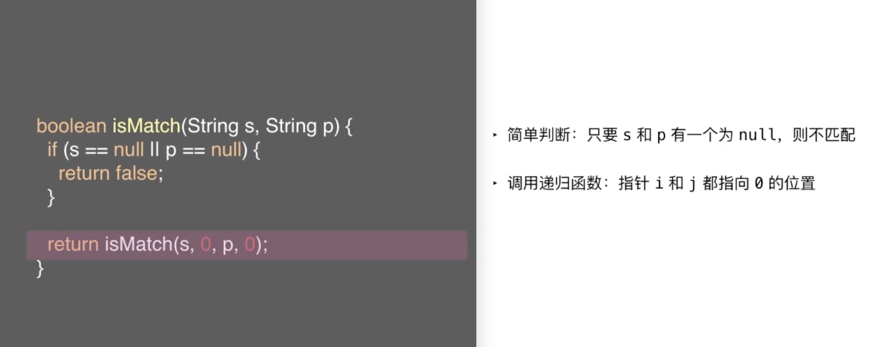
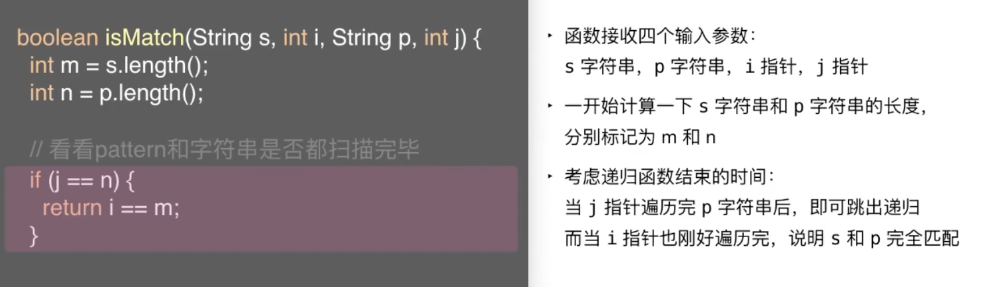
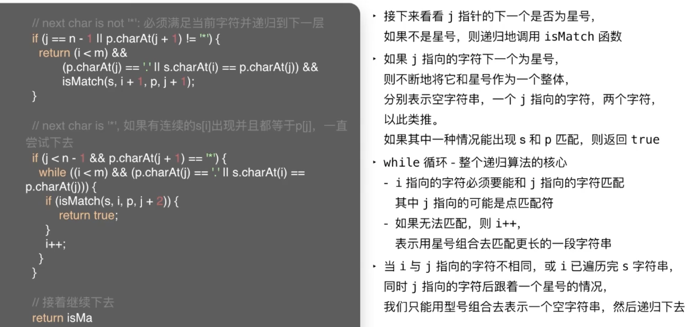
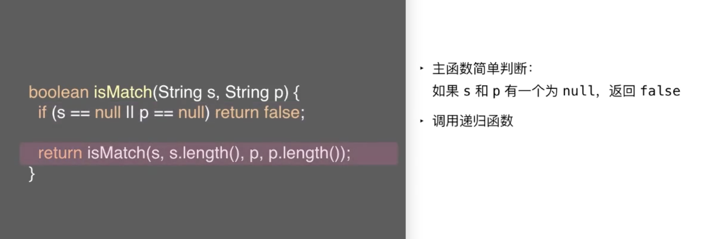
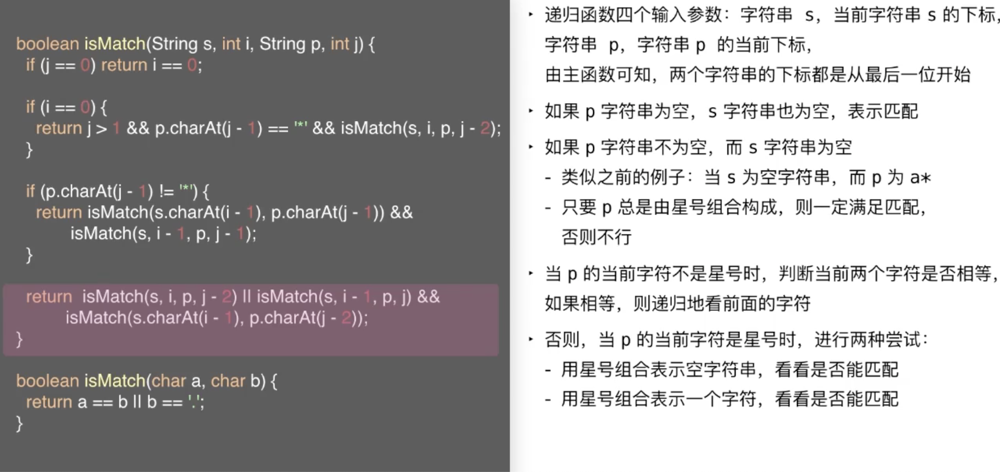
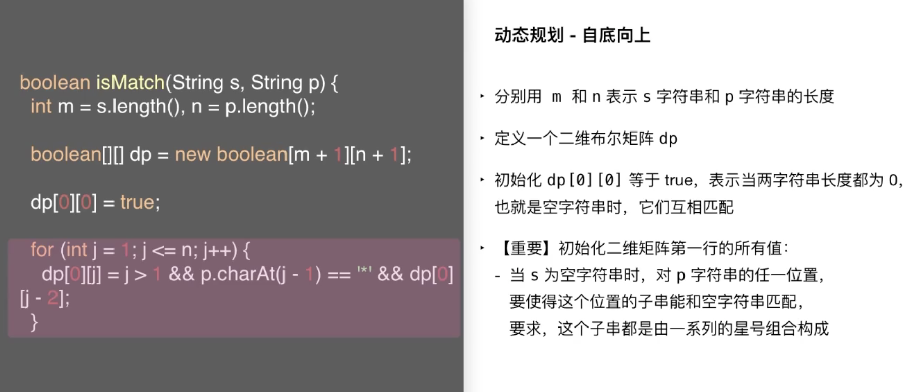
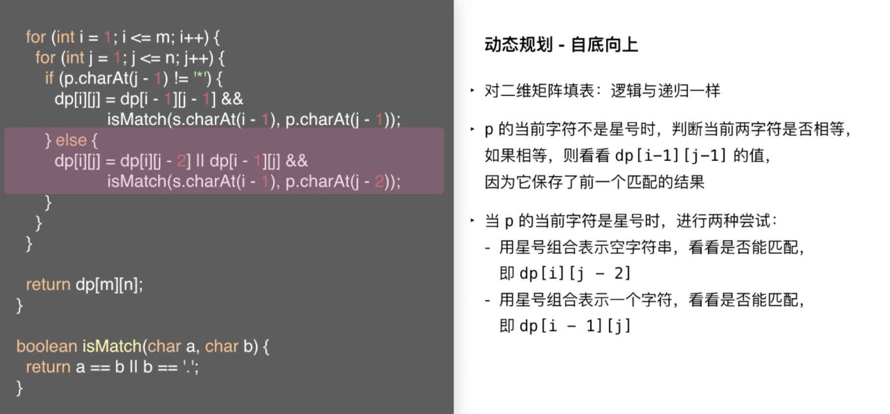

 

&此题为 **难题-正则表达式匹配** 类型的典型 &

[10. 正则表达式匹配](https://leetcode-cn.com/problems/regular-expression-matching/)

难度:  **困难**

 

经常使用正则匹配,但很少思考其背后如何实现...

在此只需要实现正则表达式里的两个小功能

 

---

 

### 递归解法1:

从前往后递归调用:

 

### 递归解法2:

从后往前递归调用:

 

---

 

一道思路相似的题目:

[leetcode-44 通配符匹配]()