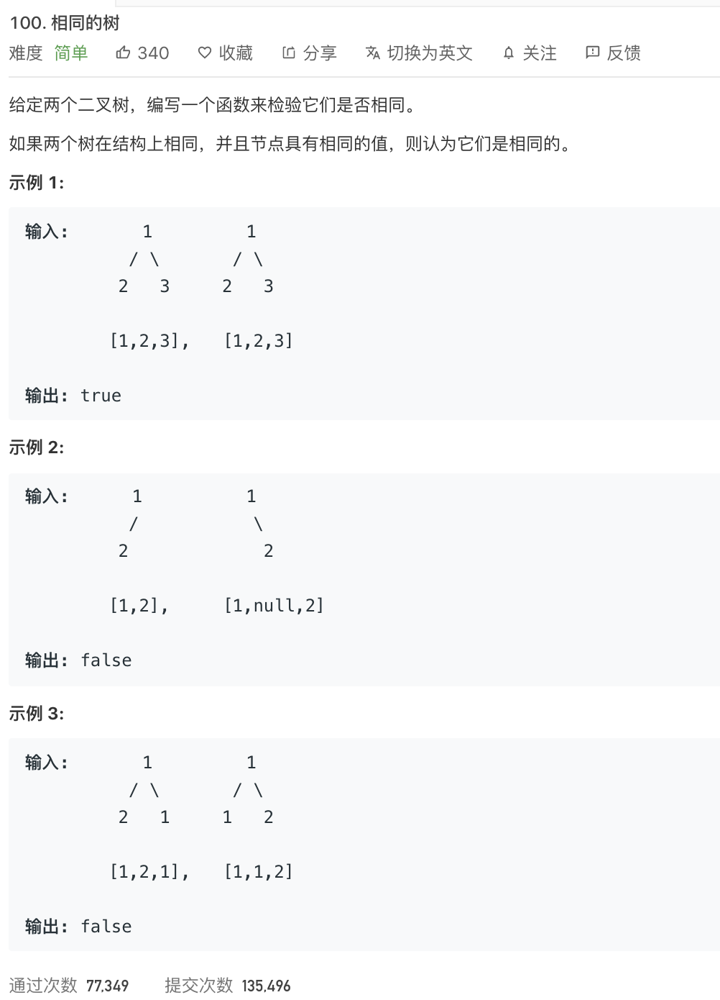

<br>


[100. 相同的树](https://leetcode-cn.com/problems/same-tree/)

难度:  <font color="green">**简单**</font>





<br>

---


<br>


```go
/**
 * Definition for a binary tree node.
 * type TreeNode struct {
 *     Val int
 *     Left *TreeNode
 *     Right *TreeNode
 * }
 */
func isSameTree(p *TreeNode, q *TreeNode) bool {

    if p == nil && q == nil {
        return true
    }

    //已经判断过了两个二叉树全为nil,并已经返回; 
    //所以此处但凡满足条件,即只要有一个是nil,另一个一定不会是nil
    if p == nil || q == nil {
        return false
    }

    if p.Val != q.Val {
        return false
    }

    return isSameTree(p.Left,q.Left) && isSameTree(p.Right,q.Right)

}
```