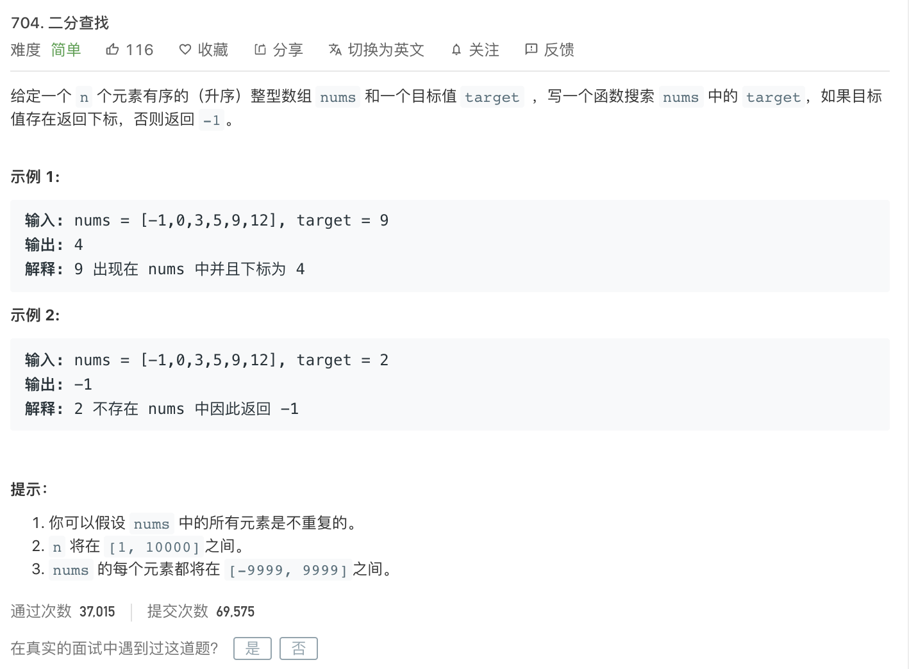

<br>


[101. 对称二叉树](https://leetcode-cn.com/problems/symmetric-tree/)

难度:  <font color="green">**简单**</font>





<br>

---

<br>


```go
/**
 * Definition for a binary tree node.
 * type TreeNode struct {
 *     Val int
 *     Left *TreeNode
 *     Right *TreeNode
 * }
 */
func isSymmetric(root *TreeNode) bool {

    if root == nil {
        return true
    }

    return isSameNode(root.Left,root.Right)    
}


func isSameNode(left *TreeNode,right *TreeNode) bool {

    if left == nil && right == nil {
        return true
    }

    if left == nil || right == nil {
        return false
    }


    if left.Val != right.Val {
        return false
    }

    return isSameNode(left.Left,right.Right) && isSameNode(left.Right,right.Left)

}

```