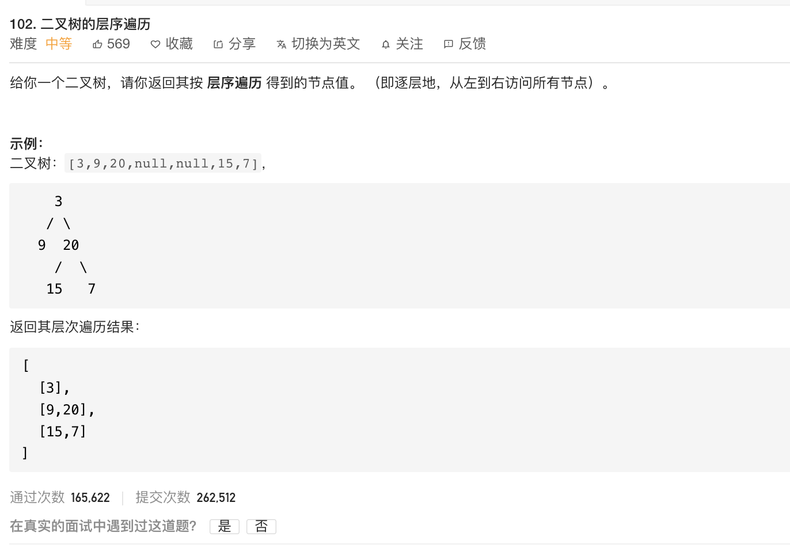

---

姊妹篇:

[107. 二叉树的层次遍历 II](https://leetcode-cn.com/problems/binary-tree-level-order-traversal-ii/)


---

<br>

[102. 二叉树的层序遍历](https://leetcode-cn.com/problems/binary-tree-level-order-traversal/)

难度:  <font color="orange">**中等**</font>





<br>


> 宽度优先搜索算法（又称广度优先搜索）是最简便的图的搜索算法之一，这一算法也是很多重要的图的算法的原型。Dijkstra单源最短路径算法和Prim最小生成树算法都采用了和宽度优先搜索类似的思想。其别名又叫BFS(Breadth First Search)，属于一种盲目搜寻法，目的是系统地展开并检查图中的所有节点，以找寻结果。


<br>

---

<br>

递归写法:

```go

//Definition for a binary tree node.
type TreeNode struct {
	Val   int
	Left  *TreeNode
	Right *TreeNode
}

var res [][]int

func levelOrder(root *TreeNode) [][]int {
	res = [][]int{}
	bfs(root, 0)
	return res

}

func bfs(root *TreeNode, level int) {
	if root != nil {
		if len(res) == level {
			res = append(res, []int{})
		}

		res[level] = append(res[level], root.Val)
		bfs(root.Left, level+1)
		bfs(root.Right, level+1)
	}
}

```


<br>


---


参考:

[二叉树的层序遍历 golang](https://blog.csdn.net/csdn_kou/article/details/105256582)