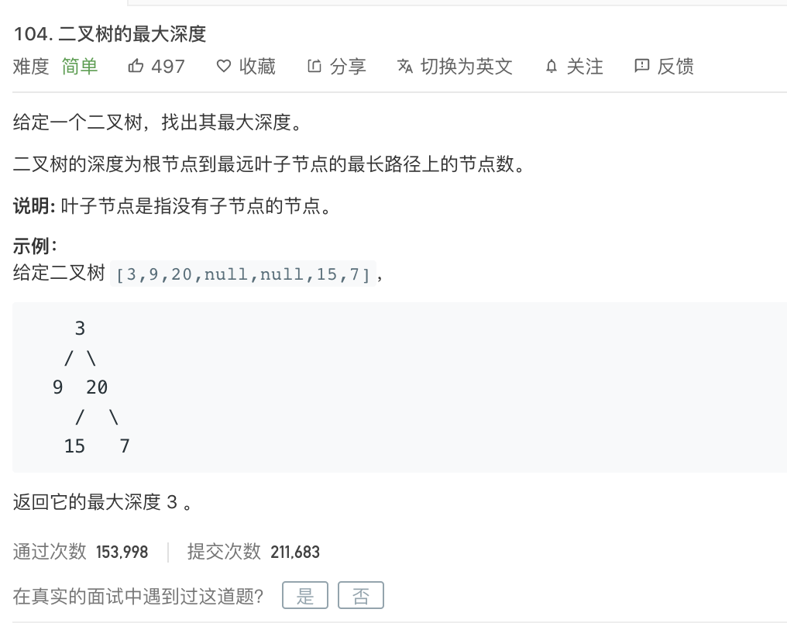

姊妹篇:

[leetcode-111 二叉树的最小深度](https://dashen.tech/2015/03/01/leetcode-111-%E4%BA%8C%E5%8F%89%E6%A0%91%E7%9A%84%E6%9C%80%E5%B0%8F%E6%B7%B1%E5%BA%A6/)

---


[104. 二叉树的最大深度](https://leetcode-cn.com/problems/maximum-depth-of-binary-tree/)

难度:  <font color="green">**简单**</font>





<br>

---

<br>


- 递归求出根节点到叶子节点的深度，输出其中最大值即可

<br>


```go
/**
 * Definition for a binary tree node.
 * type TreeNode struct {
 *     Val int
 *     Left *TreeNode
 *     Right *TreeNode
 * }
 */
func maxDepth(root *TreeNode) int {

    var res int
    
    if root == nil {
        return res
    }


    left := maxDepth(root.Left)
    right := maxDepth(root.Right)

    if left > right {
        return left + 1 //根节点也算一层
    } else {
        return right + 1
    }

}
```
