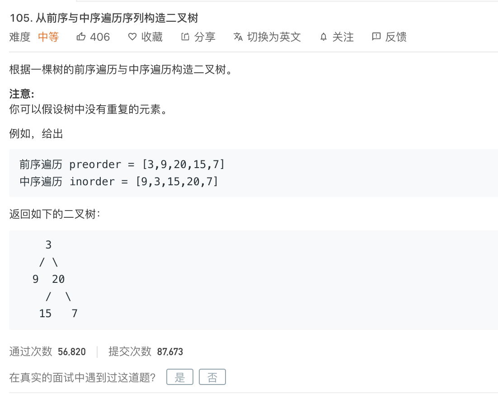

<br>


[105. 从前序与中序遍历序列构造二叉树](https://leetcode-cn.com/problems/construct-binary-tree-from-preorder-and-inorder-traversal/)

难度:  <font color="orange">**中等**</font>





<br>

---

<br>


```go
/**
 * Definition for a binary tree node.
 * type TreeNode struct {
 *     Val int
 *     Left *TreeNode
 *     Right *TreeNode
 * }
 */
func buildTree(preorder []int, inorder []int) *TreeNode {

    var root *TreeNode

    if len(preorder) < 1 || len(inorder) < 1{
        return root
    }

    left := find(inorder,preorder[0])

    if left < 0{
        return root
    }

    root = &TreeNode{
        Val:preorder[0],
        Left:buildTree(preorder[1:left+1],inorder[0:left]),
        Right:buildTree(preorder[left+1:],inorder[left+1:]),
    }
    return root
}


func find(inorder []int,target int) int {


    for i := 0; i < len(inorder);i++ {

        if  target == inorder[i] {
            return i
        }
    }

    return -1
}
```