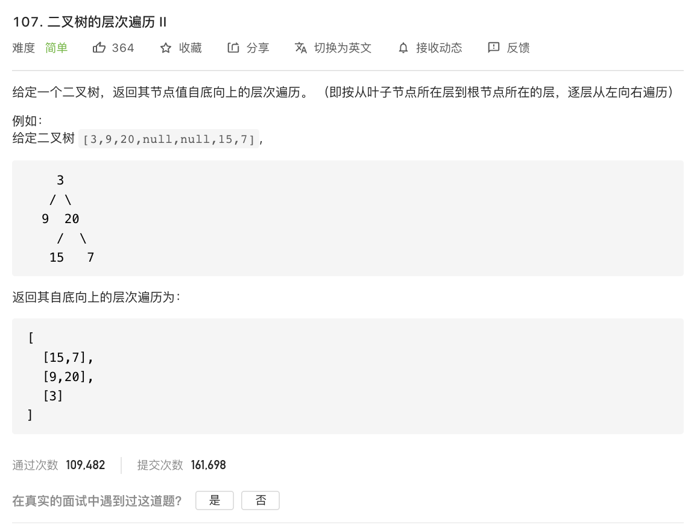

---

姊妹篇:

[102. 二叉树的层序遍历](https://leetcode-cn.com/problems/binary-tree-level-order-traversal/)


---


[107. 二叉树的层次遍历II](https://leetcode-cn.com/problems/binary-tree-level-order-traversal-ii/)

难度:  <font color="green">**简单**</font>





<br>


---


<br>

递归写法:

```go
//Definition for a binary tree node.
type TreeNode struct {
	Val   int
	Left  *TreeNode
	Right *TreeNode
}

var res [][]int

func levelOrderBottom(root *TreeNode) [][]int {
	res = [][]int{}
	bfs(root, 0)

	reverse(res)
	return res

}

func bfs(root *TreeNode, level int) {
	if root != nil {
		if len(res) == level {
			res = append(res, []int{})
		}

		res[level] = append(res[level], root.Val)
		bfs(root.Left, level+1)
		bfs(root.Right, level+1)
	}
}
func reverse(res [][]int) [][]int {
	long := len(res) - 1
	i := 0
	for long > i {
		res[long], res[i] = res[i], res[long]
		long--
		i++
	}
	return res
}

```


<br>

相比于[102. 二叉树的层序遍历](https://leetcode-cn.com/problems/binary-tree-level-order-traversal/),只是在输出前,多了一个反转的操作