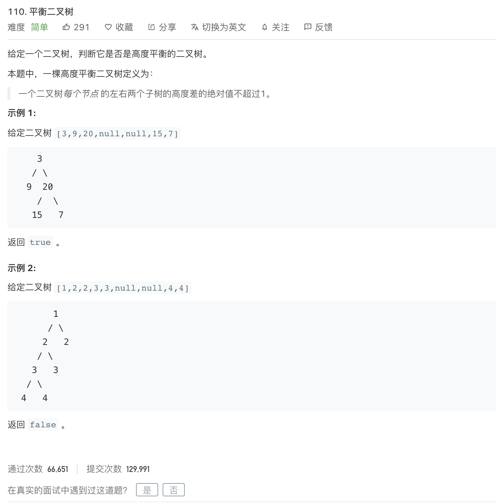

<br>

---

### 平衡二叉树（Balanced Binary Tree)

具有以下性质：

**它是一棵空树或它的左右两个子树的高度差的绝对值不超过1，并且左右两个子树都是一棵平衡二叉树。**

平衡二叉树的常用实现方法有红黑树、AVL、替罪羊树、Treap、伸展树等。 

最小二叉平衡树的节点的公式如下 F(n)=F(n-1)+F(n-2)+1 这个类似于一个递归的数列，可以参考Fibonacci数列，1是根节点，F(n-1)是左子树的节点数量，F(n-2)是右子树的节点数量。

---

<br>

[110. 平衡二叉树](https://leetcode-cn.com/problems/balanced-binary-tree/)


难度:  <font color="green">**简单**</font>




<br>


```go

package main

import "fmt"

type TreeNode struct {
	Val   int
	Left  *TreeNode
	Right *TreeNode
}

func main() {

	root := TreeNode{
		Val:   3,
		Left:  &TreeNode{Val: 9},
		Right: &TreeNode{Val: 20, Left: &TreeNode{Val: 15}, Right: &TreeNode{Val: 7}},
	}

	rs := isBalanced(&root)

	fmt.Println(rs)

}

func isBalanced(root *TreeNode) bool {

	if root == nil {
		return true
	}

	fmt.Println(111)

	if isBalanced(root.Left) && isBalanced(root.Right) && height(root.Left)-height(root.Right) <= 1 && height(root.Left)-height(root.Right) >= -1 {
		return true
	} else {
		return false
	}
}

func height(root *TreeNode) int {
	var h int

	if root == nil {
		return h
	}

	fmt.Println("左右为:", height(root.Left), height(root.Right))

	if height(root.Left) >= height(root.Right) {

		return height(root.Left) + 1
	} else {
		return height(root.Right) + 1
	}
}

```

Go Math中很多常用方法的返回值都是float..比如取绝对值,取最大值

---

<br>


[三道题套路解决递归问题](https://lyl0724.github.io/2020/01/25/1/)

如链接失效,可[点击](https://note.youdao.com/web/#/file/WEB6be23dc2fd11cbe89b41b4813e1f2560/note/WEB8fd547019ee52b7059148abcbc785d2e/)

<br>

---

<br>


