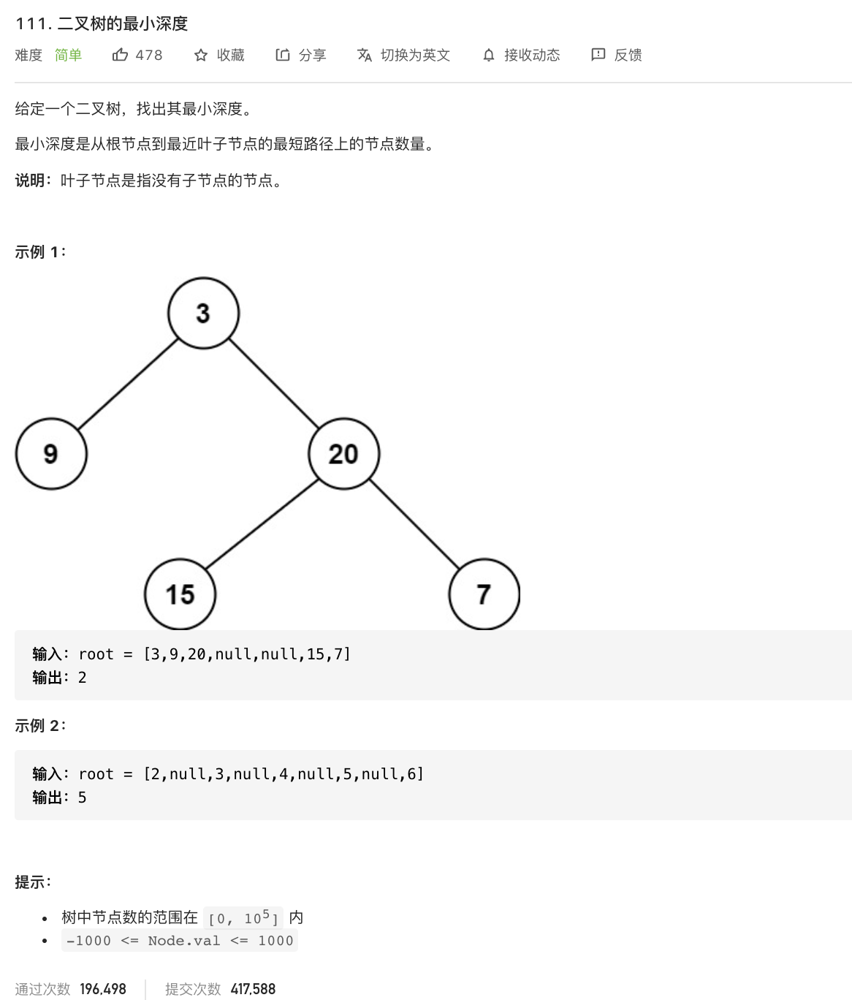

姊妹篇:

[leetcode-104 二叉树的最大深度](https://dashen.tech/2015/03/01/leetcode-104-%E4%BA%8C%E5%8F%89%E6%A0%91%E7%9A%84%E6%9C%80%E5%A4%A7%E6%B7%B1%E5%BA%A6/)

<br>

---

<br>

[111. 二叉树的最小深度](https://leetcode-cn.com/problems/minimum-depth-of-binary-tree/)

难度:  <font color="green">**简单**</font>





<br>

---

<br>

- 递归求出根节点到叶子节点的深度，输出最小值即可

<br>


```go

/**
 * Definition for a binary tree node.
 * type TreeNode struct {
 *     Val int
 *     Left *TreeNode
 *     Right *TreeNode
 * }
 */
func minDepth(root *TreeNode) int {

    if root == nil {
        return 0
    }

    if root.Left == nil {
        return minDepth(root.Right) + 1
    }

    if root.Right == nil {
        return minDepth(root.Left) + 1
    }


    //之所以定义left和right,为了防止下面return时还有再次计算
    left := minDepth(root.Left)
    right := minDepth(root.Right)
    if left  > right {
        return right + 1
    } else {
        return left + 1
    }


```


<br>

---


<br>

[三道题套路解决递归问题](https://lyl0724.github.io/2020/01/25/1/)

如链接失效,可[点击](https://note.youdao.com/web/#/file/WEB6be23dc2fd11cbe89b41b4813e1f2560/note/WEB8fd547019ee52b7059148abcbc785d2e/)

