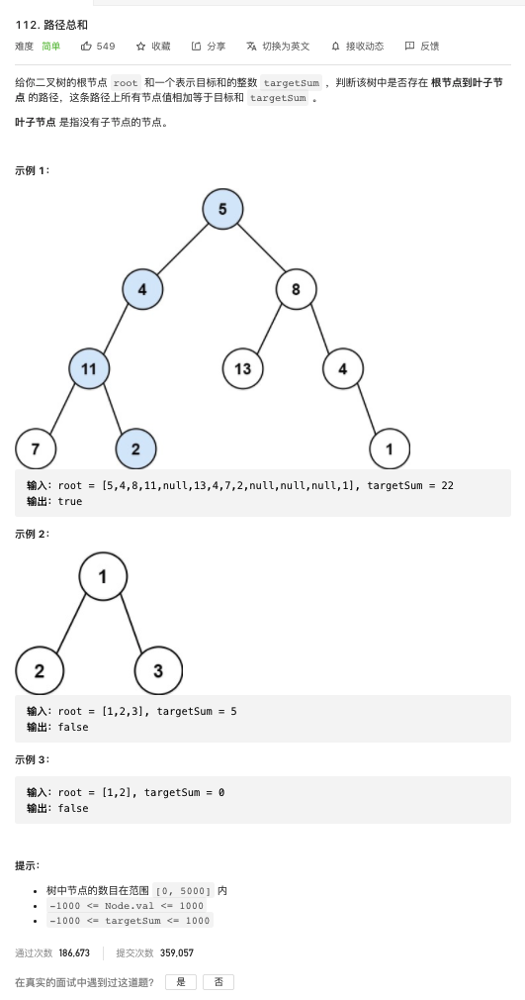

[112. 路径总和](https://leetcode-cn.com/problems/path-sum/)

难度:  <font color="green">**简单**</font>





<br>

---


<br>


- 递归求解即可

<br>


```go
/**
 * Definition for a binary tree node.
 * type TreeNode struct {
 *     Val int
 *     Left *TreeNode
 *     Right *TreeNode
 * }
 */
func hasPathSum(root *TreeNode, targetSum int) bool {

	if root == nil {
		return false
	}

	if root.Left == nil && root.Right == nil {
		return targetSum == root.Val
	}

	return hasPathSum(root.Left, targetSum-root.Val) || hasPathSum(root.Right, targetSum-root.Val)

}

```
