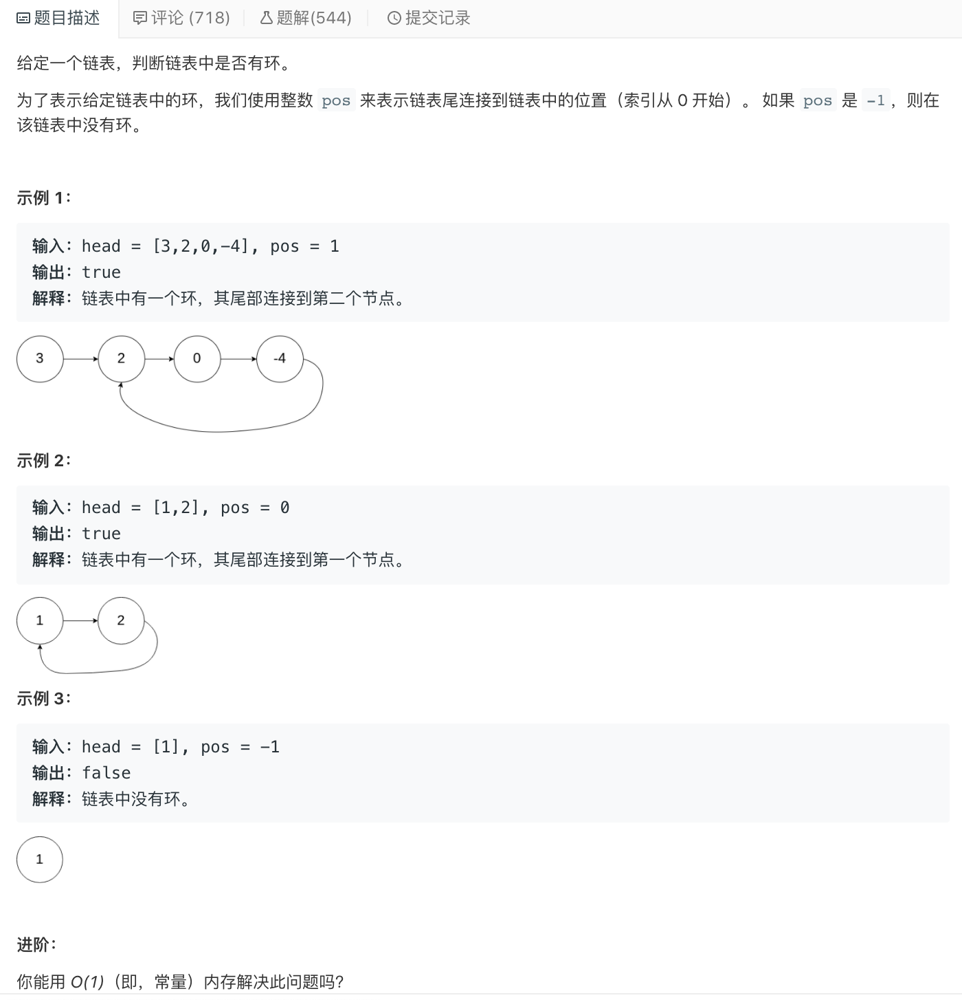
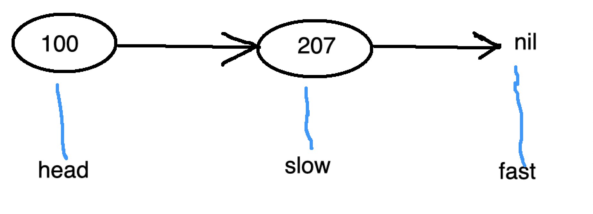

<br>


[141. 环形链表](https://leetcode-cn.com/problems/linked-list-cycle/)


难度:  <font color="green">**简单**</font>




<br>

---


### (经典的)快慢指针法:

<br>

```go
/**
 * Definition for singly-linked list.
 * type ListNode struct {
 *     Val int
 *     Next *ListNode
 * }
 */
func hasCycle(head *ListNode) bool {

    if head == nil {
        return false
    }

    slow := head
    fast := head

    for fast != nil && fast.Next != nil { //之所以还要加fast != nil的判断(且必须在前),是为了短路,防止报错,见后面的代码
        slow = slow.Next
        fast = fast.Next.Next

        if slow == fast {
            return true
        }

    }
    return false
}
```

<br>


**为何还要加`fast != nil`的判断且必须在前面?**

<br>


```go
package main

import "github.com/davecgh/go-spew/spew"

func main() {

	l0 := &ListNode{}

	l0.Val = 100

	l1 := &ListNode{}

	l1.Val = 207

	l0.Next = l1

	spew.Println(l0)

	spew.Println("--------------")

	hasCycle(l0)

}

// * Definition for singly-linked list.
type ListNode struct {
	Val  int
	Next *ListNode
}

func hasCycle(head *ListNode) bool {

	if head == nil {
		return false
	}

	slow := head
	fast := head

	for fast.Next != nil {

		spew.Println("此时慢指针的下一个节点是:", slow.Next)
		spew.Println("此时快指针的下一个节点是:", fast.Next)
		slow = slow.Next
		fast = fast.Next.Next

		spew.Println("此时慢指针的下一个节点是:", slow.Next)
		spew.Println("此时快指针的下一个节点是:", fast.Next)

		//cs := fast.Next.Next.Next.Next.Next.Next //在不打印,不判别时,不会报错,可以一直写下去
		//spew.Println(cs)

		if slow == fast {
			return true
		}
	}

	return false

}
```

<br>


输出为:

```go
<*>{100 <*>{207 <nil>}}
--------------
此时慢指针的下一个节点是: <*>{207 <nil>}
此时快指针的下一个节点是: <*>{207 <nil>}
此时慢指针的下一个节点是: <nil>
panic: runtime error: invalid memory address or nil pointer dereference
[signal SIGSEGV: segmentation violation code=0x1 addr=0x8 pc=0x10be51e]

goroutine 1 [running]:
main.hasCycle(0xc0000102d0, 0x1)
	/Users/shuangcui/go/src/leetcode/141.go:49 +0x1ae
main.main()
	/Users/shuangcui/go/src/leetcode/141.go:21 +0xfb
exit status 2
```


如上代码中,传入一个有两个元素的链表. 

因为 快指针fast 不是顺次遍历,而是跳跃,如果不加**fast != nil**的条件,且不放在判别式的前面, 就会出现如上报错,即在判定(或打印)下下个指针时,会出现越界而报错.


第一次遍历后,各变量指针的指向:



如果不加**fast != nil**的条件,且不放在判别式的前面,那fast.Next越界而发生panic