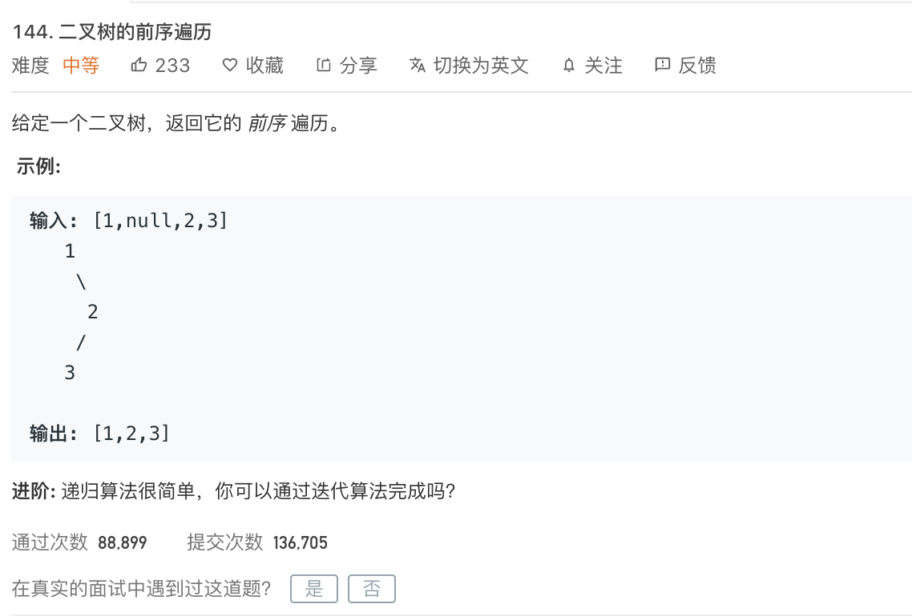

---
姊妹篇:

[leetcode-94 二叉树的中序遍历](http://www.dashen.tech/2015/03/01/leetcode-94-%E4%BA%8C%E5%8F%89%E6%A0%91%E7%9A%84%E4%B8%AD%E5%BA%8F%E9%81%8D%E5%8E%86/)

[leetcode-145 二叉树的后序遍历](http://www.dashen.tech/2015/03/01/leetcode-145-%E4%BA%8C%E5%8F%89%E6%A0%91%E7%9A%84%E5%90%8E%E5%BA%8F%E9%81%8D%E5%8E%86/)


---


<br>

[144. 二叉树的前序遍历](https://leetcode-cn.com/problems/binary-tree-preorder-traversal/)

难度:  <font color="orange">**中等**</font>





<br>

---


### 递归解法:

<br>

```go
/**
 * Definition for a binary tree node.
 * type TreeNode struct {
 *     Val int
 *     Left *TreeNode
 *     Right *TreeNode
 * }
 */
func preorderTraversal(root *TreeNode) []int {


    var res []int = make([]int, 0)

    if root == nil {
        return res
    }

    res = append(res,root.Val)


    //递归调用,遍历左节点;temp用来承接返回的值
    temp := preorderTraversal(root.Left)
    res = append(res,temp...)

    //遍历右节点
    temp = preorderTraversal(root.Right)
    res = append(res,temp...)

    return res

}
```


<br>

---

<br>

### 迭代解法:

<br>

[参考](https://leetcode-cn.com/problems/binary-tree-preorder-traversal/solution/shu-de-qian-xu-bian-li-fei-di-gui-fang-fa-zhan-by-/)