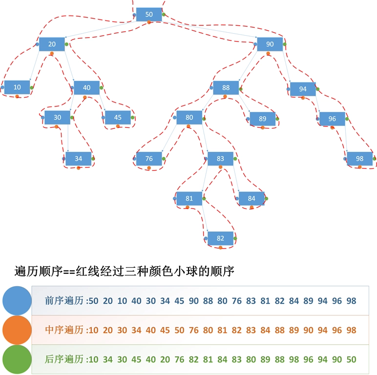
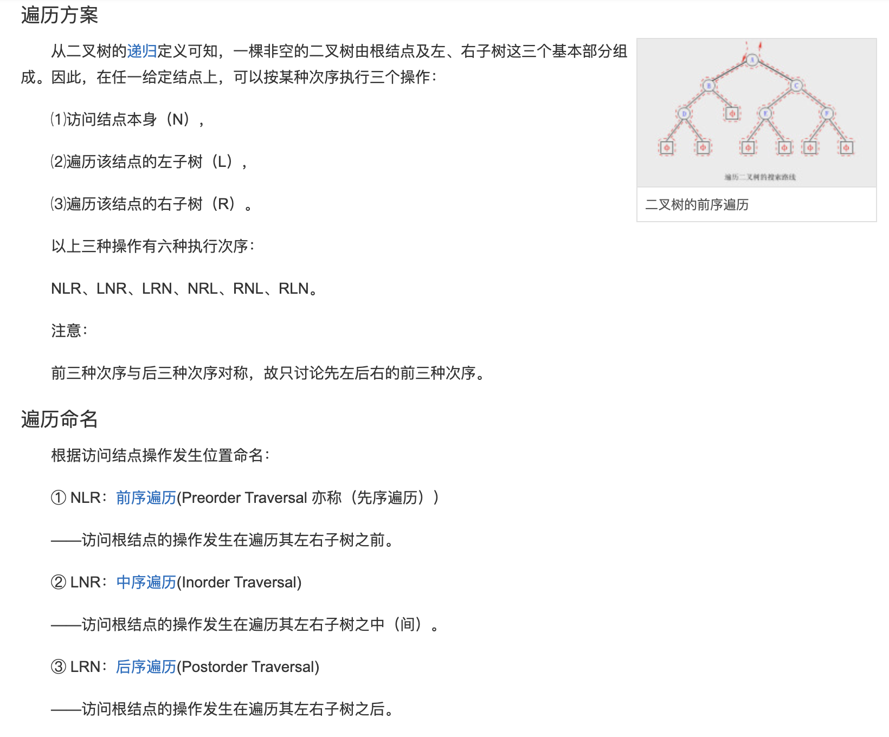
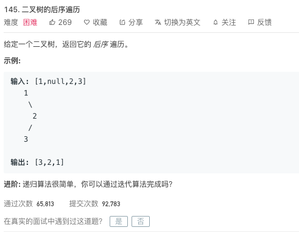

<br>




---
姊妹篇:

[leetcode-94 二叉树的中序遍历](http://www.dashen.tech/2015/03/01/leetcode-94-%E4%BA%8C%E5%8F%89%E6%A0%91%E7%9A%84%E4%B8%AD%E5%BA%8F%E9%81%8D%E5%8E%86/)

[leetcode-144 二叉树的前序遍历](http://www.dashen.tech/2015/03/01/leetcode-144-%E4%BA%8C%E5%8F%89%E6%A0%91%E7%9A%84%E5%89%8D%E5%BA%8F%E9%81%8D%E5%8E%86/)


---


> 后序遍历（LRD）是二叉树遍历的一种，也叫做后根遍历、后序周游，可记做**左右根**。后序遍历有递归算法和非递归算法两种。在二叉树中，先左后右再根，即首先遍历左子树，然后遍历右子树，最后访问根结点。遍历路径为 **＞**


### 为何"Postorder Traversal"缩写为`LRD`?

<br>

**LRD其实是指遍历的顺序:**


- L为left
- R为right
- D为根节点,因为root与right首字母相同,为免歧义,用`D`代指根节点(Data),有的地方也用`N`来代指(Node)

<br>




<br>


相应的,前序遍历(Preorder Traversal ,DLR)和中序遍历(Inorder Traversal ,LDR)如下:

> 前序遍历（DLR），是二叉树遍历的一种，也叫做先根遍历、先序遍历、前序周游，可记做**根左右**。前序遍历首先访问根结点然后遍历左子树，最后遍历右子树。遍历路径为 **＜**


> 中序遍历（LDR），是二叉树遍历的一种，也叫做中根遍历、中序周游，可记做**左根右**。在二叉树中，中序遍历首先遍历左子树，然后访问根结点，最后遍历右子树。遍历路径为 **∧**


<br>


<font color="#FF3030">所谓的"前/中/后",是指访问到**根节点**的次序</font>

<br>

---


<br>

[145. 二叉树的后序遍历](https://leetcode-cn.com/problems/binary-tree-postorder-traversal/)

难度:  <font color="red">**困难**</font>





<br>

---

<br>


### 递归写法:

<br>


```go
/**
 * Definition for a binary tree node.
 * type TreeNode struct {
 *     Val int
 *     Left *TreeNode
 *     Right *TreeNode
 * }
 */
func postorderTraversal(root *TreeNode) []int {
    var res []int = make([]int,0)

    if root == nil {
        return res
    }

    //递归一定要写好终止条件
    temp := postorderTraversal(root.Left)
    res = append(res,temp...)

    temp = postorderTraversal(root.Right)
    res = append(res,temp...)

    res = append(res,root.Val)

    return res
}

```

时间复杂度/空间复杂度均为O(n)