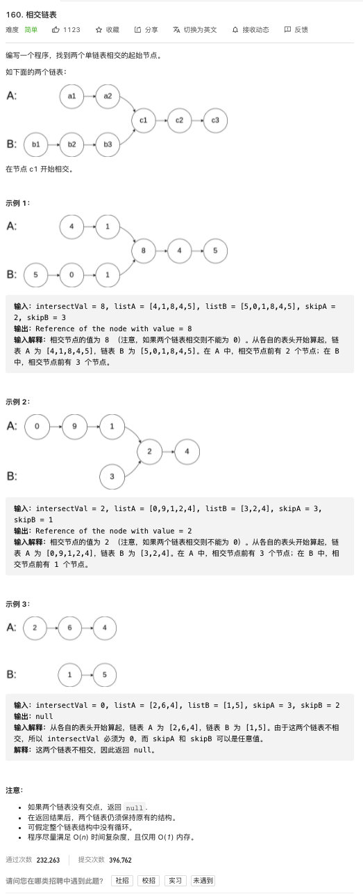

[160. 相交链表](https://leetcode-cn.com/problems/intersection-of-two-linked-lists/)

难度:  **简单**

 

---

https://www.cnblogs.com/yxh-amysear/p/9608796.html

http://c.biancheng.net/view/8250.html

https://zhuanlan.zhihu.com/p/83138917