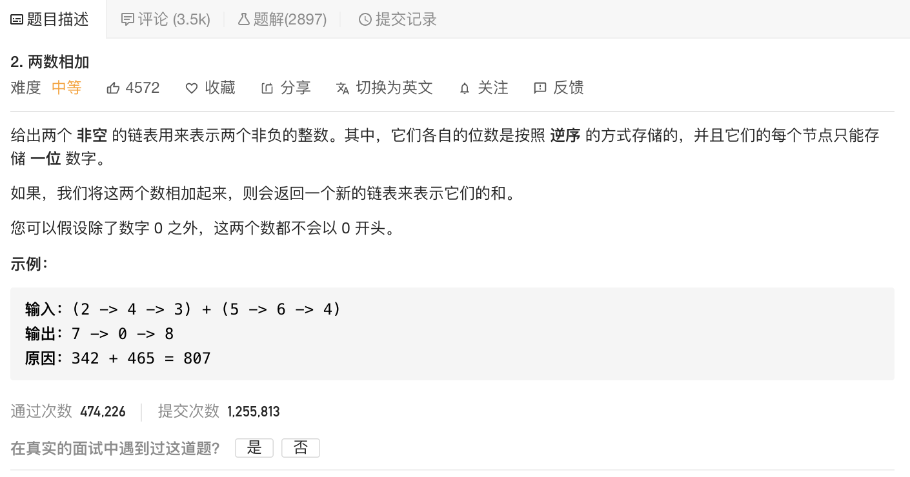

 

*那本[GPAI]1.3节内容(第29页),如何计算两个单链表所代表的数之和*

[2. 两(个单链表所代表的)数相加](https://leetcode-cn.com/problems/add-two-numbers/)

难度:  **中等**

 

---

### 方法一: 整数相加法

分别遍历两个链表,求出两个链表所代表的整数的值,而后将两个整数相加,最后将和用链表形式表示出来;

这种方法优点是计算简单,但当链表所代表的整数非常大(超出了int64的范围),就无法使用该法了.

 

### 方法二: 链表相加法