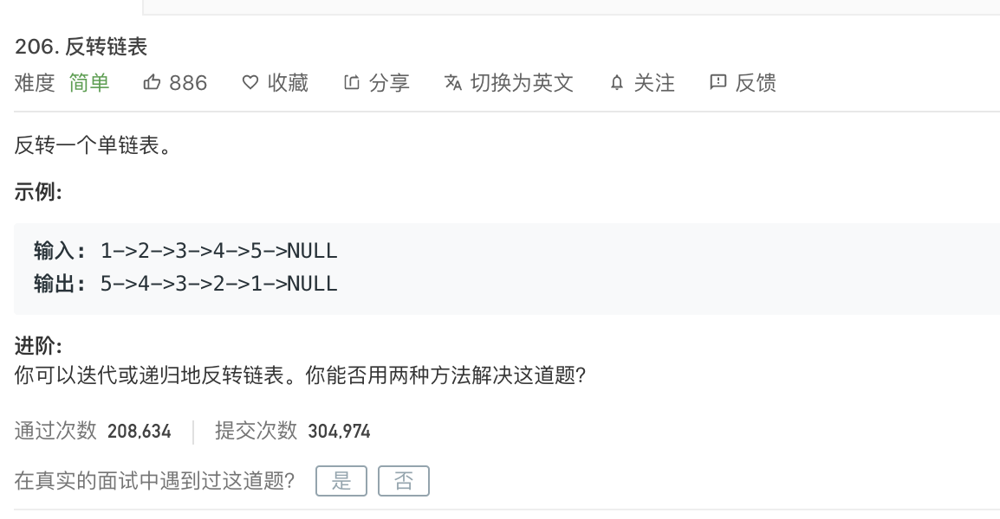
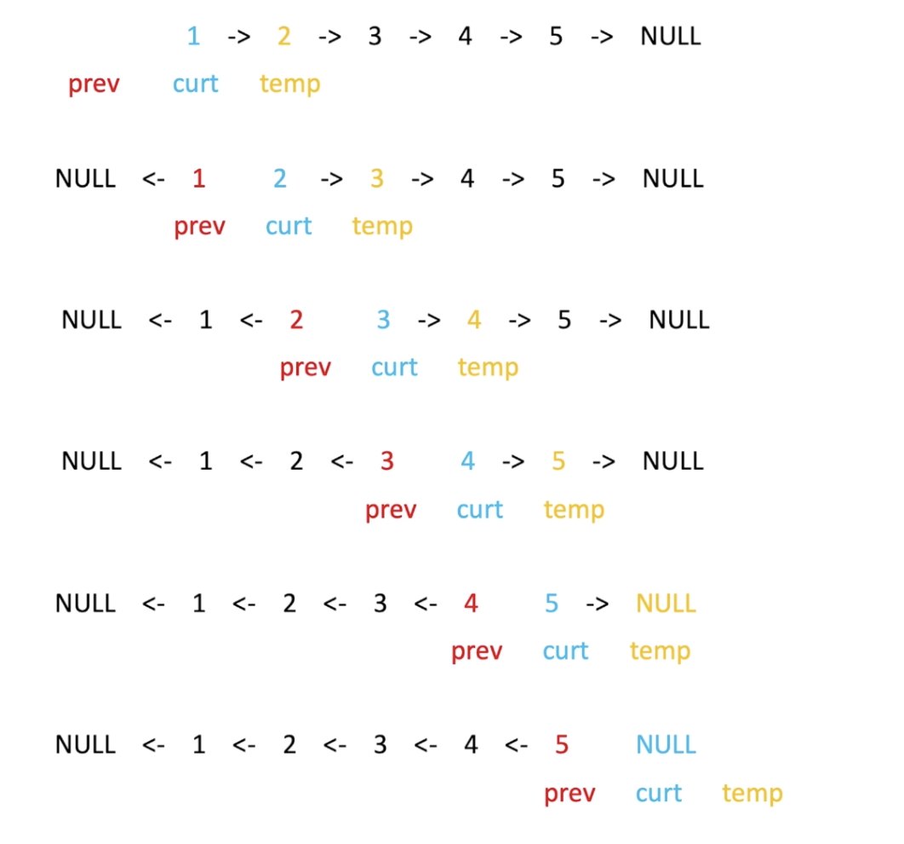

<br>


&也许是面试中最常考察的算法题... &


[206. 反转链表](https://leetcode-cn.com/problems/reverse-linked-list/)

难度:  <font color="green">**简单**</font>





<br>

---


<br>

所给代码中已经定义好了一个单链表

```go
/**
 * Definition for singly-linked list.
 * type ListNode struct {
 *     Val int
 *     Next *ListNode
 * }
 */
func reverseList(head *ListNode) *ListNode {


    if head == nil {
        return head
    }

    var prev *ListNode

    var curt *ListNode = head

    for curt != nil {
        //var temp *ListNode = curt.Next  //暂存下一个节点

    //指针反转
        //curt.Next = prev

    //往下走一步
       // prev = curt
        //curt = temp


        //三者交换value..可以不引入temp中间变量;但结合下图,还是用之前引入temp变量的写法更好理解
        curt.Next,prev,curt = prev,curt,curt.Next
    }

    return prev

}
```

<br>





图片来自:[大圣算法](https://www.bilibili.com/video/av68131315)

---

<br>

升级款:

[leetcode-92 反转链表II](http://www.dashen.tech/2015/03/01/leetcode-92-%E5%8F%8D%E8%BD%AC%E9%93%BE%E8%A1%A8II/)


