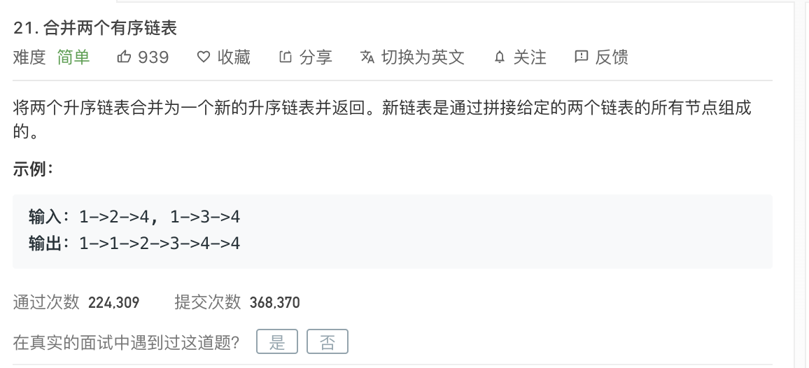

<br>


&此题为使用 **链表/ Linked List** 求解的典型&


[21. 合并两个有序链表](https://leetcode-cn.com/problems/merge-two-sorted-lists/submissions/)


难度:  <font color="green">**简单**</font>





<br>


---

<br>

```go
/**
 * Definition for singly-linked list.
 * type ListNode struct {
 *     Val int
 *     Next *ListNode
 * }
 */
func mergeTwoLists(l1 *ListNode, l2 *ListNode) *ListNode {

    var dummy *ListNode = &ListNode{}

    var curr *ListNode = dummy

    for l1 != nil && l2 != nil {

        if l1.Val < l2.Val {
            curr.Next = &ListNode{Val:l1.Val}
            l1 = l1.Next
        } else {

            curr.Next = &ListNode{Val:l2.Val}
            l2 = l2.Next

        }

        curr = curr.Next

    }

    if l1 != nil {
        curr.Next = l1
    }

    if l2 != nil {
        curr.Next = l2
    }

    return dummy.Next
}
```