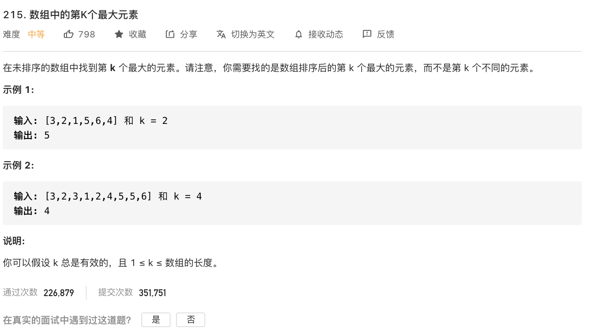

姊妹问题: [面试题 17.14. 最小K个数](https://leetcode-cn.com/problems/smallest-k-lcci/)

<br>

~~&此题为使用 **快速排序** 进行求解的典型 &~~

<br>

因为第K个,正好对应快排枢纽值pivot右侧的元素

但因为此题没有时间/空间复杂度要求,可以用任何排序.

也可以使用**堆排序**中*堆化*部分的代码,只选出前K个最大元素.

<br>

形式上最简单的就是先不管,排好序,(如果是从大到小排)然后再取第K个,即为第K大的元素


在此使用堆排序


[215. 数组中的第K个最大元素](https://leetcode-cn.com/problems/kth-largest-element-in-an-array/)

难度:  <font color="orange">**中等**</font>




```go
func findKthLargest(nums []int, k int) int {
    heapSort(nums)
    return nums[len(nums)-k]
}

type Heap struct {
	arr  []int // 用来存储堆的数据
	size int   // 用来标识堆的大小
}

func createHeap(arr []int) (h Heap) {
	h.arr = arr
	h.size = len(arr)

	//非常标志性的特点,i--
	for i := h.size / 2; i >= 0; i-- {
		adjustHeap(h, i)
	}
	return
}

func adjustHeap(h Heap, parentNode int) {
	leftNode := parentNode*2 + 1
	rightNode := parentNode*2 + 2

	maxNode := parentNode
	if leftNode < h.size && h.arr[maxNode] < h.arr[leftNode] {
		maxNode = leftNode
	}
	if rightNode < h.size && h.arr[maxNode] < h.arr[rightNode] {
		maxNode = rightNode
	}

	if maxNode != parentNode {
		h.arr[maxNode], h.arr[parentNode] = h.arr[parentNode], h.arr[maxNode]
		adjustHeap(h, maxNode)
	}
}

func heapSort(arr []int) {
	h := createHeap(arr)

	for h.size > 0 {
		// 将最大的数值调整到堆的末尾
		h.arr[0], h.arr[h.size-1] = h.arr[h.size-1], h.arr[0]
		// 减少堆的长度
		h.size--
		// 由于堆顶元素改变了，而且堆的大小改变了，需要重新调整堆，维持堆的性质
		adjustHeap(h, 0)
	}
}

```

<br>


如果时间复杂度要求是O(N),可参考:

[Top K 问题](https://leetcode-cn.com/problems/kth-largest-element-in-an-array/solution/shu-zu-zhong-de-di-kge-zui-da-yuan-su-by-leetcode-/)


[找出一个数组里面前K个最大数](https://www.cnblogs.com/myittec/archive/2011/07/20/2392869.html)

