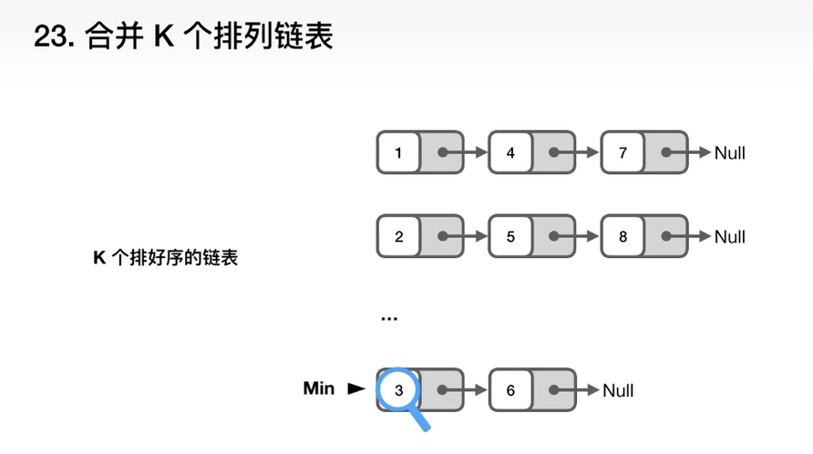
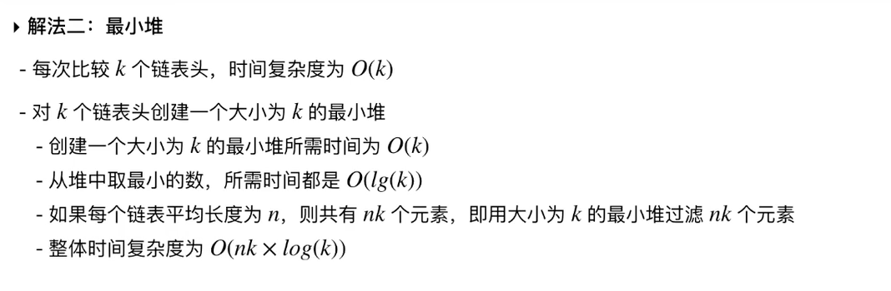
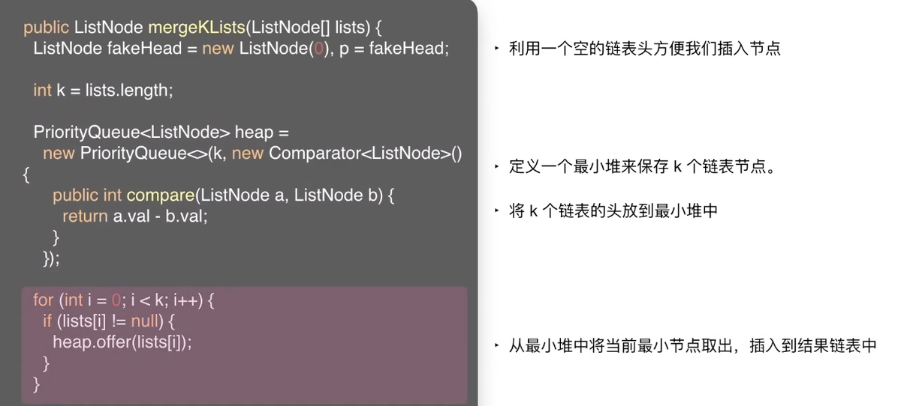
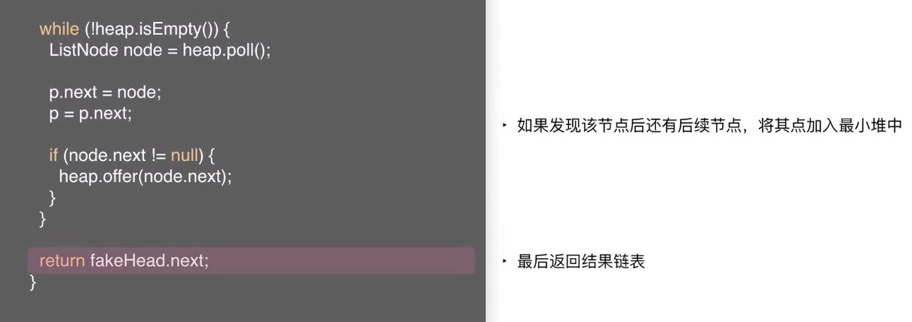
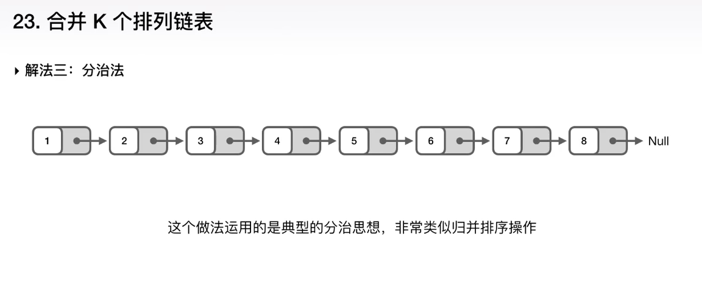
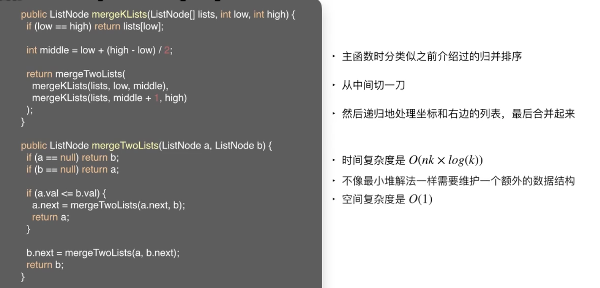

 

&此题为 **高频面试题** 的典型 &

[23. 合并K个排序链表](https://leetcode-cn.com/problems/merge-k-sorted-lists/)

难度:  **困难**

 

### 解法1:暴力法

用一个数组保存所有链表中的数,然后进行排序,从头到尾将数组遍历,生成一个排好序的链表;

假设每个链表的平均长度为n,则整体的时间复杂度为O(nk * log(nk))

 

### 解法2:最小堆

 

一直维护这个大小为k的最小堆

 

### 解法3:分治法

 

