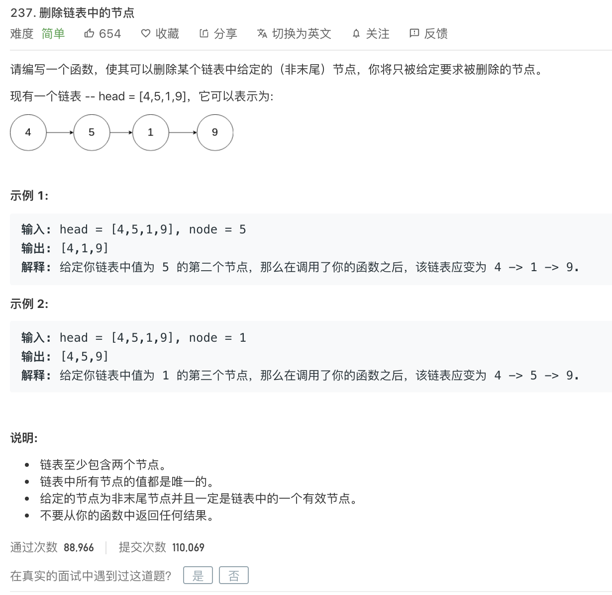

<br>


[237. 删除链表中的节点](https://leetcode-cn.com/problems/delete-node-in-a-linked-list/)

难度:  <font color="green">**简单**</font>





<br>

---

<br>


```go
/**
 * Definition for singly-linked list.
 * type ListNode struct {
 *     Val int
 *     Next *ListNode
 * }
 */
func deleteNode(node *ListNode) {
    if node == nil {
        return
    }
    node.Val = node.Next.Val
    node.Next = node.Next.Next

}
```

<br>

---