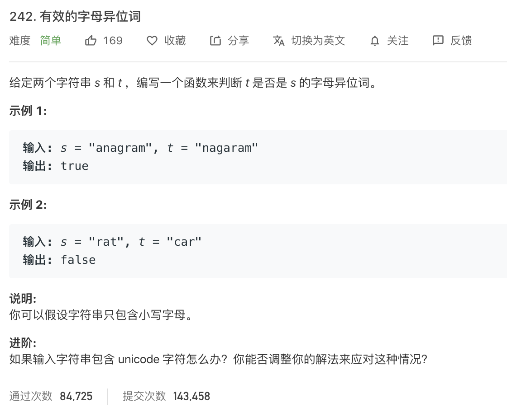

<br>


&此题为使用  **数组,字符串 /Array&String** 求解的典型&

[242. 有效的字母异位词](https://leetcode-cn.com/problems/valid-anagram/)

难度:  <font color="green">**简单**</font>





<br>


```go
package main

import (
	"fmt"
)

func main() {

	s := "anagram"
	t := "nagaram"
	rs := isAnagram(s, t)

	fmt.Println(rs)

}

func isAnagram(s string, t string) bool {

    if len(s) != len(t) {
		return false
    }
    
	//各维护一个map,字母为key,出现次数为value,各循环一遍;
	//然后进行比较

	m1 := make(map[rune]int) //rune即int32
	m2 := make(map[int32]int)

	for _, item := range s {
		//ok判别式
		if _, ok := m1[item]; ok {
			m1[item]++
		} else {
			m1[item] = 1
		}
		//fmt.Println(reflect.TypeOf(item))
		//fmt.Println(m1)
	}

	for _, item := range t {
		//ok判别式
		if _, ok := m2[item]; ok {
			m2[item]++
		} else {
			m2[item] = 1
		}
	}

	//fmt.Println(m2)

	//判断m1和m2是否一致
	//两个map之间没法没接用"=="比较,"=="只能用来判断map是否为nil
	//可以使用reflect.DeepEqual来"深度比较"两个map是否"相同"

	if len(m1) != len(m2) {
		return false
	}

	for k := range m1 {

		if m1[k] != m2[k] {
			return false
		}
	}
	return true
}
```