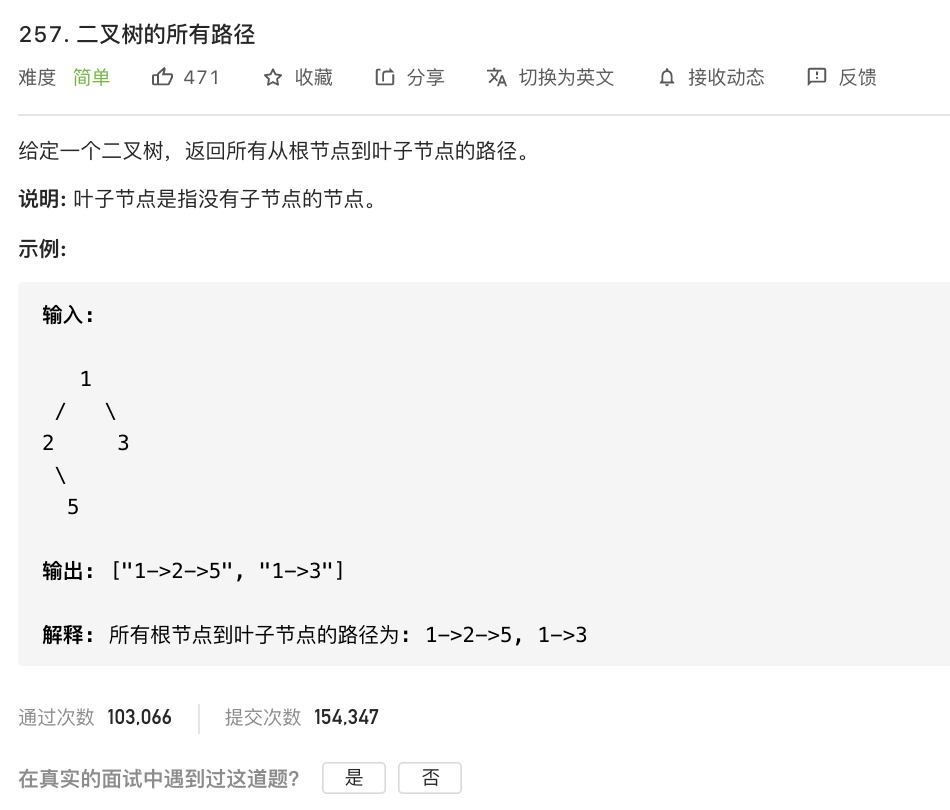

[257. 二叉树的所有路径](https://leetcode-cn.com/problems/binary-tree-paths/)

难度:  <font color="green">**简单**</font>





<br>

---


<br>


- 考察递归, 此题为 Google 的面试题之一

<br>

```go
/**
 * Definition for a binary tree node.
 * type TreeNode struct {
 *     Val int
 *     Left *TreeNode
 *     Right *TreeNode
 * }
 */
func binaryTreePaths(root *TreeNode) []string {

    var res []string
    
    if root == nil {
        return res
    }

    if root.Left == nil && root.Right == nil {
        return []string{strconv.Itoa(root.Val)} 
    }

    tmpLeft := binaryTreePaths(root.Left)
	for i := 0; i < len(tmpLeft); i++ {
		res = append(res, strconv.Itoa(root.Val)+"->"+tmpLeft[i])
	}

	tmpRight := binaryTreePaths(root.Right)
	for i := 0; i < len(tmpRight); i++ {
		res = append(res, strconv.Itoa(root.Val)+"->"+tmpRight[i])
	}
	return res

}

```