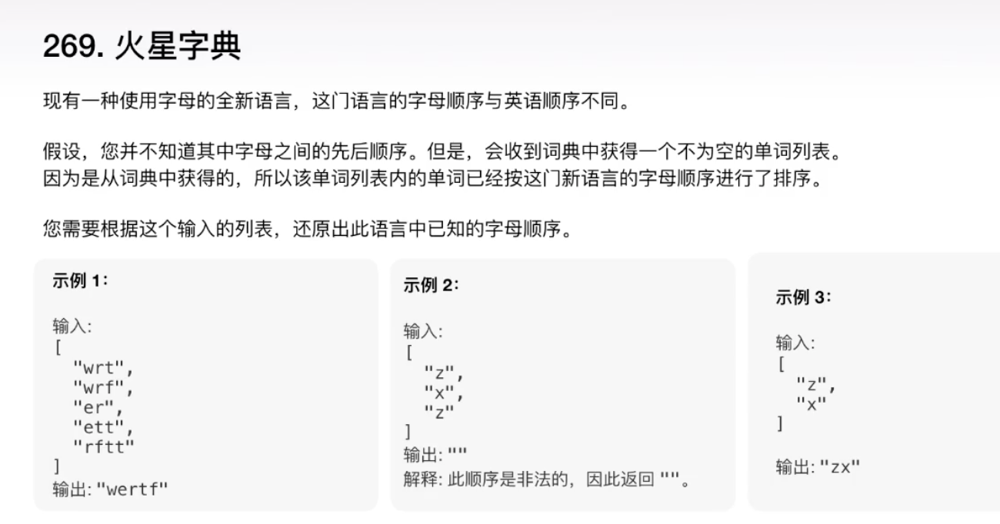
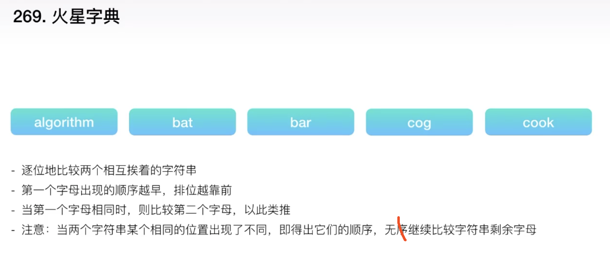
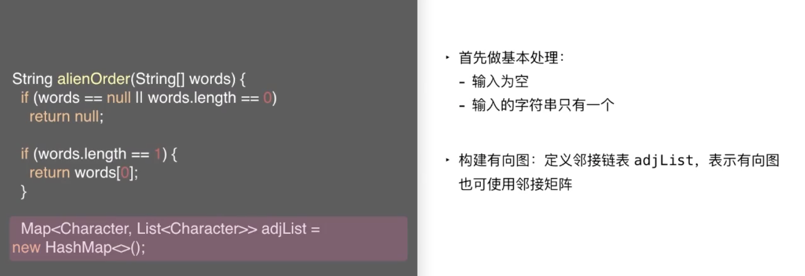
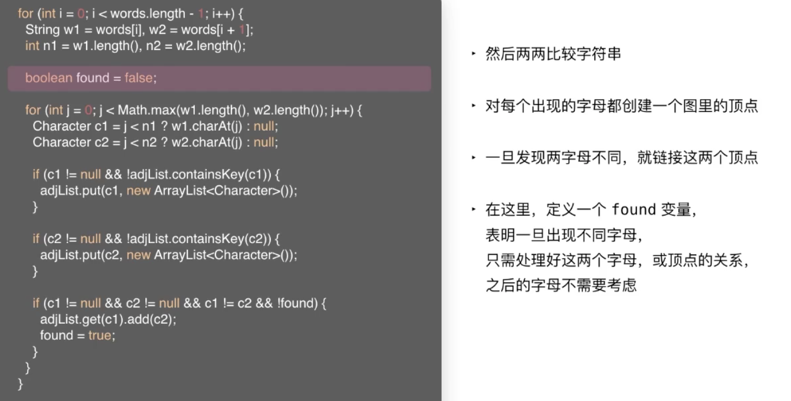
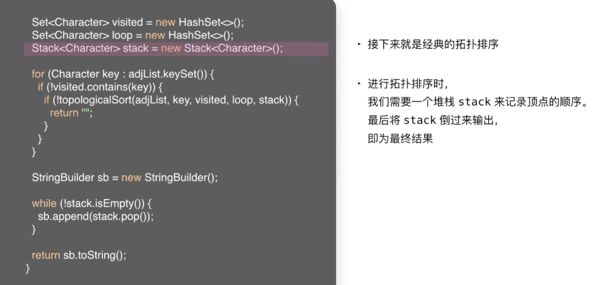
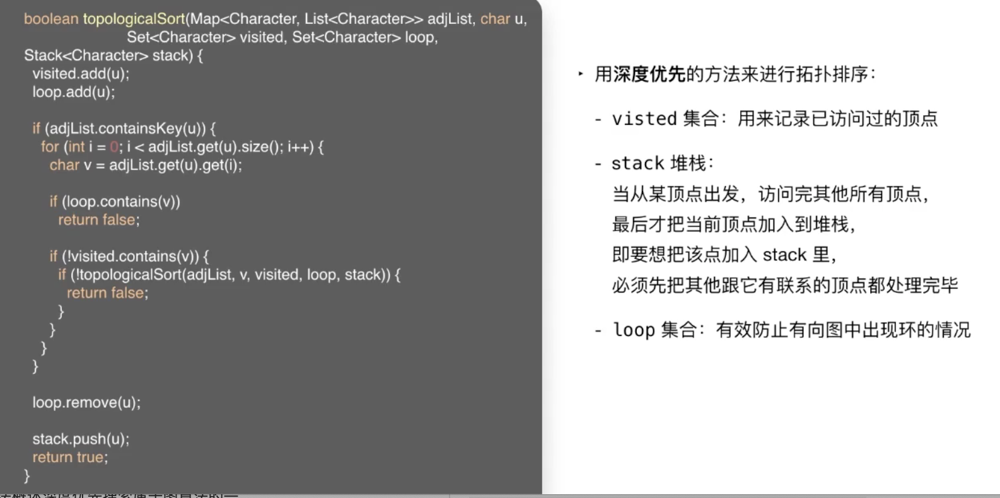
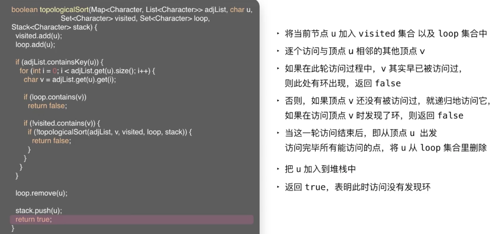

 

&此题为 **高频面试题-火星字典** 类型的典型 &

[269. 火星字典]()

难度:  **困难**

 

---

拓扑排序,将每个字母看作是图里的顶点,它们之间的关系,是连接顶点与顶点的边,且是有向边,是一个有向图..最后对这个有向图进行拓扑排序

1. 根据输入构建一个有向图

2. 对这个有向图进行排序

 

第三课用广度优先算法(Breadth First Search, BFS)实现了拓扑排序,在此用深度优先算法(Depth First Search,DFS)来实现

掌握好`拓扑排序`的两种写法