 

&此题为 **难题-实现strStr()** 类型的典型 &

[28. 实现 strStr()](https://leetcode-cn.com/problems/implement-strstr/)

难度:  **简单**

 

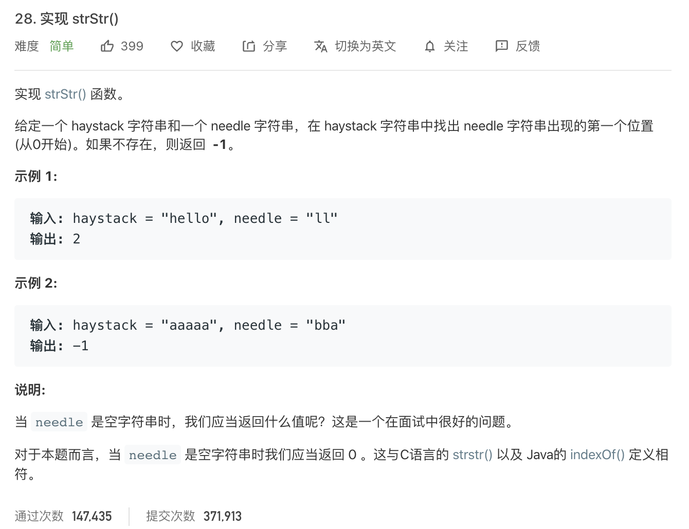

 

---

 

### 暴力法:

比较简单

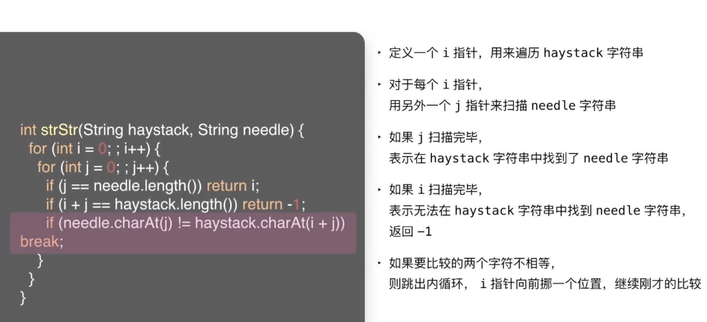
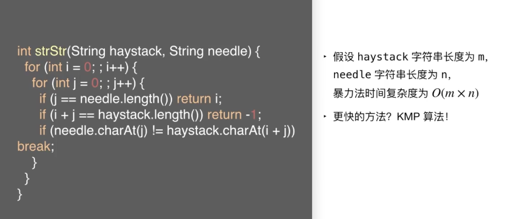

 

### KMP算法

 

 

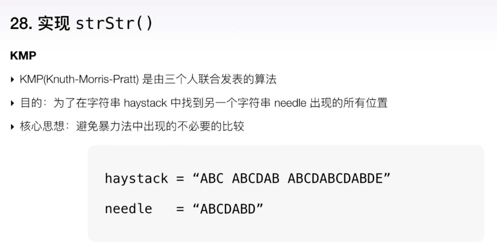

两个疑惑:

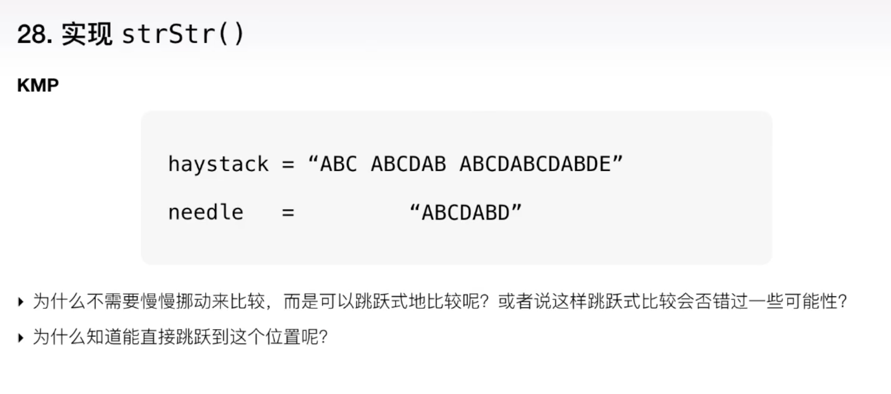

KMP中重要的数据结构:

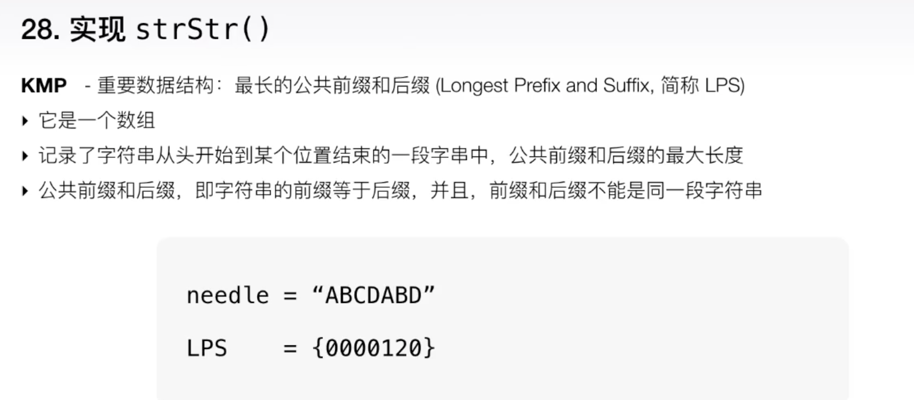
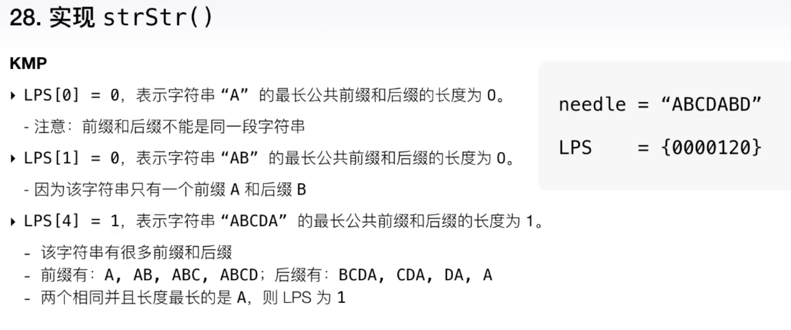
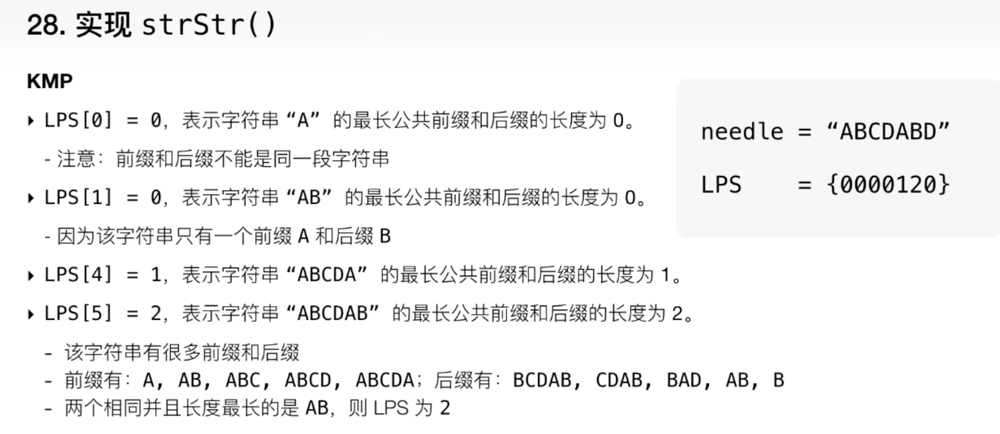

LPS

 

为什么不需要比较前面的位置?

反证法可以证明: 没有必要!

当我们知道两个绿色的方块,就是最大的公共前缀和后缀时,就可以放心地进行**跳跃操作**,而不需要担心我们会担心完全匹配的情况发生.因为完美匹配不可能在跳跃的空间内发生

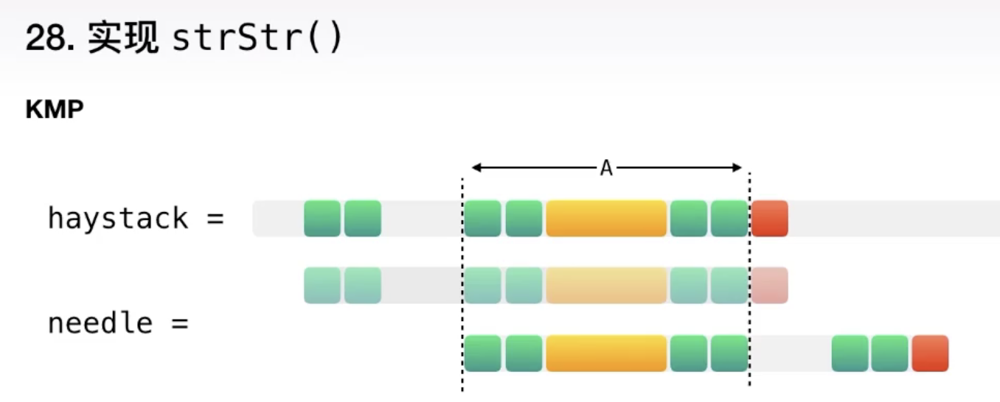

 

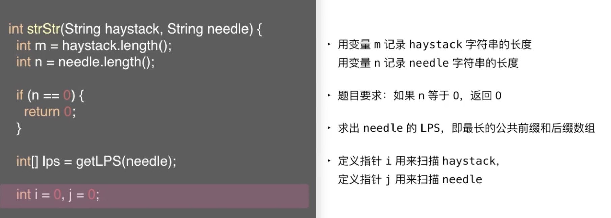
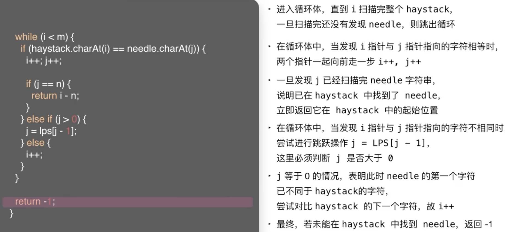

如何求出needle字符串的最长公共前缀和后缀数组?

1. 暴力法:

 

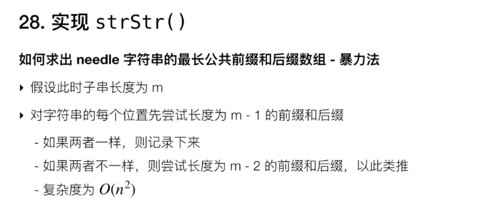

O(n的平方)

 

2. 更高效的做法:

 

O(n)

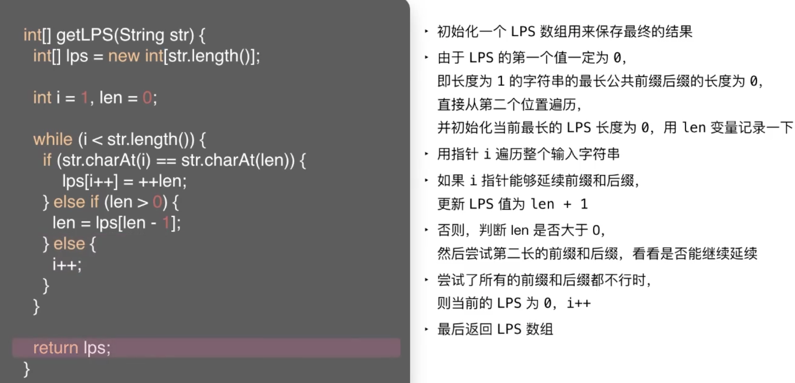

实例:

needle = ADCADB

LPS = 000000

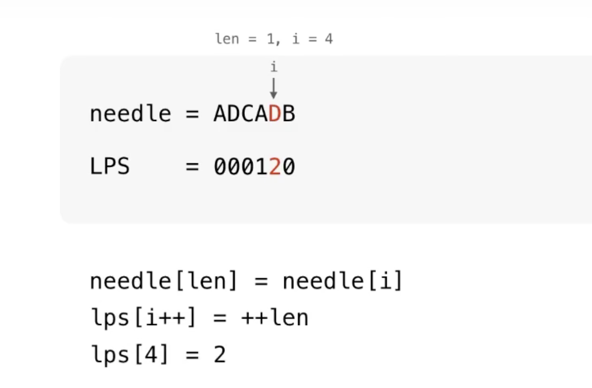
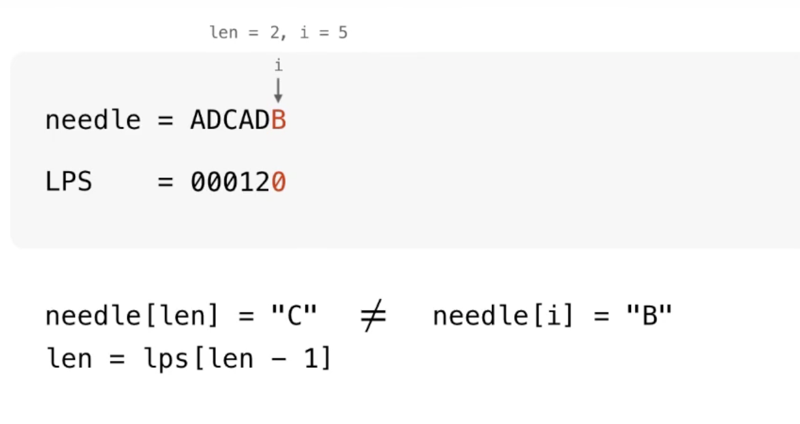

**复杂度分析:**

KMP的代码十分精妙~

