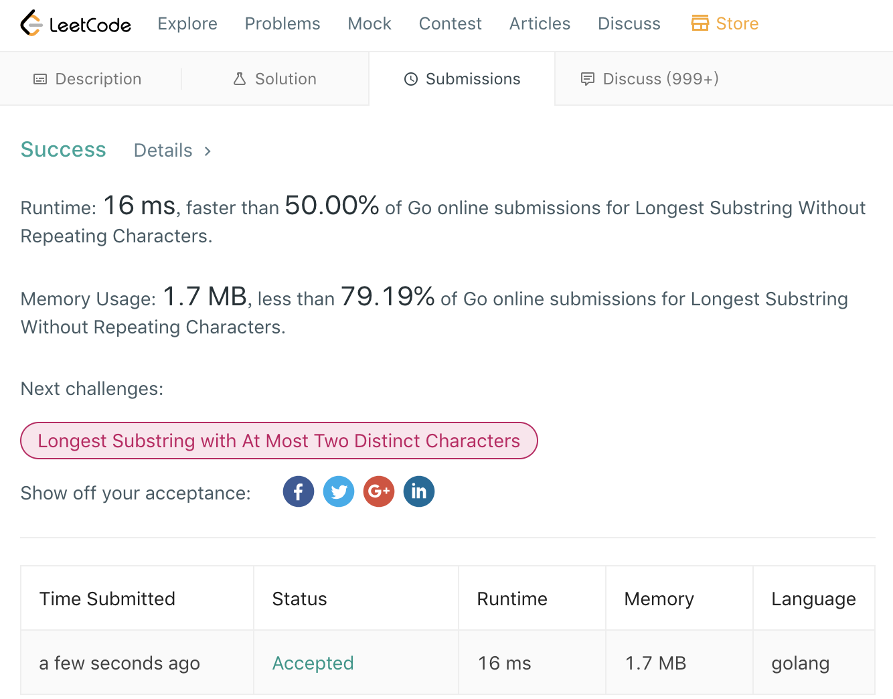

<br>

**Longest Common SubString, 又称为"LCS"问题**

<br>

```go
func lengthOfLongestSubstring(s string) int {
    
    start := 0 
    end := 0
    repeatCount := 0 
    
    slen := len(s)
    
    m := make(map[byte]byte)
    
    for end < slen {
        tmp := s[end]
        if _,ok := m[tmp];!ok {
            m[tmp] = tmp
            end++
            repeatCount = int(math.Max(float64(repeatCount),float64(end-start)))
            
        } else {
            delete(m,s[start])
            start++
            
        }
        
    }
      return repeatCount
    
}
```

<br>




[参考](https://blog.csdn.net/heart66_A/article/details/83714168),
所谓容器,即一个map


更多参考:


[图解LeetCode第 3 号问题：无重复字符的最长子串](https://www.itcodemonkey.com/article/12773.html)

[无重复字符的最长子串](https://leetcode-cn.com/problems/longest-substring-without-repeating-characters/solution/wu-zhong-fu-zi-fu-de-zui-chang-zi-chuan-dong-tai-2/)

[最长公共子序列和最长公共子串](https://zhuanlan.zhihu.com/p/68409952)


[动态规划求解最长公共子序列](https://juejin.im/post/5c733670e51d4568b3326aac)

[笔试面试算法经典--最长公共子串（Longest Common SubString）](https://blog.csdn.net/u013309870/article/details/69479488)