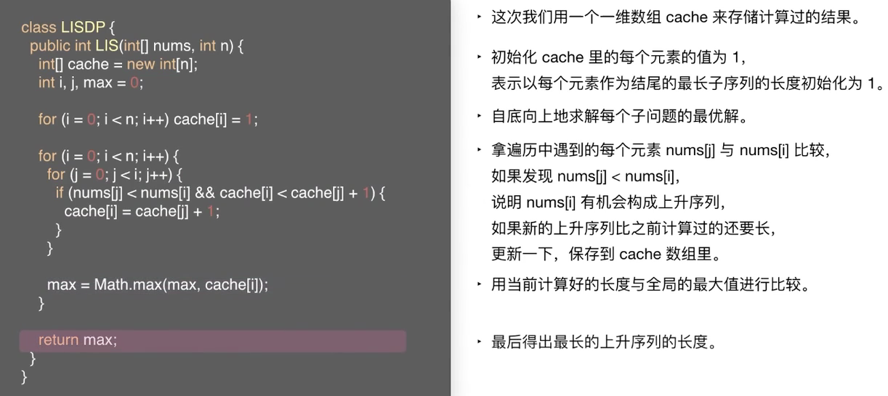

 

&此题为 **动态规划** 类型的典型题目 &

[300. 最长上升子序列](https://leetcode-cn.com/problems/longest-increasing-subsequence/)

难度:  **中等**

---

### 暴力法:

 

状态转移方程式,即一个递推公式

已经证明了有最优子结构,那有重复子问题吗?

 

时间复杂度分析:

递归的写法需要耗费非常多的重复计算..避免重叠计算`---`一种办法就是"记忆化",把算好的保存起来

记忆化总是发生在递归之后

时间复杂度分析:

对于这种将问题规模不断减少的做法,称为`自顶向下`的方法

时间复杂度分析:

 

---

 

### 动态规划解题难点:

 

- 应当采用什么样的数据结构,来保存什么样的计算结果?

- 如何利用保存下来的计算结果,推导出状态转移方程.

 

---

 

