 

&此题为 **难题-回文对** 类型的典型 &

[336. 回文对](https://leetcode-cn.com/problems/palindrome-pairs/)

难度:  **困难**

 

---

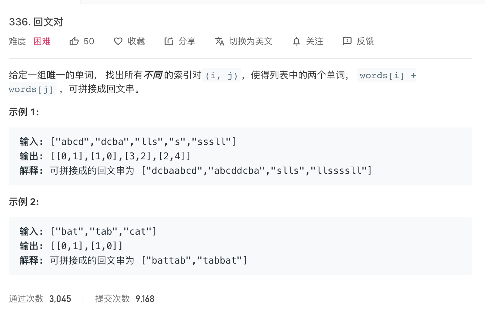

   

回文: 正读和反读都一样的字符串

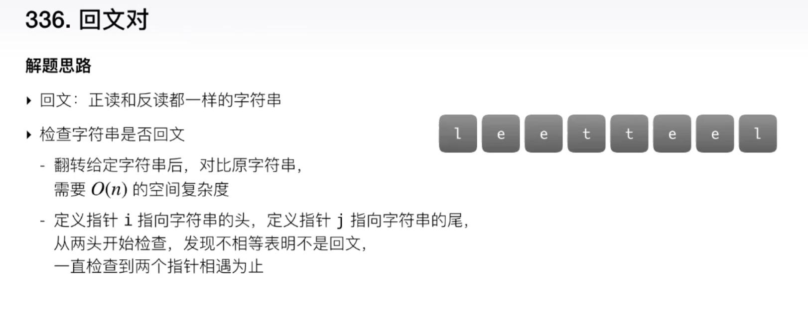

 

1. 暴力法:

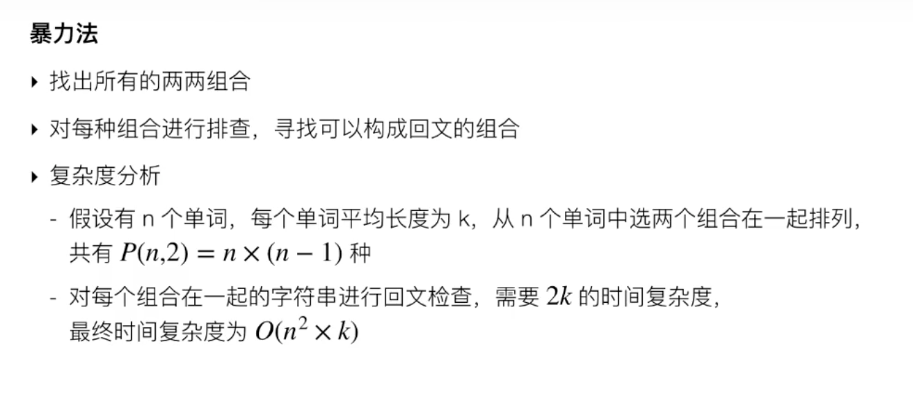

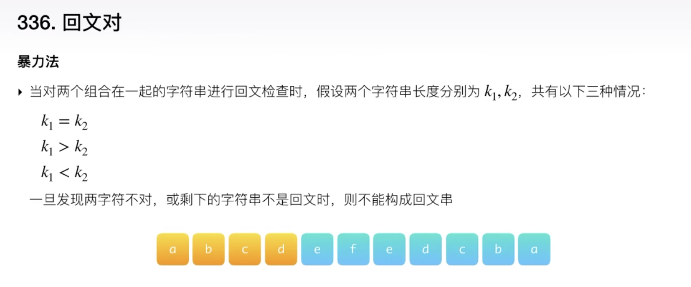

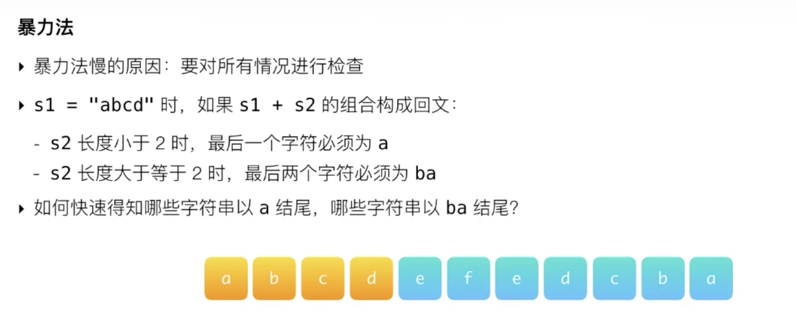
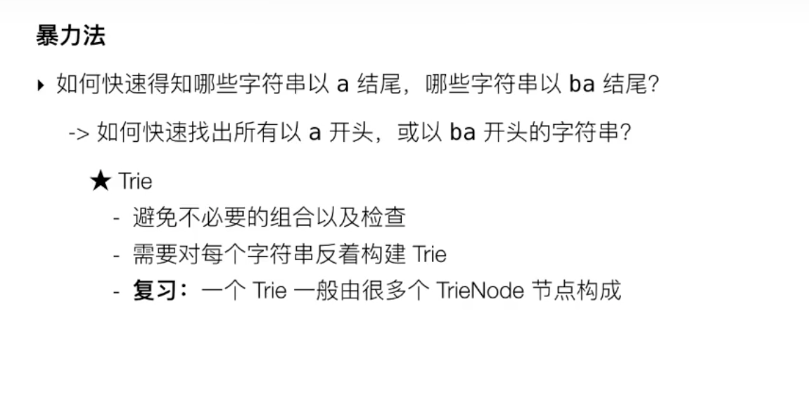

 

**复习一下Trie:**

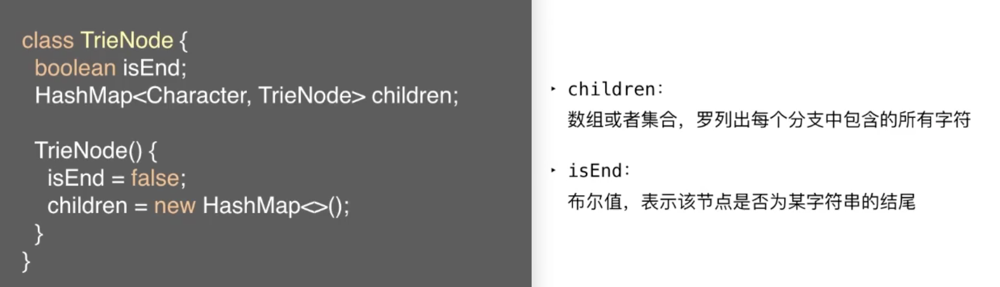

 

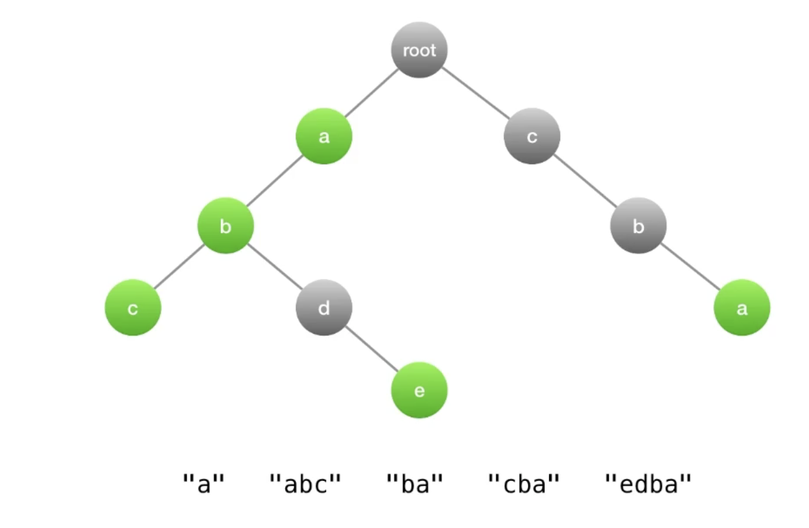
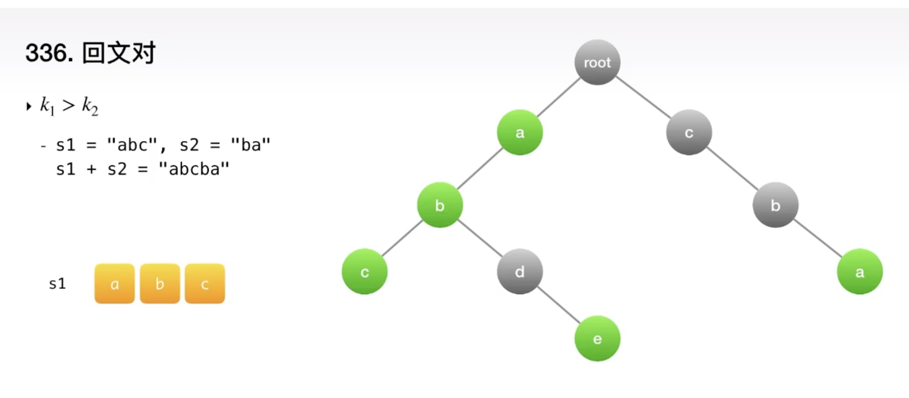

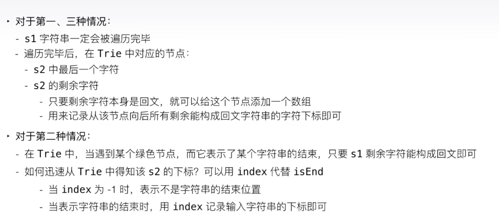

 

代码实现:

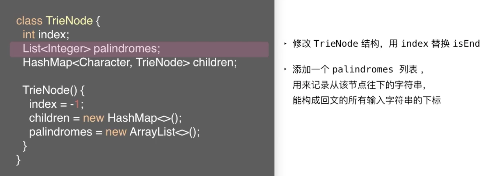

 

主体函数比较简单:

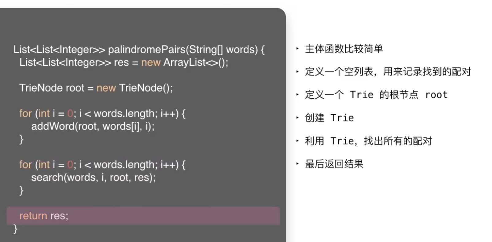
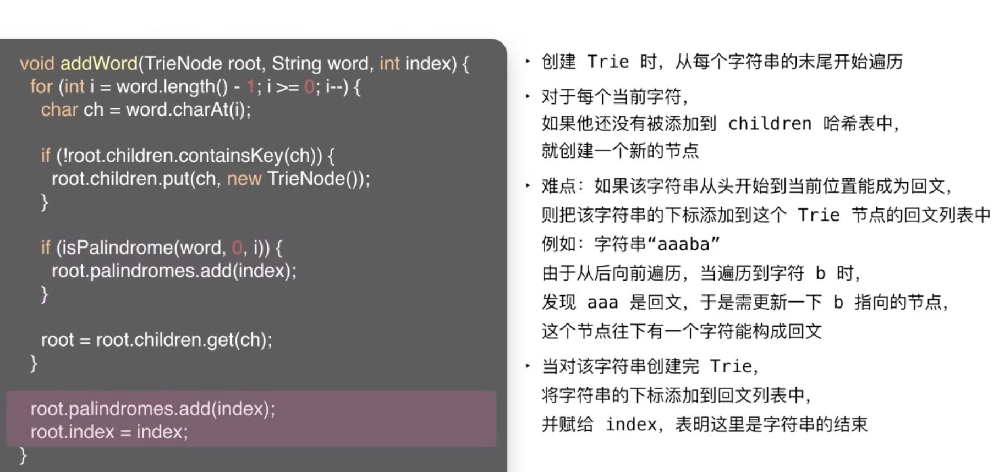

 

如何处理查找:

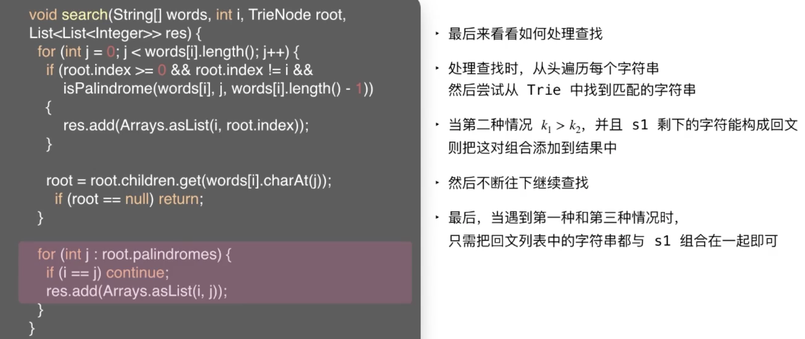

 

复杂度分析:

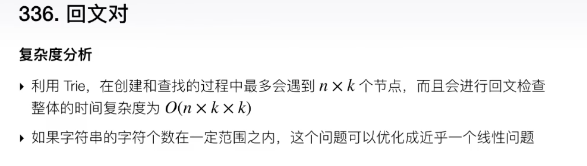

---
