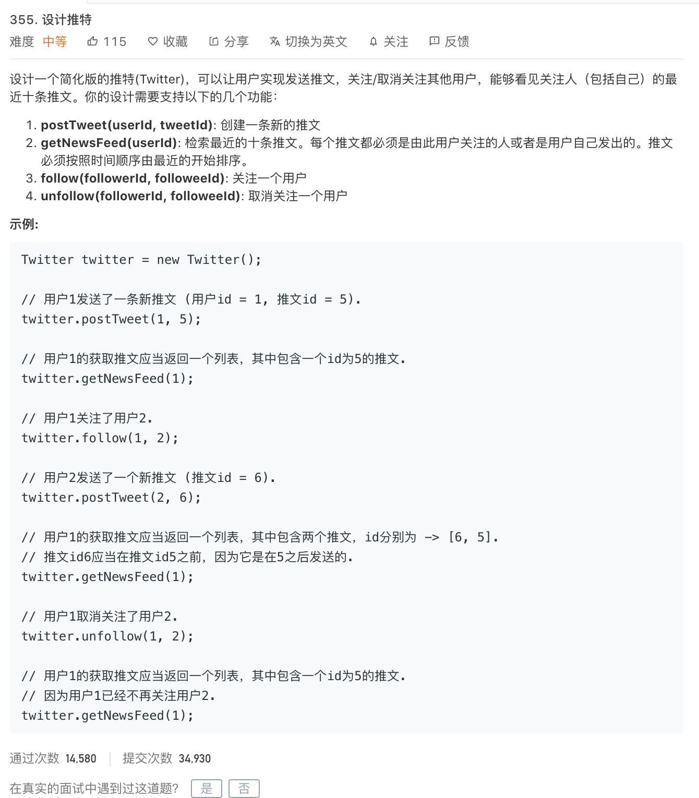

<br>


[355. 设计推特](https://leetcode-cn.com/problems/design-twitter/)


难度:  <font color="orange">**中等**</font>




<br>

---

<br>

已有的代码:

```go
type Twitter struct {

}


/** Initialize your data structure here. */
func Constructor() Twitter {

}


/** Compose a new tweet. */
func (this *Twitter) PostTweet(userId int, tweetId int)  {

}


/** Retrieve the 10 most recent tweet ids in the user's news feed. Each item in the news feed must be posted by users who the user followed or by the user herself. Tweets must be ordered from most recent to least recent. */
func (this *Twitter) GetNewsFeed(userId int) []int {

}


/** Follower follows a followee. If the operation is invalid, it should be a no-op. */
func (this *Twitter) Follow(followerId int, followeeId int)  {

}


/** Follower unfollows a followee. If the operation is invalid, it should be a no-op. */
func (this *Twitter) Unfollow(followerId int, followeeId int)  {

}


/**
 * Your Twitter object will be instantiated and called as such:
 * obj := Constructor();
 * obj.PostTweet(userId,tweetId);
 * param_2 := obj.GetNewsFeed(userId);
 * obj.Follow(followerId,followeeId);
 * obj.Unfollow(followerId,followeeId);
 */

 ```


 ---


 <br>


参考:

[LeetCode 第355题 Design Twitter](https://codechina.org/2019/08/leetcode-355-design-twitter/)