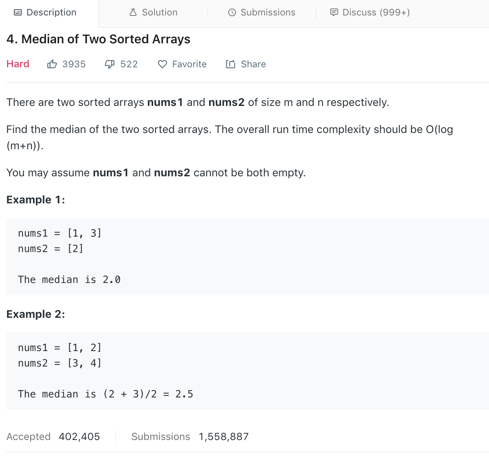

 

思路分析:第一感觉,先对两个数组排序,再判断得出其中位数的值,好像并不困难.

但说了时间复杂度需要为 O(log(m + n)),那第一步排序,几种常见的排序算法就要被滤掉.

[常见算法的时间复杂度参考](https://blog.csdn.net/l975764577/article/details/39399077)

[可参考](https://blog.csdn.net/jek123456/article/details/80022075)