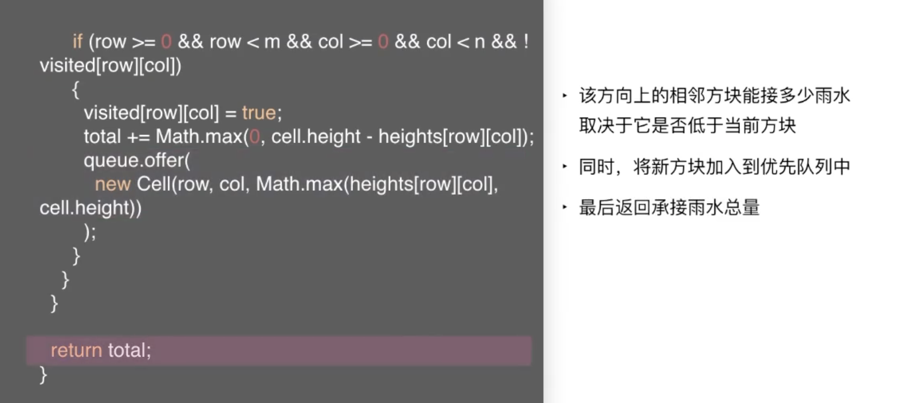

 

&此题为 **难题-接雨水II** 类型的典型 &

[407. 接雨水 II](https://leetcode-cn.com/problems/trapping-rain-water-ii/)

难度:  **困难**

 

---

   

从里面向外寻找,

对于每一个点,都要不断地往外去寻找超过自己,又最矮的柱子

时间复杂度为O(n的立方)

 

采用农村包围城市的做法,从外面往里面寻找

从最外面最矮的那个开始,慢慢向里面计算(做BFS,即广度优先算法)

为什么不先选择最高的那个呢?因为决定接雨水的高度,是由最矮的那个决定的~

怎样可以快速知道,接下来哪个高度最矮呢?  可以借用有限队列提高速度

 

代码如下:

 

**复杂度分析:**

 

[leetcode-417 太平洋大西洋水流问题]()