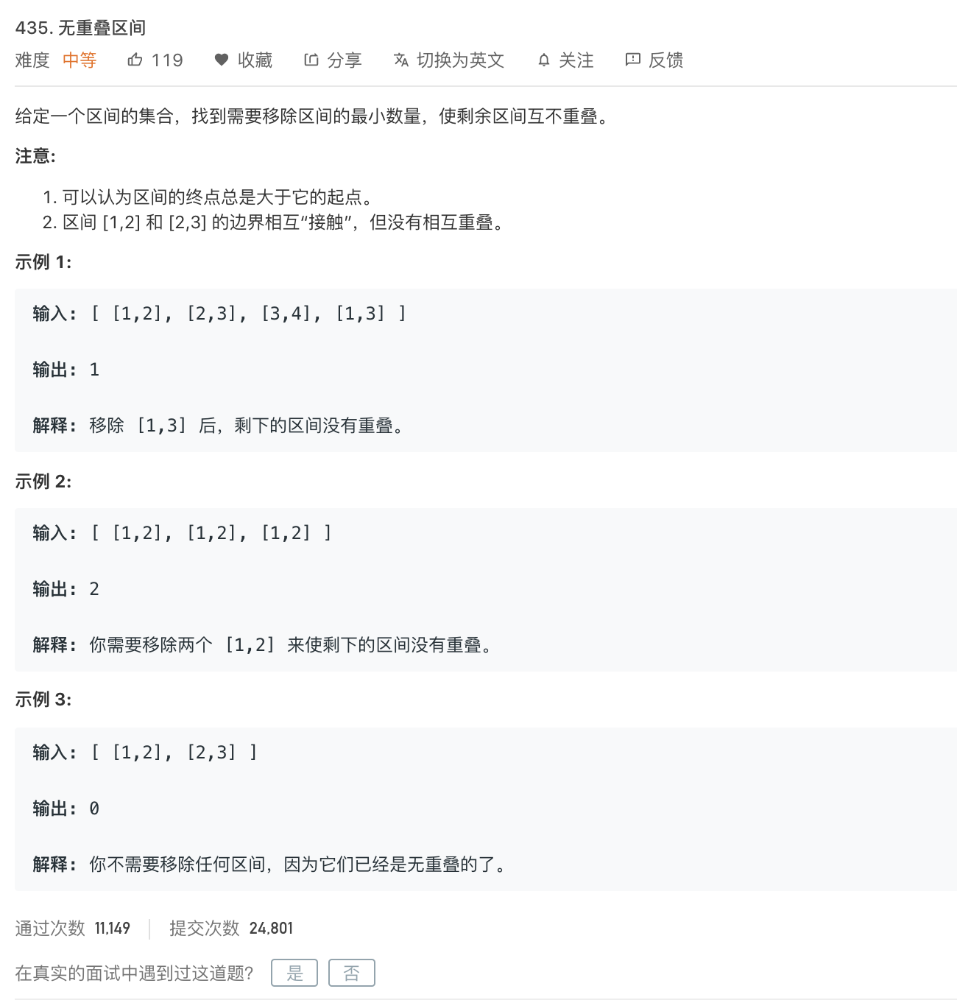
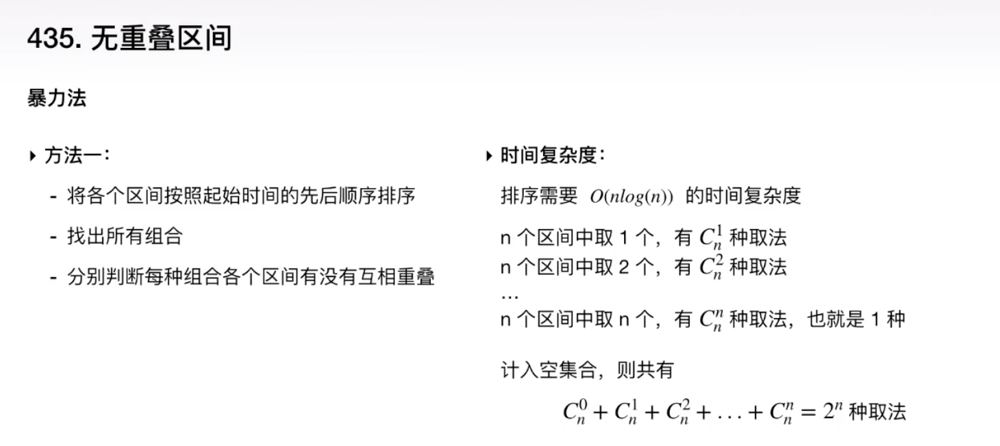
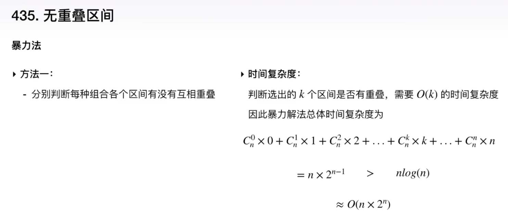
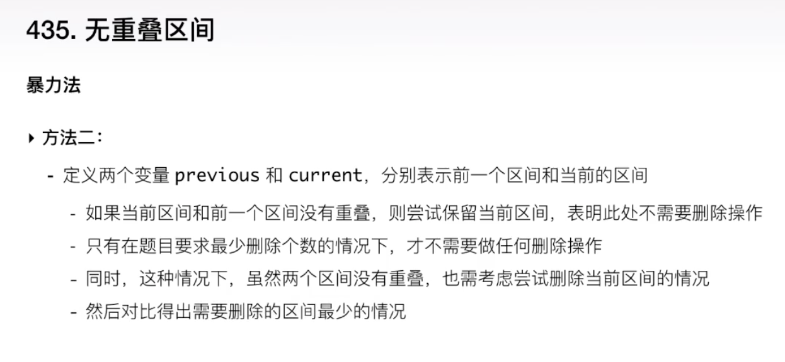
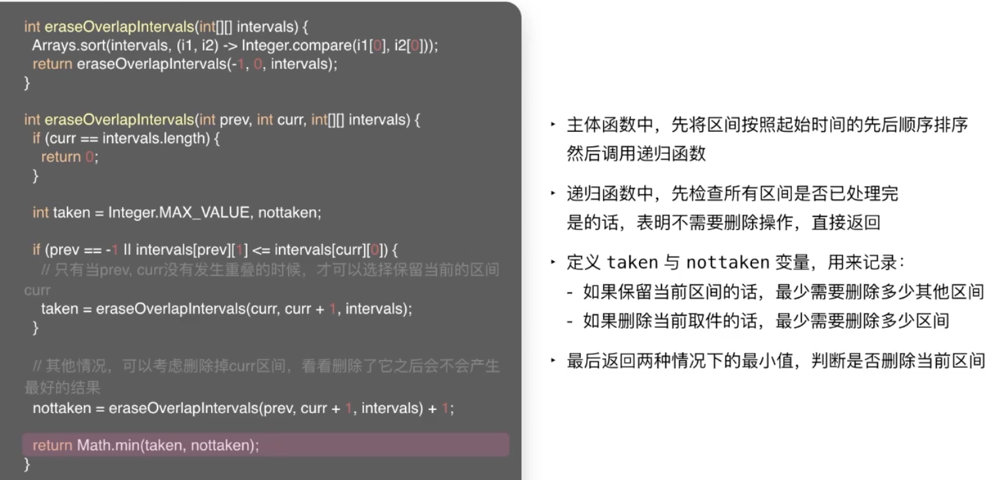
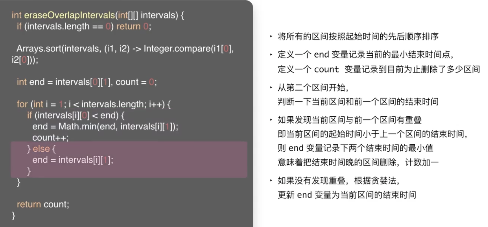
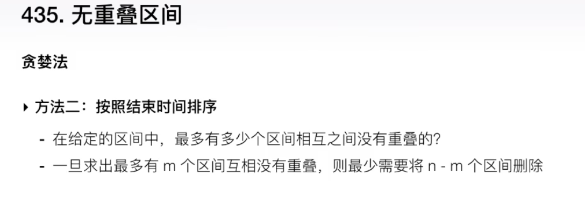
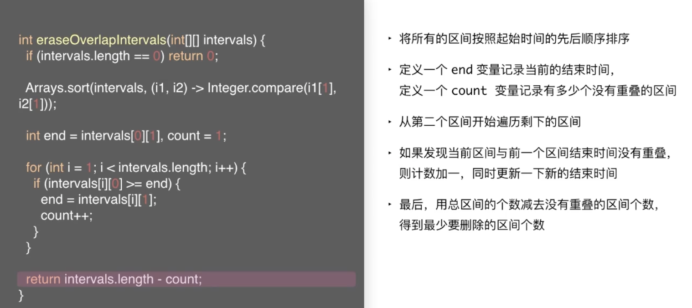

 

&此题为 **高频试题-合并区间** 类型的典型题目 &

[435. 无重叠区间](https://leetcode-cn.com/problems/non-overlapping-intervals/)

难度:  **中等**

---

 

### 方法1:暴力法

 

因为n*(2的n-1次方)远大于n*log(n),故而排序的时间复杂度就可以忽略不计了

 

### 方法2:暴力法2

 

 

### 方法3:贪婪法1

 

 

### 方法4:贪婪法2

 

按照结束时间排序

