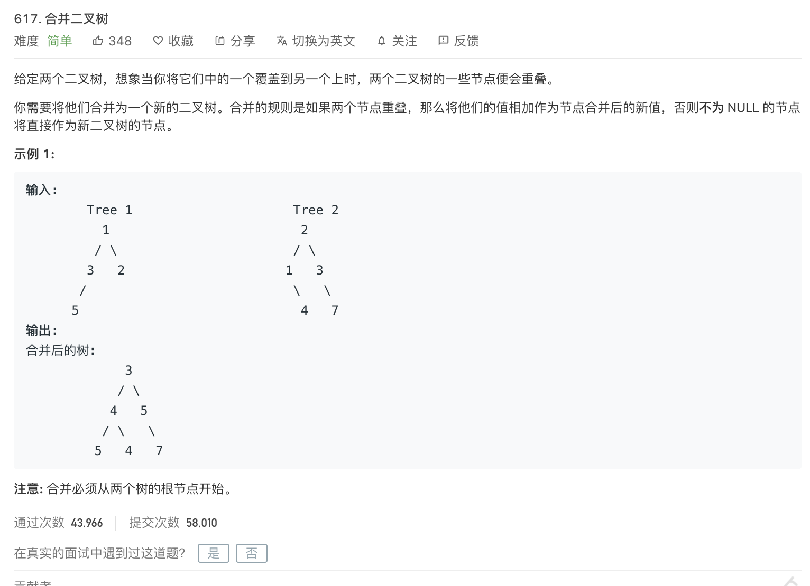

 

[617. 合并二叉树](https://leetcode-cn.com/problems/merge-two-binary-trees/)

难度:  **简单**

 

---

 

[三道题套路解决递归问题](https://lyl0724.github.io/2020/01/25/1/)

如链接失效,可[点击](https://note.youdao.com/web/#/file/WEB6be23dc2fd11cbe89b41b4813e1f2560/note/WEB8fd547019ee52b7059148abcbc785d2e/)

 

---
