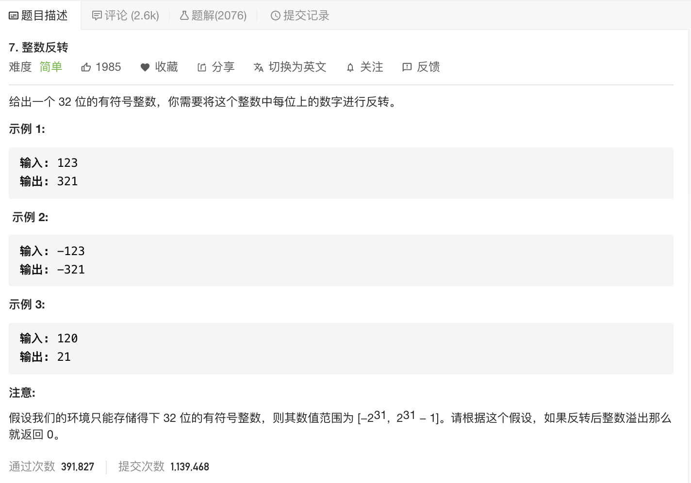

<br>


[7. 整数反转](https://leetcode-cn.com/problems/reverse-integer/)

难度:  <font color="green">**简单**</font>





<br>

---

<br>

### 方法一: 转为字符串,将字符串反转后再转为整型


```go
func reverse(x int) int {
    	if x == 0 || x < -2147483648 || x > 2147483647  {
		return 0
	}

	if x > 0 {

		rs :=  dealPostiveData(x)

        if rs < -2147483648 || rs > 2147483647 {
			return 0
		} else {
			return rs
		}

	} else {
		numPostive := x * -1
		rsPostive := dealPostiveData(numPostive)

        rs := rsPostive * -1

		 if rs < -2147483648 || rs > 2147483647 {
			return 0
		} else {
			return rs
		}
	}
}


func dealPostiveData(num int) (int) {

	var sli []string
	numStr := strconv.Itoa(num)
	for _, v := range numStr {
		sli = append(sli, string(v))
	}

	long := len(sli)

	var sli2 []string
	for k := range sli {
		sli2 = append(sli2, sli[long-k-1])
	}

	rsStr := ""

	for _, val := range sli2 {
		rsStr += val
	}

	rs, _ := strconv.Atoi(rsStr)
	return rs

}


```


---

<br>


### 方法二: 除10取余


